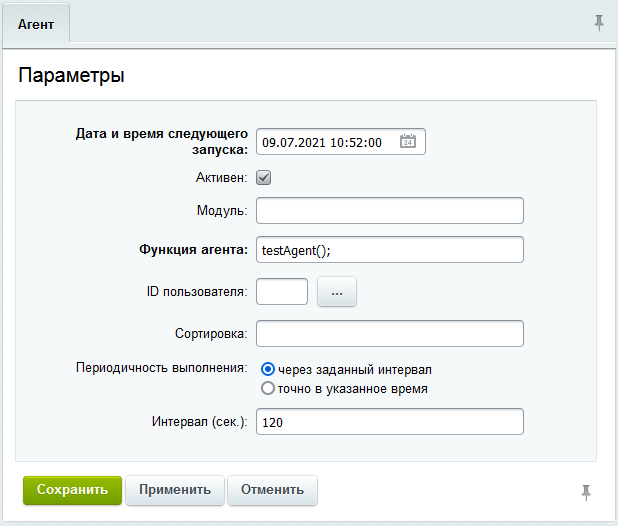

# Примеры агентов

**Навигация**
- [← Оглавление курса](index.md)
- [← Предыдущий: 12173 — Подписка на события модуля](lesson_12173.md)
- [Следующий: 2943 — Запуск агентов из cron →](lesson_2943.md)

Официальная страница урока: https://dev.1c-bitrix.ru/learning/course/index.php?COURSE_ID=43&LESSON_ID=2290

Тему урока можно изучить в новом формате — [в документации по Bitrix Framework](https://docs.1c-bitrix.ru/pages/framework/background-jobs.html). В ней улучшена структура, описание, примеры.

### Пример создания агента

Если необходимо динамически добавлять агентов, то используйте [API](http://dev.1c-bitrix.ru/api_help/main/reference/cagent/index.php) агентов. Если вам просто нужно прикрутить один или два агента, то это проще сделать вручную.

Агента создаем на странице Настройки &gt; Настройки продукта &gt; Агенты по команде **Добавить агента** на контекстной панели:



О параметрах, значение которых может быть неясно из названия:

- **дата последнего запуска** - выводится время последнего запуска (при редактировании агента);
- **дата и время следующего запуска** – время старта работы агента, если он не периодический то выполнится 1 раз в это время;
- **модуль** - этот модуль будет автоматически подключаться, а именно будет подключаться файл `/bitrix/modules/ID модуля/include.php`, в этом случае необходимо убедиться, что функция-агент будет доступна после подключения этого файла;
- **функция агента** - это основное поле, у нас функция называется testAgent();
- **ID пользователя** – это фильтр выполнения на хите для определенного пользователя;

Сама функция будет выглядеть так:

```

function testAgent()
{
	mail('mail@gmail.com', 'Агент', 'Агент');
	return "testAgent();";
}
```

Функцию добавить в файл `/bitrix/php_interface/init.php`.

Для активизации агента выполните в php-консоли админки следующий код:

```
CAgent::AddAgent("testAgent();");
```

Если письмо пришло, то агент работает и можно писать свой функционал.

### Простые примеры агентов

```

<?
// добавим агент модуля "Статистика"
CAgent::AddAgent(
	"CStatistic::CleanUpStatistics_2();", // имя функции
	"statistic",                          // идентификатор модуля
	"N",                                  // агент не критичен к кол-ву запусков
	86400,                                // интервал запуска - 1 сутки
	"07.04.2005 20:03:26",                // дата первой проверки на запуск
	"Y",                                  // агент активен
	"07.04.2005 20:03:26",                // дата первого запуска
	30);
?>
```

```

<?
// добавим агент модуля "Техподдержка"
CAgent::AddAgent(
	"CTicket::AutoClose();",  // имя функции
	"support",                // идентификатор модуля
	"N",                      // агент не критичен к кол-ву запусков
	86400,                    // интервал запуска - 1 сутки
	"",                       // дата первой проверки - текущее
	"Y",                      // агент активен
	"",                       // дата первого запуска - текущее
	30);
?>
```

```

<?
// добавим произвольный агент не принадлежащий ни одному модулю
CAgent::AddAgent("My_Agent_Function();");
?>

<?
// файл /bitrix/php_interface/init.php

function My_Agent_Function()
{
	// выполняем какие-либо действия
	return "My_Agent_Function();";
}
?>
```

```

<?
// добавим произвольный агент принадлежащий модулю
// с идентификатором my_module

CAgent::AddAgent(
	"CMyModule::Agent007(1)",
	"my_module",
	"Y",
	86400);
?>

<?
// данный агент будет запущен ровно 7 раз с периодичностью раз в сутки,
// после чего будет удален из таблицы агентов.

Class CMyModule
{
	public static function Agent007($cnt=1) : string
	{
		echo "Hello!";
		if($cnt>=7)
		return "";
	return "CMyModule::Agent007(".($cnt+1).");";
   }
}>
```

### Курсы валют

Практичный пример: Обновление курса валют на сайте. Запуск данного агента рекомендуется повесить на [cron](http://ru.wikipedia.org/wiki/Cron).

```
<?// Обновление курса валют

function AgentGetCurrencyRate()
{
	global $DB;

	// подключаем модуль "валют"
	if(!CModule::IncludeModule('currency'))
		return "AgentGetCurrencyRate();";

	$arCurList = array('USD', 'EUR');
	$bWarning = False;
	$rateDay = GetTime(time(), "SHORT", LANGUAGE_ID);
	$QUERY_STR = "date_req=".$DB->FormatDate($rateDay, CLang::GetDateFormat("SHORT", SITE_ID), "D.M.Y");
	$strQueryText = QueryGetData("www.cbr.ru", 80, "/scripts/XML_daily.asp", $QUERY_STR, $errno, $errstr);

	// данная строка нужна только для сайтов в кодировке utf8
	$strQueryText = iconv('windows-1251', 'utf-8', $strQueryText);

	if (strlen($strQueryText) <= 0)
		$bWarning = True;

	if (!$bWarning)
	{
		require_once($_SERVER["DOCUMENT_ROOT"]."/bitrix/modules/main/classes/general/xml.php");
		$objXML = new CDataXML();
		$objXML->LoadString($strQueryText);
		$arData = $objXML->GetArray();
		$arFields = array();
		$arCurRate["CURRENCY_CBRF"] = array();

	if (is_array($arData) && count($arData["ValCurs"]["#"]["Valute"])>0)
	{
		for ($j1 = 0; $j1<count($arData["ValCurs"]["#"]["Valute"]); $j1++)
		{
			$arFields = array(
				"CURRENCY" => $arData["ValCurs"]["#"]["Valute"][$j1]["#"]["CharCode"][0]["#"],
				'DATE_RATE' => $rateDay,
				'RATE' => DoubleVal(str_replace(",", ".", $arData["ValCurs"]["#"]["Valute"][$j1]["#"]["Value"][0]["#"])),
				'RATE_CNT' => IntVal($arData["ValCurs"]["#"]["Valute"][$j1]["#"]["Nominal"][0]["#"]),
			);
			CCurrencyRates::Add($arFields);
		}

	}
}

return "AgentGetCurrencyRate();";
}?>
```

Указанный код добавляется в файл `/bitrix/php_interface/init.php`. Не забудьте добавить агента *AgentGetCurrencyRate();* на странице Настройки &gt; Настройки продукта &gt; Агенты.

### Элементы без цен

Агент, проверяющий наличие элементов инфоблока без заполненных цен.

1. Создадим:

  - Почтовое событие и шаблон.
  - «Агента», который будет запускать функцию 1 раз в день.
2. Убедимся, что агент запускается, производится запись в журнал и приходят письма на почту.
3. Размещение функции должно быть в отдельном файле, который подключается в `init.php`.

```

function AgentCheckPrice()
{
	if(CModule::IncludeModule("iblock"))
	{
		$arSelect = Array("ID", "NAME", "PROPERTY_PRICE");
		$arFilter = Array("IBLOCK_ID"=> 2, "PROPERTY_PRICE" => false);
		$rsResCat = CIBlockElement::GetList(Array(), $arFilter, false, false, $arSelect);
		$arItems = array();
		while($arItemCat = $rsResCat->GetNext())
		{
			$arItems[] = $arItemCat;
		}

		CEventLog::Add(array(
				"SEVERITY" => "SECURITY",
				"AUDIT_TYPE_ID" => "CHECK_PRICE",
				"MODULE_ID" => "iblock",
				"ITEM_ID" => "",
				"DESCRIPTION" => "Проверка цен, нет цен для ".count($arItems)." элементов",
		));

		if(count($arItems) > 0)
		{
			$arFilter = Array(
					"GROUPS_ID" => Array(2)
			);
			$rsUsers = CUser::GetList(($by="personal_country"), ($order="desc"), $arFilter);
			$arEmail = array();
			while($arResUser = $rsUsers->GetNext())
			{
				$arEmail[] = $arResUser["EMAIL"];
			}

			if(count($arEmail) > 0)
			{
				$arEventFields = array(
						"TEXT" => "Проверка цен, нет цен для ".count($arItems)." элементов",
						"EMAIL" => implode(", ", $arEmail),
				);
				CEvent::Send("INFO_PRICE", "s1", $arEventFields);
			}
		}
	}

	return "AgentCheckPrice();";
}
```
