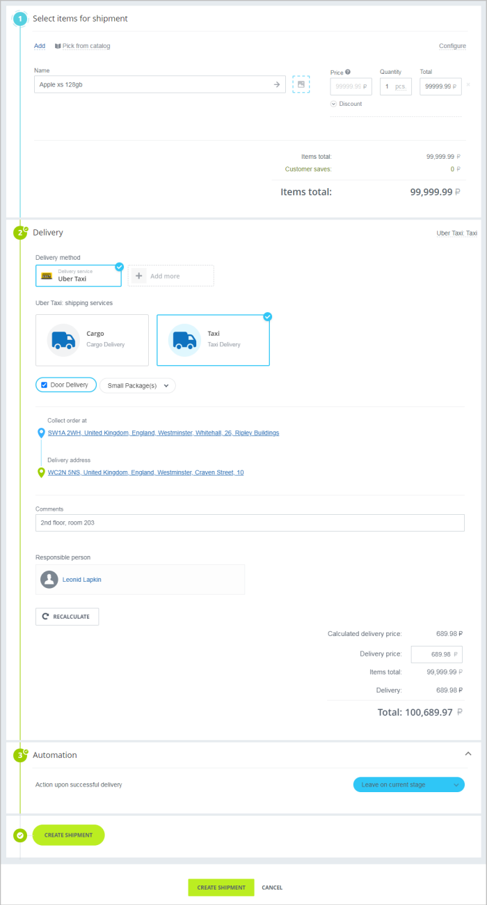
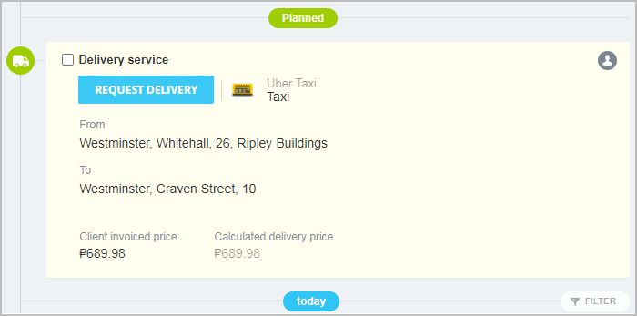
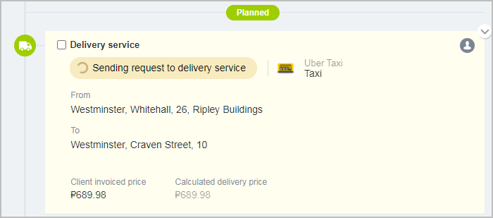
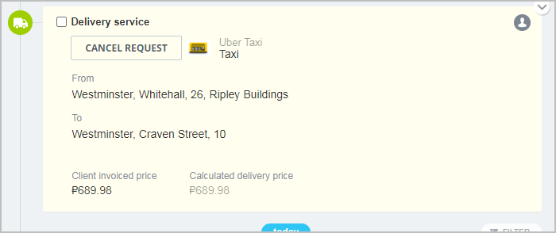
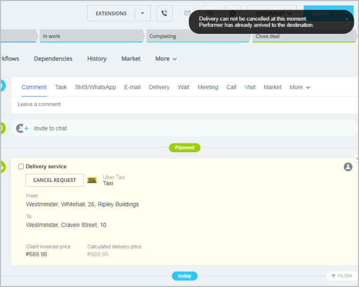
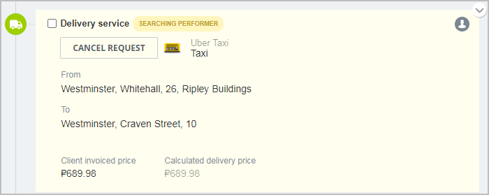
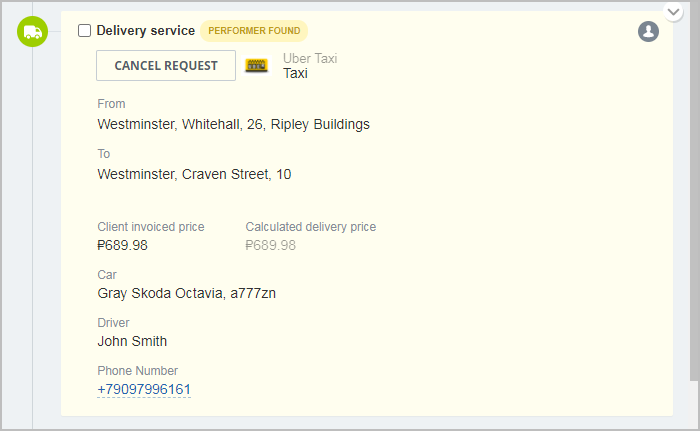
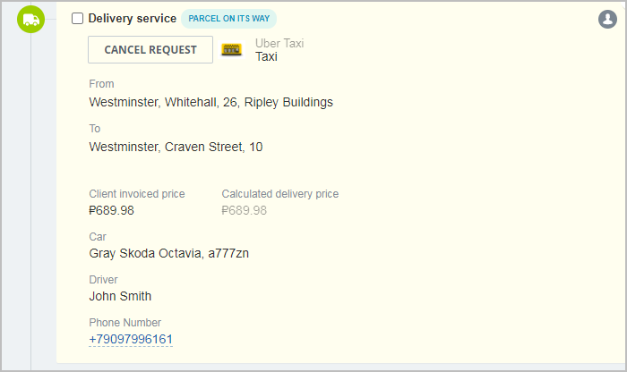
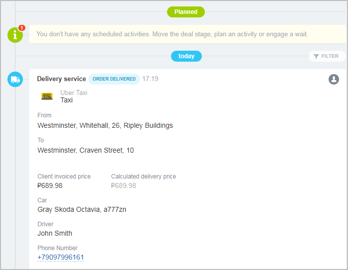
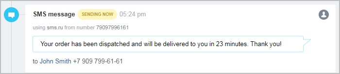

# Процесс использования службы доставки в сценариях центра продаж

**Навигация**
- [← Оглавление курса](index.md)
- [← Предыдущий: 23600 — Процесс создания и настройки службы доставки](lesson_23600.md)
- [Следующий: 8415 — Пример создания собственной службы доставки →](lesson_8415.md)

Официальная страница урока: https://dev.1c-bitrix.ru/learning/course/index.php?COURSE_ID=43&LESSON_ID=23602

Рассмотрим один из полноценных типовых сценариев работы REST служб доставки - работу с доставкой в центре продаж. Стартовой точкой для менеджера тут может являться функционал принятия оплаты («Принять оплату в сделке») или создание дела на доставку.


### Работа со стороны менеджера

#### Предварительный расчет стоимости доставки

В слайдере доставки менеджер имеет возможность рассчитать предварительную стоимости, выбрав товары для отгрузки и указав значения свойств (в данном случае это адреса и комментарий) и требования к дополнительным услугам:



При расчете доставки отправляется запрос на URL, указанный в значении свойства `CALCULATE_URL` обработчика службы доставки. В запросе передаются все необходимые для расчета стоимости параметры (свойства отгрузки, вес, стоимость товаров, требуемые дополнительные услуги, значения настроек службы доставки и т.д.). В ответе служба доставки должна сообщить предварительную стоимость доставки в валюте заказа. В случае, если расчет стоимости невозможен, служба доставки должна сообщить текст ошибки, который будет показан менеджеру (см. [веб-хук предварительного расчета стоимости доставки](https://dev.1c-bitrix.ru/rest_help/sale/delivery/webhooks/calculate.php)).

Если обработчик службы доставки поддерживает возможность создания заказов на доставку и их дальнейшего отслеживания (значение параметра `HAS_CALLBACK_TRACKING_SUPPORT` у обработчика выставлено в "Y"), то после создания отгрузки будет создано

			дело




		 на доставку данной отгрузки.

#### Создание заказа на доставку

Посредством дела на доставку менеджер имеет возможность инициировать процесс создания заказа на доставку. При клике на **Заказать доставку** (

			Request Delivery


		) отправляется

			запрос




		 на URL, указанный в значении свойства `CREATE_DELIVERY_REQUEST` обработчика службы доставки. В запросе, помимо информации о самой отгрузке, присутствует информация о контактах отправителя и получателя для связи с ними.

При успешной обработке запроса служба доставки должна создать заказ на доставку на своей стороне и в ответе передать его внешний идентификатор. В дальнейшем этот идентификатор потребуется для обновления статуса заказа и связи с отправителем или получателем груза. В случае, если заказ на доставку не может быть создан по той или иной причине, служба доставки должна выдать текст ошибки, который будет показан менеджеру (см. [веб-хук создания заказа на доставку](https://dev.1c-bitrix.ru/rest_help/sale/delivery/webhooks/create_delivery_request.php)).

После успешного создания заказа на доставку дело на доставку будет выглядеть следующим образом:



#### Отмена заказа на доставку

Менеджер имеет возможность в любой момент попытаться отменить ранее созданный заказ до тех пор, пока он не был завершен службой доставкой. При клике на **Отменить заявку** (Cancel Request) отправляется запрос на URL, указанный в значении свойства `CANCEL_DELIVERY_REQUEST` обработчика службы доставки. В случае, если заказ может быть отменен, служба доставки отменяет его и сообщает об успешной отмене в ответе. Дело на доставку в этом случае возвращается в начальный вид, и менеджер имеет возможность повторно оформить заказ на доставку. В случае, если отмена заказа невозможна, служба доставки должна сообщить причину, по которой отмена невозможна.

			Причина




		 будет выведена менеджеру при попытке отмены заказа (см. [веб-хук отмены заказа на доставку](https://dev.1c-bitrix.ru/rest_help/sale/delivery/webhooks/cancel_delivery_request.php)).

### Работа со стороны службы доставки

#### Обновление заказа на доставку

В дальнейшем ожидается, что в процессе выполнения заказа служба доставки будет обновлять информацию о нём.

Сразу после создания заказа на доставку требуется как минимум обновить его статус, чтобы менеджер понимал, что в данный момент происходит с заказом. Например, если поиск исполнителя по заказу занимает некоторое время, то можно сообщить об этом менеджеру путем обновления

			статуса заказа




		 методом [sale.delivery.request.update](https://dev.1c-bitrix.ru/rest_help/sale/delivery/saledeliveryrequest/sale_delivery_request_update.php):

```

{
	"DELIVERY_ID":723,
	"REQUEST_ID":"4757aca4931a4f029f49c0db4374d13d",
	"STATUS":{
		"TEXT":"Searching performer",
		"SEMANTIC":"process"
	}
}
```

Предположим, что исполнитель заказа найден, и теперь требуется зафиксировать в заказе

			новый статус и информацию об исполнителе




		. Для этого можно воспользоваться функционалом набираемых свойств для заказа на доставку (метод [sale.delivery.request.update](https://dev.1c-bitrix.ru/rest_help/sale/delivery/saledeliveryrequest/sale_delivery_request_update.php)):

```

{
	"DELIVERY_ID":723,
	"REQUEST_ID":"4757aca4931a4f029f49c0db4374d13d",
	"STATUS":{
		"TEXT":"Performer found",
		"SEMANTIC":"process"
	},
	"PROPERTIES":[
		{
		"NAME":"Car",
		"VALUE":"Gray Skoda Octavia, a777zn"
		},
		{
		"NAME":"Driver",
		"VALUE":"John Smith"
		},
		{
		"NAME":"Phone Number",
		"VALUE":"+79097996161",
		"TAGS":[
			"phone"
			]
		}
	]
}
```

Набор свойств может быть произвольным. Если требуется, чтобы значение свойства было обработано особенным образом, то можно отметить его тегом. В примере выше значение номера телефона исполнителя отмечено тегом "phone". Это позволяет вывести его как ссылку и открывать либо через IP телефонию (если она настроена у клиента), либо стандартными средствами браузера.

Допустим, служба доставки передала заказ исполнителю (отгрузила заказ), и теперь нужно

			обновить его статус




		 методом [sale.delivery.request.update](https://dev.1c-bitrix.ru/rest_help/sale/delivery/saledeliveryrequest/sale_delivery_request_update.php):

```

{
	"DELIVERY_ID":723,
	"REQUEST_ID":"4757aca4931a4f029f49c0db4374d13d",
	"STATUS":{
		"TEXT":"Parcel on its way",
		"SEMANTIC":"process"
	}
}
```

В данном случае не передаются значения свойств, так как их обновление не требуется. Если всё же необходимо обновить свойства заказа на доставку, то есть два режима:

- добавление новых свойств и значений (`OVERWRITE_PROPERTIES = N`, это режим по умолчанию)
- перезапись всего набора значений свойств (`OVERWRITE_PROPERTIES = Y`)

Когда заказ на доставку завершен, то необходимо его финализировать методом [sale.delivery.request.update](https://dev.1c-bitrix.ru/rest_help/sale/delivery/saledeliveryrequest/sale_delivery_request_update.php):

```

{
	"DELIVERY_ID":723,
	"REQUEST_ID":"4757aca4931a4f029f49c0db4374d13d",
	"FINALIZE":"Y"
}
```

Дело на доставку в этом случае переходит в

			статус выполненного




		, и его отмена со стороны менеджера уже невозможна.

#### Отправка сообщений по заказу на доставку

Предположим, что в процессе выполнения заказа на доставку необходимо оповестить ответственного за доставку менеджера или грузополучателя о том или ином событии. Допустим, требуется сообщить клиенту о факте того, что посылка передана в службу доставки, и о времени доставки (метод [sale.delivery.request.sendmessage](https://dev.1c-bitrix.ru/rest_help/sale/delivery/saledeliveryrequest/sale_delivery_request_sendmessage.php)):

```

{
	"DELIVERY_ID":723,
	"REQUEST_ID":"4757aca4931a4f029f49c0db4374d13d",
	"ADDRESSEE":"RECIPIENT",
	"MESSAGE":{
		"SUBJECT":"We will soon deliver your parcel to you!",
		"BODY":"Your order has been dispatched and will be delivered to you in 23 minutes. Thank you!",
		"STATUS":{
			"MESSAGE":"Dispatched",
			"SEMANTIC":"success"
		}
	}
}
```

Оповещение




		 будет отправлено клиенту по одному из каналов связи, настроенных в CRM. Это может быть SMS-оповещение или сообщение в один из мессенджеров. Для отправки сообщения менеджеру необходимо установить адресата сообщения (`ADDRESSEE`) в значение "MANAGER".

#### Отправка сообщений по заказу на доставку

Служба доставки также может по своей инициативе отменить заказ, послав [соответствующий запрос](https://dev.1c-bitrix.ru/rest_help/sale/delivery/saledeliveryrequest/sale_delivery_request_delete.php) и убедившись, что принимающая сторона его получила. Такое может быть необходимо, например, когда изначально неизвестно, будет ли найден исполнитель для выполнения заказа или нет. Если исполнитель не был найден, то служба доставки должна инициировать отмену заказа. В этом случае дело на доставку возвращается к своему начальному виду, в котором у менеджера будет возможность оформить доставку снова.
