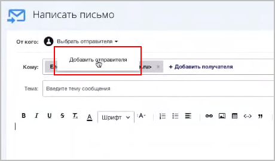
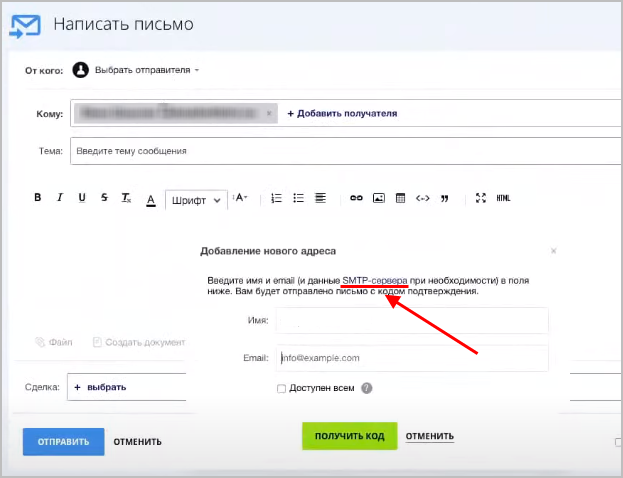
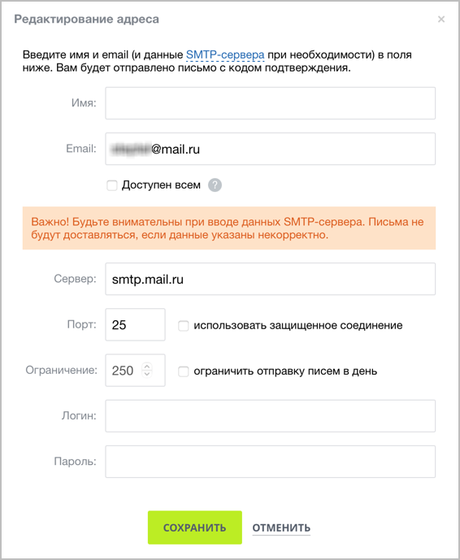
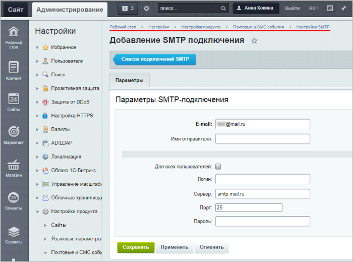
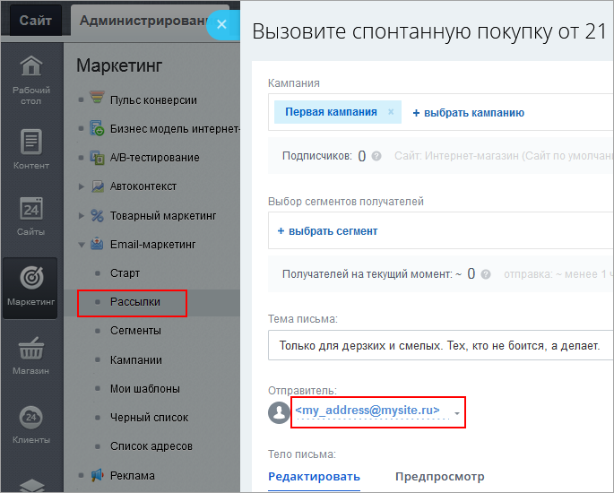

# Локальные настройки SMTP-сервера

**Навигация**
- [← Оглавление курса](index.md)
- [← Предыдущий: 14034 — Подключения к Redis, Memcache](lesson_14034.md)
- [Следующий: 3524 — Пространства имён →](lesson_3524.md)

Официальная страница урока: https://dev.1c-bitrix.ru/learning/course/index.php?COURSE_ID=43&LESSON_ID=23612

С версии **21.900.0** модуля **main** в продукты *1С-Битрикс: Управление сайтом* и коробочные версии *Битрикс24* добавлена новая опция **smtp**, с помощью которой можно организовать разделение потоков отправки писем.

### Теория

#### Как письма уходят с сайта/портала

В продуктах *1С-Битрикс: Управление сайтом* и коробочных версиях *Битрикс24* вызывается глобальная функция [bxmail](https://dev.1c-bitrix.ru/api_help/main/functions/other/bxmail.php), которая вызывает стандартную функцию **mail** языка PHP, оборачивая письмо заголовками. Далее эта функция mail обращается к вашей внутренней инфраструктуре (в зависимости от того, как вы

			её настроили

                     Работа через Bitrix Framework требует настройки отправки и приема электронной почты. Возможны три варианта отправки:

		**-** через локальный sendmail или postfix (если сайт на Linux);

		**-** через внешний SMTP-сервер без авторизации (если на Windows);

		**-** через внешний сервер с авторизацией путем замены функции отправки почты.

		[Подробнее](https://dev.1c-bitrix.ru/learning/course/index.php?COURSE_ID=41&CHAPTER_ID=04806&LESSON_PATH=3911.4558.4806)...

		: **postfix**, **sendmail** или какое-то собственное решение, работающее на очередях – все письма отправляются через функцию **mail**).

Все письма (рассылки, письма CRM, одиночные письма, письма для восстановления пароля, роботы и т.д.) уходят в один поток.

С помощью новых локальных настроек SMTP-сервера можно настроить **разделение потоков** нужным вам образом.

#### Преимущества использования SMTP-сервера отправителя

- разделение потоков;
- использование
  			алиасов
                       **Алиасы** — это дополнительные имена почтовых ящиков. С их помощью можно присвоить одному почтовому ящику на вашем домене дополнительные имена. Например, у вас есть почтовый ящик **mysite@example.com**. Можно добавить алиас **marketing&lt;mysite@example.com&gt;** для отдела маркетинга. После этого пользователи, получившие письмо от отдела маркетинга, в качестве отправителя увидят просто **marketing**.
  		 Если пользователи ответят на это письмо, то их ответ попадёт на реальный ящик mysite@example.com.
  		 (alias);
- простота настройки;
- возможность отладки;
- возможность отправки на хитах;
- возможность держать подключение открытым (полезно для массовых рассылок).


### Включение SMTP-сервера

Чтобы в продуктах *1С-Битрикс: Управление сайтом* и коробочных версиях *Битрикс24* включить возможность использования SMTP-сервера отправителя, отредактируйте файл

			/bitrix/.settings.php

                     *Bitrix Framework* имеет ряд специфичных настроек ядра, которые не имеют визуального интерфейса редактирования. Этот подход вызван тем, что изменение настроек или ошибка в них легко могут привести к неработоспособности системы (настройки подключения к базе данных, настройки кеширования и т.д.).

		[Подробнее](https://dev.1c-bitrix.ru/learning/course/index.php?COURSE_ID=43&CHAPTER_ID=02795)...

		, добавив секцию **smtp** со следующим кодом:

```
 'smtp' =>
	array (
		'value' =>
		array(
			'enabled' => true,
			'debug' => true, //optional
			'log_file' => '/var/mailer.log', //optional
		),
	),
```

> **Напоминаем**, что коды всех секций файла **.settings.php** должны располагаться внутри одного (основного) массива настроек.

**Важно!** При редактировании файла **.settings.php** будьте внимательны: ошибка может привести к неработоспособности системы.

Параметры настройки:

- **enabled** – включение возможности использования SMTP-сервера отправителя;
- **debug** – необязательный параметр (по умолчанию выключен). Включите его, если хотите увидеть полностью весь процесс взаимодействия с SMTP-серверами;
- **log_file** – необязательный параметр. Можно указать файл для сбора логов, прописав полный путь до файла (главное, чтобы к этому файлу был доступ). По умолчанию в директории проекта/сайта уже создан файл **mailer.log**, куда будут записываться все логи.


### Настройка SMTP-подключения

SMTP-подключение можно настроить двумя способами:

- При создании нового почтового сообщения
  			добавить отправителя
                       
  		, в открывшейся форме кликнуть по ссылке
  			SMTP-сервер
                       
  		 и заполнить появившиеся поля настройки подключения SMTP-сервера:
  

  - введите имя и email;
  - определите, кто сможет видеть данного отправителя письма, использующего этот SMTP-сервер: только вы или же все пользователи;
    **Примечание**: Каждому сотруднику можно подключить свой SMTP-сервер.
  - укажите почтовый сервер;
  - пропишите порт (в основном используются три значения: `25`, `465`, `587`);
  - укажите
    			ограничение
                         У разных почтовых серверов (Яндекс, Google, Mail и т.д.) есть разные ограничения на количество отправленных писем (чаще всего это ограничение на число отправленных писем за одни сутки). Если использовать эту опцию, то система *1С-Битрикс* сама будет вести статистику числа отправленных писем и выдавать ошибку, если лимит писем исчерпан.
    		 отправки писем;
  - введите логин и пароль подключаемого SMTP-сервера.
- Аналогичную форму подключения SMTP-сервера можно заполнить и в административном разделе сайта на странице Настройки &gt; Настройки продукта &gt; Почтовые и СМС события &gt; Настройки SMTP, кликнув на кнопку **Добавить SMTP-подключение**:
  
  Чтобы подключение успешно добавилось при использовании 465 порта, укажите в адресе сервера явное упоминание протокола SSL — например, `ssl://smtp.yandex.ru`.
  **Примечание**: На текущий момент при добавлении SMTP-подключения через административный раздел сайта нельзя указать лимиты отправки писем.


**Обратите внимание!** Отправка писем от имени и адреса, указанного при настройке локального SMTP-сервера, возможна только в тех случаях, когда в письме можно выбрать отправителя. Например, при создании Рассылок в Маркетинг &gt; E-mail-маркетинг &gt;

			Рассылки

                    

		, отправке [писем из CRM](https://helpdesk.bitrix24.ru/open/2099711/) или из раздела [Почта](https://helpdesk.bitrix24.ru/open/8233911/) корпоративного портала.

Cистемные письма из *"Битрикс24"* или *"1С-Битрикс: Управление сайтом"* отправляются:

- через SMTP, если e-mail по умолчанию совпадает с e-mail одного из настроенных SMTP отправителей;
- через **.msmtprc**, если таковых совпадений нет.


### Дополнительно


#### Связаны ли описанные в уроке настройки с настройками SMTP в виртуальной машине?

Описанные в данном уроке настройки SMTP-серверов **не связаны** с настройками

			SMTP виртуальной машины BitrixVM

                     Для настройки SMTP-клиента выполните следующее:

		1. Перейти в главном меню в 6. Configure pool sites &gt; 4. Change e-mail settings on site и ввести имя хоста, для которого нужно настроить отправку почты

		[Подробнее](https://dev.1c-bitrix.ru/learning/course/index.php?COURSE_ID=37&CHAPTER_ID=08853&LESSON_PATH=3908.8809.8847.8853)...

		.

***Пример:** допустим, у сайта на BitrixVM настроена почта **Gmail**

			через меню виртуальной машины

                     В уроке представлены настройки некоторых почтовых сервисов в виртуальной машине BitrixVM.

		[Подробнее](https://dev.1c-bitrix.ru/learning/course/index.php?COURSE_ID=37&LESSON_ID=12265)...

		. Добавим новое SMTP-подключение к **Mail.ru** через административный раздел сайта. Теперь при создании нового письма или рассылки в поле **От кого** можно выбрать отправителей двух почтовых сервисов: **Gmail** и **Mail.ru**. В зависимости от этого выбора почта будет отправлена либо средствами виртуальной машины, либо средствами ядра.*

#### Если SMTP настроен и локально, и в виртуальной машине, то не произойдёт ли конфликт настроек или дублирование писем?

Нет, конфликта настроек или дублирования писем не возникнет. При отправке письма система проверяет, есть ли активный параметр **smtp** в файле `/bitrix/.settings.php`:

- если есть, то отправка письма будет происходить через локальный SMTP;
- если параметра нет, то письмо будет отправляться средствами сервера через
  			msmtp
                      Для настройки SMTP-клиента выполните следующее:
  		1. Перейти в главном меню в 6. Configure pool sites &gt; 4. Change e-mail settings on site и ввести имя хоста, для которого нужно настроить отправку почты
  		[Подробнее](https://dev.1c-bitrix.ru/learning/course/index.php?COURSE_ID=37&CHAPTER_ID=08853&LESSON_PATH=3908.8809.8847.8853)...
  		.

#### Можно ли проверить работу SMTP-сервера с помощью инструмента «Проверка системы»?

Тест отправки почты в инструменте

			Проверка системы


Форма **Проверка системы** (Настройки &gt; Инструменты &gt; Проверка системы) предназначена для всесторонней проверки соответствия параметров системы, на которой осуществляется функционирование проекта, минимальным и рекомендуемым техническим требованиям продукта.

[Подробнее](https://dev.1c-bitrix.ru/learning/course/index.php?COURSE_ID=35&LESSON_ID=14020)...

		 проверяет только php функцию e-mail, что не имеет отношения к SMTP отправке. Таким образом, если у вас выполнены только локальные настройки SMTP-сервера, то письма отправляться будут, но тест выдаст ошибку.

Для успешного прохождения теста настройте отправку писем через

			msmtp

                    Для настройки SMTP-клиента выполните следующее:

		1. Перейти в главном меню в 6. Configure pool sites &gt; 4. Change e-mail settings on site и ввести имя хоста, для которого нужно настроить отправку почты

		[Подробнее](https://dev.1c-bitrix.ru/learning/course/index.php?COURSE_ID=37&CHAPTER_ID=08853&LESSON_PATH=3908.8809.8847.8853)...

		.
