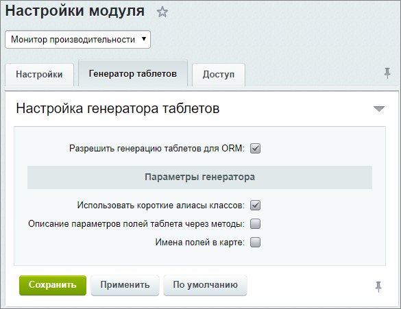
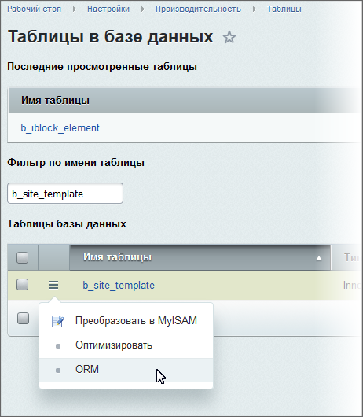

# Автоматическая генерация ORM-классов

**Навигация**
- [← Оглавление курса](index.md)
- [← Предыдущий: 3030 — Фильтр ORM](lesson_3030.md)
- [Следующий: 5824 — Использование ORM или почему поля из SELECT и ORDER BY автоматически попадают в GROUP BY →](lesson_5824.md)

Официальная страница урока: https://dev.1c-bitrix.ru/learning/course/index.php?COURSE_ID=43&LESSON_ID=2410

### Автоматическая генерация

Для использования генератора ORM классов перейдите на страницу Настройки &gt; Настройки продукта &gt; Настройки модулей &gt; Монитор производительности (модуль **Монитор производительности** (perfmon) должен быть установлен) и на вкладке

			Генератор таблетов

                    Вкладка доступна с версии **20.0.100** модуля **Монитор производительности** (perfmon).



		 отметьте поле **Разрешить генерацию таблетов для ORM**.

У генератора имеются следующие параметры:

| \| Параметр \| Описание \|<br>\| --- \| --- \| |
| --- |

## Использование генератора ORM классов до версии perfmon 20.0.100

Для использования генератора ORM классов перейдите на страницу Настройки &gt; Производительность &gt; Таблицы (должен быть установлен модуль **Монитор производительности** (perfmon)) и добавьте в адресную строку GET-параметр `orm=y`. Адрес будет выглядеть так: http://_ваш_сайт_/bitrix/admin/perfmon_tables.php?lang=ru&orm=y.

После перезагрузки страницы станет доступен пункт в меню - **ORM**.

После включения генератора таблетов на странице Настройки &gt; Производительность &gt; Таблицы
 в меню действий станет доступен пункт **ORM**.



**Примечание**: Имена файлов таблетов предлагаются с суффиксом **table** (Например: было `product.php`, стало - `producttable.php`).

**Примечание**: Описания полей создаются в виде создания объектов-наследников \Bitrix\Main\ORM\Data\Field (а не в виде ассоциативных массивов как было до версии **20.0.100** модуля **perfmon** )

Для полей типа `timestamp / date / datetime` анализируется дефолтное значение (**sql**). Если это функция, возвращающая текущее время, то в таблете создается функция для получения текущего времени/даты:

```

'default' => function()
{
	return new DateTime();
}
```

Другие особенности для полей:

- Поле помечается как `mandatory` только в случае, когда поле является обязательным и не имеет значения по-умолчанию;
- Поля типа `text / mediumtext` не помечаются как строка.

### Пример

Пример автоматического создания ORM-класса

Рассмотрим пример автоматического создания ORM-класса для штатной таблицы шаблонов сайта **b_site_template**. Воспользуемся пунктом **ORM** и получим следующий код:

```
<?php
namespace Bitrix\Site;

use Bitrix\Main\Localization\Loc,
	Bitrix\Main\ORM\Data\DataManager,
	Bitrix\Main\ORM\Fields\IntegerField,
	Bitrix\Main\ORM\Fields\StringField,
	Bitrix\Main\ORM\Fields\Validators\LengthValidator;

Loc::loadMessages(__FILE__);

/**
 * Class TemplateTable
 *
 * Fields:
 * <ul>
 * <li> ID int mandatory
 * <li> SITE_ID string(2) mandatory
 * <li> CONDITION string(255) optional
 * <li> SORT int optional default 500
 * <li> TEMPLATE string(255) mandatory
 * </ul>
 *
 * @package Bitrix\Site
 **/

class TemplateTable extends DataManager
{
	/**
	 * Returns DB table name for entity.
	 *
	 * @return string
	 */
	public static function getTableName()
	{
		return 'b_site_template';
	}

	/**
	 * Returns entity map definition.
	 *
	 * @return array
	 */
	public static function getMap()
	{
		return [
			new IntegerField(
				'ID',
				[
					'primary' => true,
					'autocomplete' => true,
					'title' => Loc::getMessage('TEMPLATE_ENTITY_ID_FIELD')
				]
			),
			new StringField(
				'SITE_ID',
				[
					'required' => true,
					'validation' => [__CLASS__, 'validateSiteId'],
					'title' => Loc::getMessage('TEMPLATE_ENTITY_SITE_ID_FIELD')
				]
			),
			new StringField(
				'CONDITION',
				[
					'validation' => [__CLASS__, 'validateCondition'],
					'title' => Loc::getMessage('TEMPLATE_ENTITY_CONDITION_FIELD')
				]
			),
			new IntegerField(
				'SORT',
				[
					'default' => 500,
					'title' => Loc::getMessage('TEMPLATE_ENTITY_SORT_FIELD')
				]
			),
			new StringField(
				'TEMPLATE',
				[
					'required' => true,
					'validation' => [__CLASS__, 'validateTemplate'],
					'title' => Loc::getMessage('TEMPLATE_ENTITY_TEMPLATE_FIELD')
				]
			),
		];
	}

	/**
	 * Returns validators for SITE_ID field.
	 *
	 * @return array
	 */
	public static function validateSiteId()
	{
		return [
			new LengthValidator(null, 2),
		];
	}

	/**
	 * Returns validators for CONDITION field.
	 *
	 * @return array
	 */
	public static function validateCondition()
	{
		return [
			new LengthValidator(null, 255),
		];
	}

	/**
	 * Returns validators for TEMPLATE field.
	 *
	 * @return array
	 */
	public static function validateTemplate()
	{
		return [
			new LengthValidator(null, 255),
		];
	}
}
File: /bitrix/modules/site/lang/ru/lib/templatetable.php
<?
$MESS["TEMPLATE_ENTITY_ID_FIELD"] = "";
$MESS["TEMPLATE_ENTITY_SITE_ID_FIELD"] = "";
$MESS["TEMPLATE_ENTITY_CONDITION_FIELD"] = "";
$MESS["TEMPLATE_ENTITY_SORT_FIELD"] = "";
$MESS["TEMPLATE_ENTITY_TEMPLATE_FIELD"] = "";
?>
Таблицы базы данных
```

Преобразовав этот результат нужным образом получим настоящий класс для работы с шаблонами, расположенный по пути `/bitrix/modules/site/lib/templatetable.php`.
