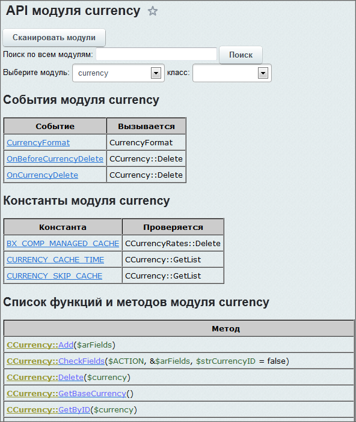
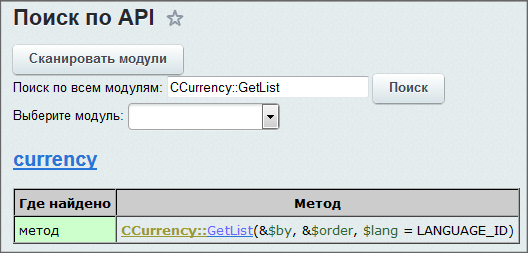
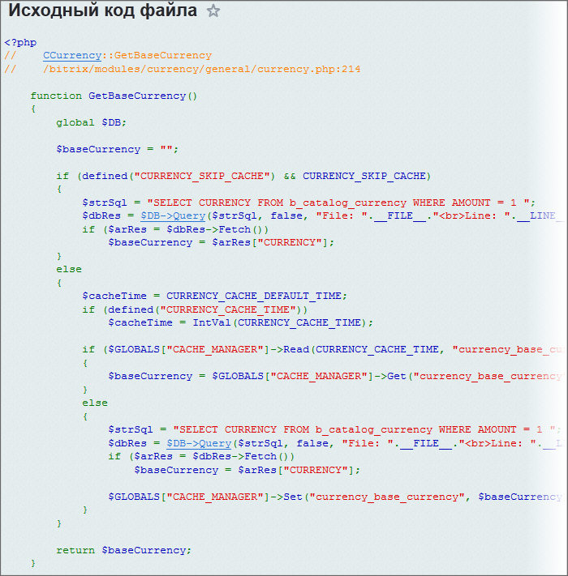

# Если нет описания API

**Навигация**
- [← Оглавление курса](index.md)
- [← Предыдущий: 3559 — Ошибки в D7](lesson_3559.md)
- [Следующий: 3112 — Практика. Некоторые классы →](lesson_3112.md)

Официальная страница урока: https://dev.1c-bitrix.ru/learning/course/index.php?COURSE_ID=43&LESSON_ID=2534

### Живое описание АПИ

При работе с Bitrix Framework очень большое значение имеет описание API. К сожалению составление описаний API нового функционала никогда не выходит одновременно с функционалом. Причин этого несколько:

- Создавать описание API и сам функционал одновременно невозможно;
- Создавать описание API сразу после выхода функционала – не практично, так как в первое время после выхода обнаруживается много багов, которые требуют исправления и, соответственно учета этих исправлений в документации.

Как правило, описание API пишется через некоторое время (обычно два-три месяца) после выхода релиза. К сожалению, бывает что и старый функционал не всегда полностью и верно описан: внесли изменения и забыли отметить в документации, например.

Для работы в таких условиях единственный выход у разработчика – смотреть сам код. В помощь для таких случаев есть специальный бесплатный модуль [Живое описание АПИ](https://marketplace.1c-bitrix.ru/solutions/bitrix.liveapi/), который сканирует текущие файлы ядра и выводит список доступных API функций и событий всех модулей.

Возможности модуля:

- Модуль доступен только пользователю с правами администратора системы.
- Все модули сканируются последовательно один раз, после этого рядом с **live_api.php** появляется файл **live_api.data.php**, который содержит данные о функциях;
- Можно выбрать не только модуль, но и интересующий класс;
- В исходном коде имеющиеся функции и методы Bitrix Framework отображены в виде ссылок, которые ведут на их исходный код этих функций и методов.

### Как работать?

- С помощью кнопки **Сканировать модули** отсканируйте текущее состояние.
- В полях формы выберите модуль, класс, или воспользуйтесь поиском.
  **Примечание**: Если будет выбран только модуль, то в форме отобразится все, относящееся к этому модулю.

Система автоматически отобразит все найденные сущности. По списку аргументов можно легко догадаться, что они означают.

**Например**, метод *CCurrency::GetList* (см. иллюстрацию выше) имеет два обязательных параметра: поле сортировки и порядок сортировки. Оба передаются по ссылке. Третий параметр язык, по умолчанию принимает значение текущего языка.

По клику на функцию открывается её описание в новом окне. Код функции читается прямо из файла, при этом уже скрипты не парсятся, вся необходимая информация передаётся в URL.

По клику на событие или константу открывается метод, где оно инициируется. Вызов события (константы) подсвечивается.

**Примечание**: Есть и [онлайн версия](http://bxapi.ru/) этого модуля, созданная [Антоном Долганиным](http://dev.1c-bitrix.ru/community/webdev/user/11948/).

**Примечание**: В файлах ядра D7 есть комментарии в PHPdoc, оставляемые разработчиками. Эти комментарии не всегда попадают в документацию по ряду причин, но они могут пригодиться разработчикам в работе.
