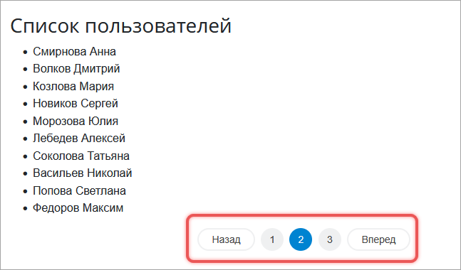

# Постраничная навигация

**Навигация**
- [← Оглавление курса](index.md)
- [← Предыдущий: 5824 — Использование ORM или почему поля из SELECT и ORDER BY автоматически попадают в GROUP BY](lesson_5824.md)
- [Следующий: 12866 — Концепция и архитектура →](lesson_12866.md)

Официальная страница урока: https://dev.1c-bitrix.ru/learning/course/index.php?COURSE_ID=43&LESSON_ID=2741

Постраничная навигация позволяет не загружать все записи сразу, а показывать их частями — по 10, 15 или 50 на странице.



Чтобы добавить навигацию к записям, выполните три действия.

1. Создайте объект навигации.
2. Выполните запрос к базе данных.
3. Передайте объект навигации компоненту для вывода ссылок.

### Как настроить объект навигации через API

#### Создать и сконфигурировать объект

Создайте объект постраничной навигации и укажите его поведение с помощью методов `allowAllRecords`, `setPageSizes`, `setRecordCount`.

```
$pagination = new \Bitrix\Main\UI\PageNavigation('nav-name');

/**
 * Конфигурируем
 */
$pagination
	// разрешаем показ всех записей
	->allowAllRecords(true)

	// указываем, какие варианты выбора страниц есть
	->setPageSizes([
		5,
		10,
		20,
		50,
		100,
	])

	// указываем общее число записей
	->setRecordCount($totalCount)
;
```

Идентификатор навигации, например `nav-name`, должен быть уникальным на странице. Он используется в URL: `?nav-name=page-3`.

**Классы навигации**

- `\Bitrix\Main\UI\PageNavigation` — работает с прямой навигацией,
- `\Bitrix\Main\UI\ReversePageNavigation` — отвечает за обратную навигацию,
- `\Bitrix\Main\UI\AdminPageNavigation` — создает навигацию в административном разделе.

#### Инициализировать навигацию из URL

Объект прочитает из адреса текущую страницу и количество записей с помощью метода `initFromUri()`.

```

$pagination->initFromUri();
```

Поддерживаются два формата:

- GET-параметры — `/items/?nav-name=page-3-size-20`,
- ЧПУ — `/items/nav-name/page-3/size-20/`.

#### Выполнить запрос к базе данных

В запросе передайте данные с помощью методов:

- `getLimit()` — максимальное количество записей,
- `getOffset()` — позицию записи, с которой начинать выборку.

```

$records = \Bitrix\Main\UserTable::query()
	->setLimit($pagination->getLimit())
	->setOffset($pagination->getOffset())
	->fetchCollection();
```

Если нужны фильтры, добавьте их в запрос.

```

$records = \Bitrix\Main\UserTable::query()
	->setFilter(['>ID' => 10])
	->setLimit($pagination->getLimit())
	->setOffset($pagination->getOffset())
	->fetchCollection();
```

Чтобы получить общее число записей, выполните отдельный запрос до основного:

```

$totalCount = \Bitrix\Main\UserTable::query()
	->setFilter(['>ID' => 10])
	->count();
$pagination->setRecordCount($totalCount);
```

Метод `count()` выполняет `SELECT COUNT(*)` и возвращает число. ORM не выполняет подсчет автоматически, чтобы избежать лишних запросов к базе.

На таблицах с сотнями тысяч или миллионами записей запрос `SELECT COUNT(*)` выполняется долго и создает нагрузку на базу. Если общее число не нужно, используйте [навигацию без COUNT](#navnocount).

### Как отобразить навигацию

Чтобы на странице отобразить ссылки, передайте объект навигации в компонент.

#### Компонент main.pagenavigation

Подключите компонент `main.pagenavigation` и передайте объект навигации через `NAV_OBJECT`. Компонент выведет ссылки.

```

$APPLICATION->IncludeComponent('bitrix:main.pagenavigation', '', [
	'NAV_OBJECT' => $pagination,
	'SEF_MODE' => 'Y', // включить ЧПУ
]);
```

В компоненте доступно четыре системных шаблона:

- `.default` — обычный вид,
- `admin` — для административной части,
- `grid` — компактный, для таблиц,
- `modern` — современный стиль.

#### Компонент main.ui.grid

Чтобы добавить навигацию в грид, передайте объект навигации в компонент `main.ui.grid`. Он выведет таблицу с колонками `HEADERS`, строками `ROWS` и постраничной навигацией `NAV_OBJECT`. Параметр `NAV_PARAMS` подключит ЧПУ для ссылок навигации.

```

$APPLICATION->IncludeComponent('bitrix:main.ui.grid', '', [
	'GRID_ID' => 'my_grid',
	'HEADERS' => [...],
	'ROWS' => $rows,
	'NAV_OBJECT' => $pagination,
	'NAV_PARAMS' => ['SEF_MODE' => 'Y'],
]);
```

#### Как кастомизировать шаблон

Чтобы создать собственный шаблон навигации, используйте методы объекта:

- `getRecordCount()` — возвращает число записей,
- `getPageCount()` — возвращает число страниц,
- `getCurrentPage()` — возвращает номер текущей страницы,
- `getPageSize()` — возвращает количество записей на странице,
- `allRecordsShown()` — возвращает `true`, если показаны все записи на одной странице,
- `getPageSizes()` — возвращает разрешенные размеры страниц `[5, 10, 20, ...]`,
- `allRecordsAllowed()` — определяет, можно ли показать все записи.

#### Как сформировать URL с параметрами навигации

Ссылки на нужные страницы можно сгенерировать вручную с помощью метода `addParams()`.

```

/**
 * Получаем ссылку на текущую страницу с параметрами навигации
 * Оба формата поддерживаются PageNavigation::initFromUri()
 */
$uri = new \Bitrix\Main\Web\Uri('https://example.ru/items/');
$pagination = new \Bitrix\Main\UI\PageNavigation('my-items');

// ЧПУ-формат
$isHumanUrl = true;
echo (string)$pagination->addParams(clone $uri, $isHumanUrl, 3);
// https://example.ru/items/my-items/page-3/

// GET-формат
$isHumanUrl = false;
echo (string)$pagination->addParams(clone $uri, $isHumanUrl, 3);
// https://example.ru/items/?my-items=page-3
```

### Большие таблицы

Если записей много, делать `COUNT` неэффективно. Используйте навигацию без точного подсчета.

#### Как работает навигация без COUNT

1. Запрашивайте на одну запись больше, чем нужно на странице.
2. Если «лишняя» запись получена, следующая страница существует.
3. Установите в навигацию приблизительное общее число записей: `позиция выборки + количество полученных записей`.
  ```
  $pagination = new \Bitrix\Main\UI\PageNavigation('users');
  $pagination
  	->allowAllRecords(false)
  	->setPageSize(20)
  	->initFromUri()
  ;
  $users = [];
  $queryResult = \Bitrix\Main\UserTable::query()
  	->setOffset($pagination->getOffset())
  	->setLimit(
  		$pagination->getLimit() + 1
  	)
  	->exec()
  ;
  foreach ($queryResult as $i => $user)
  {
  	if ($i === $pagination->getLimit())
  	{
  		break;
  	}
  	$users[] = $user;
  }
  $pagination->setRecordCount(
  	$pagination->getOffset() + $queryResult->getSelectedRowsCount()
  );
  ```
4. Подключите компонент, но скройте общее число.
  ```
  $APPLICATION->IncludeComponent('bitrix:main.pagenavigation', '', [
      'NAV_OBJECT' => $pagination,
      'SHOW_COUNT' => 'N', // не показывать общее количество
      'SEF_MODE' => 'Y',
  ]);
  ```

Для навигации без `COUNT` не включайте `allowAllRecords(true)`. Это позволит указать в URL полную выборку. В результате после вызова `initFromUri()` максимальное значение и начальная позиция не установятся.
