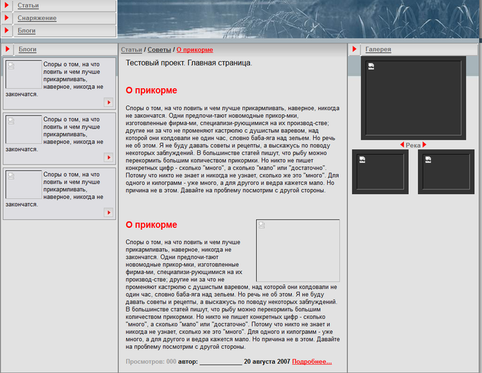

# #WORK_AREA# – Рабочая область

**Навигация**
- [← Оглавление курса](index.md)
- [← Предыдущий: 1923 — Добавление графики и стилей](lesson_1923.md)
- [Следующий: 4962 — Кастомизация шаблона компонента →](lesson_4962.md)

Официальная страница урока: https://dev.1c-bitrix.ru/learning/course/index.php?COURSE_ID=43&LESSON_ID=2748

> **#WORK_AREA#** - основная рабочая область. Рабочая область страницы, в которой размещаются собственно информационные материалы сайта. В качестве Основной рабочей области может подключаться как физический файл, так и создаваемый системой на основе комплексных компонентов, динамический код.

Поясним суть Рабочей области `#WORK_AREA#`. При создании шаблона мы загружали готовую нарезку дизайна, в которой предусмотрен текст в центральной части, колонка в правой части (фотогалерея), левая колонка с анонсами блогов. На данный момент все они: текст, левая и правая колонки входят что-то в **Header**, что-то в **Footer**. Если при формировании шаблона левая и правая колонки могут то включаться в **Footer** или **Header**, то исключаться из него, но основной текст всегда будет в `#WORK_AREA#`.

Если вы создавали сайт для тестов на установке демо-дистрибутива по способу описанному [здесь](http://dev.1c-bitrix.ru/learning/course/index.php?COURSE_ID=35&LESSON_ID=1991#add_site), то на вашем сайте отобразятся именно те лишние элементы, которые мы называли ранее. Это происходит потому, что используется та же папка для сайта, что и в демо-версии. Соответственно, отображаются элементы уже размещённые на странице **index.php**.

- Скопируйте в буфер обмена текст статьи, которая у нас сейчас видна на шаблоне. Только текст, без картинки!
- С Публичной части откройте для редактирования индексную страницу сайта в визуальном редакторе. (Либо откройте для редактирования файл **index.php** в корне сайта)
- Удалите из страницы все тексты и ярлыки компонентов. Кстати, этим действием вы удалили весь тот «непрошенный» текст, видео и картинки, которые появились у нас на сайте после вставки дизайна в шаблон.
- В самом начале страницы введите текст: Тестовый проект. Главная страница.
- В поле редактора вставьте текст из буфера обмена.
- Сохраните внесенные изменения.

Вы увидите, что статья у нас теперь отражена дважды: один раз как часть #WORK_AREA# (то, что мы только что добавили), второй раз как часть Footer’а (текст, который стоял раньше):




Вот из Footer’а нам и надо текст убрать.

- Удалите текст из кода шаблона сайта, вместе со строкой и ячейкой. Метки:
  ```
  <!-- #Begin_Article -->
  <!-- #End_Article -->
  ```
- Сохраните внесенные изменения.
- Теперь при просмотре сайта с публички текст будет отображаться только один раз и он выводится из Рабочей области #WORK_AREA#.
