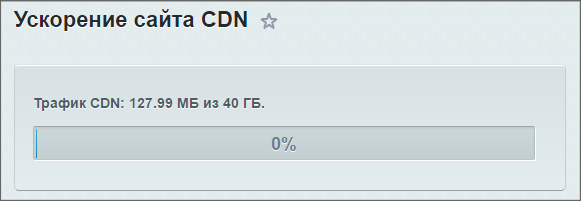
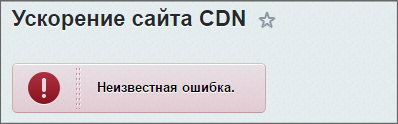

# Исключения

**Навигация**
- [← Оглавление курса](index.md)
- [← Предыдущий: 3524 — Пространства имён](lesson_3524.md)
- [Следующий: 3511 — Приложения и контекст →](lesson_3511.md)

Официальная страница урока: https://dev.1c-bitrix.ru/learning/course/index.php?COURSE_ID=43&LESSON_ID=2803

### Исключения

В D7 используется механизм исключений (**exceptions**).

> **Исключительная ситуация** (в которой может быть выброшено исключение) - нетипичная ситуация, при которой не имеет смысла продолжать выполнение базового алгоритма.

**Примеры**

Если пользователь отправил форму с пустым полем **Имя**, то это - не исключительная ситуация. Это обычная ожидаемая ситуация, которая должна быть обработана соответствующим образом.

Если же при вызове метода API для изменения элемента инфоблока был указан пустой **id** элемента, то это исключительная ситуация. Она не ожидаема и продолжать изменение элемента не имеет смысла.


Если метод ожидает **id** пользователя, а вы передаёте строку, то это - исключение, так как метод не знает что делать со строкой в данном случае.

Если метод *GetList* принимает фильтр **timestamp**, а разработчик написал **tymestamp**, то это будет исключением.

### Иерархия исключений

Все исключения D7 наследуются от встроенного в PHP класса *\Exception*, который присутствует в PHP начиная с версии 5.1. У данного класса есть не переопределяемые методы *getMessage()*, *getCode()*, *getFile()*, *getLine()*, *getTrace()*, *getTraceAsString()*, а так же переопределяемый метод *__toString()*.

Есть понятие иерархии исключений. Оно нужно для того, чтобы можно было их (исключения) обработать, посмотреть какое из них сработало и в зависимости от этого предпринять какие-то действия. Общая схема иерархии имеет вид:

- `\Exception`

  - [Bitrix\Main\SystemException](http://dev.1c-bitrix.ru/api_d7/bitrix/main/systemexception/index.php) - базовый класс всех системных исключений

    - [\Bitrix\Main\IO\IoException](http://dev.1c-bitrix.ru/api_d7/bitrix/main/io/ioexception/index.php) - базовый класс всех исключений файлового ввода-вывода

      - [\Bitrix\Main\IO\FileDeleteException](http://dev.1c-bitrix.ru/api_d7/bitrix/main/io/filedeleteexception/index.php) - исключение при удалении файла
      - [\Bitrix\Main\IO\FileNotFoundException](http://dev.1c-bitrix.ru/api_d7/bitrix/main/io/filenotfoundexception/index.php) - отсутствие требуемого файла
      - [\Bitrix\Main\IO\FileOpenException](http://dev.1c-bitrix.ru/api_d7/bitrix/main/io/fileopenexception/index.php) - исключение при открытии файла
      - [\Bitrix\Main\IO\InvalidPathException](http://dev.1c-bitrix.ru/api_d7/bitrix/main/io/invalidpathexception/index.php) - не корректный путь
      - [\Bitrix\Main\IO\FileNotOpenedException](http://dev.1c-bitrix.ru/api_d7/bitrix/main/io/filenotopenedexception/index.php) - файл не открыт
    - [\Bitrix\Main\Config\ConfigurationException](http://dev.1c-bitrix.ru/api_d7/bitrix/main/config/configurationexception/index.php) - ошибка в конфигурации
    - [Bitrix\Main\Security\SecurityException](https://dev.1c-bitrix.ru/api_d7/bitrix/main/security/securityexception/index.php) - ошибка безопасности

      - [\Bitrix\Main\Security\Sign\BadSignatureException](http://dev.1c-bitrix.ru/api_d7/bitrix/main/security/sign/badsignatureexception/index.php) - исключения ошибок подписи.
    - [\Bitrix\Main\ArgumentException](http://dev.1c-bitrix.ru/api_d7/bitrix/main/argumentexception/index.php) - базовый класс исключений, связанных с входящими параметрами методов

      - [\Bitrix\Main\ArgumentNullException](http://dev.1c-bitrix.ru/api_d7/bitrix/main/argumentnullexception/index.php) - параметр должен быть не пустым
      - [\Bitrix\Main\ArgumentOutOfRangeException](http://dev.1c-bitrix.ru/api_d7/bitrix/main/argumentoutofrangeexception/index.php) - параметр вне допустимого диапазона
      - [\Bitrix\Main\ArgumentTypeException](http://dev.1c-bitrix.ru/api_d7/bitrix/main/argumenttypeexception/index.php) - параметр не допустимого типа
    - [\Bitrix\Main\DB\Exception](http://dev.1c-bitrix.ru/api_d7/bitrix/main/db/exception/index.php) - базовый класс для исключений БД

      - [\Bitrix\Main\DB\ConnectionException](http://dev.1c-bitrix.ru/api_d7/bitrix/main/db/connectionexception/index.php\) - исключение при соединении
      - [\Bitrix\Main\DB\SqlException](http://dev.1c-bitrix.ru/api_d7/bitrix/main/db/sqlexpression/index.php) - исключение при выполнении запроса
    - [\Bitrix\Main\NotSupportedException](http://dev.1c-bitrix.ru/api_d7/bitrix/main/notsupportedexception/index.php) - вызывается, если функционал не поддерживается
    - [\Bitrix\Main\NotImplementedException](http://dev.1c-bitrix.ru/api_d7/bitrix/main/notimplementedexception/index.php) - вызывается, если функционал должен поддерживаться, но пока не реализован
  - [\Bitrix\Main\ObjectPropertyException](http://dev.1c-bitrix.ru/api_d7/bitrix/main/objectpropertyexception/index.php) - исключение выводится когда свойства объекта не валидны.
  - [\Bitrix\Main\ObjectNotFoundException](http://dev.1c-bitrix.ru/api_d7/bitrix/main/objectnotfoundexception/index.php) - выводит исключение когда объект не существует.
  - [\Bitrix\Main\ObjectException](http://dev.1c-bitrix.ru/api_d7/bitrix/main/objectexception/index.php) - исключение выводится, если объект не может быть создан.
  - [\Bitrix\Main\LoaderException](http://dev.1c-bitrix.ru/api_d7/bitrix/main/loader/loaderexception/index.php) - исключение в загрузчике

`Bitrix\Main\SystemException` базовый класс всех системных исключений, от которого наследуются все остальные исключения. Данный класс переопределяет конструктор системного класса `\Exception`. Если системный класс на вход принимает сообщение и код ошибки:

```
<?php
public function __construct($message = null, $code = 0, Exception $previous = null);
```

, то [конструктор](http://dev.1c-bitrix.ru/api_d7/bitrix/main/systemexception/__construct.php) `Main\SystemException` на вход принимает кроме этого файл в котором было выброшено исключение и номер строки:

```
<?php
public function __construct($message = "", $code = 0, $file = "", $line = 0, \Exception $previous = null);
```

Выбрасываемое исключение должно иметь максимально подходящий тип.

Если ваш метод создает исключение, то необходимо описать это в [phpDoc](https://docs.phpdoc.org/3.0/classes/phpDocumentor-Descriptor-Tag-ThrowsDescriptor.html) метода.

В Bitrix Framework это делается таким образом:

```
 /**
     * Searches connection parameters (type, host, db, login and password) by connection name
     *
     * @param string $name Connection name
     * @return array|null
     * @throws \Bitrix\Main\ArgumentTypeException
     * @throws \Bitrix\Main\ArgumentNullException
     */
    protected function getConnectionParameters($name) {}
```

### Игнорирование исключений

Иногда необходимо чтобы произошедшая ошибка не приводила к прерыванию выполнения скрипта. Пример такой реализации можно рассмотреть в самом продукте в виде работы  административной страницы модуля CDN.



Если включён CDN, то вверху страницы отображается информация о расходе трафика. В коде это реализовано так:

```
$cdn_config = CBitrixCloudCDNConfig::getInstance()->loadFromOptions();
$APPLICATION->SetTitle(GetMessage("BCL_TITLE"));
require($_SERVER["DOCUMENT_ROOT"]."/bitrix/modules/main/include/prolog_admin_after.php");
if (is_object($message))
	echo $message->Show();

if (CBitrixCloudCDN::IsActive())
{
	try
	{
		if ($cdn_config->getQuota()->isExpired())
			$cdn_config->updateQuota();

		$cdn_quota = $cdn_config->getQuota();
		if ($cdn_quota->getAllowedSize() > 0.0 || $cdn_quota->getTrafficSize() > 0.0)
		{
			CAdminMessage::ShowMessage(array(
				"TYPE" => "PROGRESS",
				"DETAILS" => ''.GetMessage("BCL_CDN_USAGE", array(
					"#TRAFFIC#" => CFile::FormatSize($cdn_quota->getTrafficSize()),
					"#ALLOWED#" => CFile::FormatSize($cdn_quota->getAllowedSize()),
				)).'#PROGRESS_BAR#',
				"HTML" => true,
				"PROGRESS_TOTAL" => $cdn_quota->getAllowedSize(),
				"PROGRESS_VALUE" => $cdn_quota->getTrafficSize(),
			));
		}
	}
	catch (Exception $e)
	{
		CAdminMessage::ShowMessage($e->getMessage());
	}
}
```

По коду видно, что если CDN активен, то формируется прогресс-бар с выводом информации о расходе трафика. Но если в ходе выполнения этого кода произойдёт ошибка, то будет выброшено исключение. Это исключение будет перехвачено так как весь код находится в `try` и сработает ветка, после `catch`, где  выводится сообщение об ошибке штатной функцией. Выполнение скрипта при этом не будет прервано:


