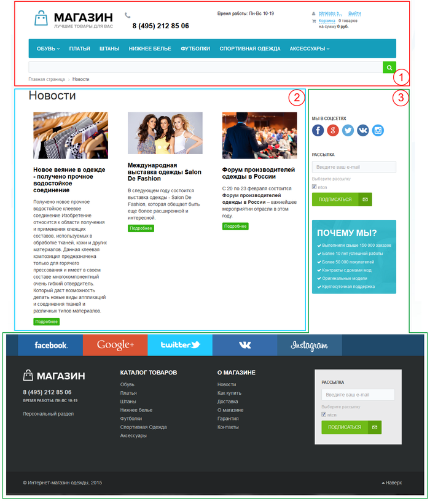

# Что такое страница

**Навигация**
- [← Оглавление курса](index.md)
- [← Предыдущий: 4773 — Сайт в понятии Bitrix Framework](lesson_4773.md)
- [Следующий: 3486 — Язык и языковые файлы →](lesson_3486.md)

Официальная страница урока: https://dev.1c-bitrix.ru/learning/course/index.php?COURSE_ID=43&LESSON_ID=2814

Тему урока можно изучить в новом формате — [в документации по Bitrix Framework](https://docs.1c-bitrix.ru/pages/cms-basics/page-templates.html). В ней улучшена структура, описание, примеры.

### Структура

> **Страница** представляет из себя PHP файл, состоящий из пролога, тела страницы (основной рабочей области) и эпилога:
>
> - header
> - workarea
> - footer

Формирование страницы сайта производится динамически, на основе используемого шаблона, данных, выводимых компонентами, и статической информации, размещенной на ней. Создание шаблонов сайта и размещение на них компонентов осуществляется разработчиками сайтов.

В общем случае все страницы сайта имеют следующую структуру:

1 Верхняя - **header**. Включает в себя, как правило, верхнюю и левую часть дизайна со статической информацией (логотипом, лозунгом и так далее), верхним горизонтальным меню и левым меню (если они есть в дизайне). Может включать в себя информационные динамические материалы.

2 Основная рабочая область - **work area**. Рабочая область страницы, в которой размещаются собственно информационные материалы сайта. В качестве Основной рабочей области может подключаться как физический файл, так и создаваемый системой на основе комплексных компонентов, динамический код.

Если в качестве Основной рабочей области подключается физический файл, то такая страница называется **статической**. Если подключается динамический код, то такая страница называется **динамической**.

3 Нижняя - **footer**. Включает в себя, как правило, статическую информацию (контактная информация, сведения об авторе и владельце сайта и так далее), нижнее горизонтальное меню и правое меню (если они есть в дизайне). Может включать в себя информационные материалы.

**Примечание**: Подробнее со структурой страницы можно познакомиться в уроке [Шаблон дизайна](lesson_2820.md).

**Верхняя** и **нижняя** части дизайна формируются на основе шаблона дизайна сайта. Т.е. информация, отображаемая в данных областях, определяется параметрами шаблона сайта.

### Шаблоны и свойства

#### Шаблоны

> **Шаблон страницы** - это PHP файл, содержимое которого соответствует правилам формирования структуры страницы. Шаблоны могут использоваться при создании новой страницы.

Шаблоны хранятся в каталогах:

- `/bitrix/templates/.default/page_templates/`;
  	`/bitrix/templates/ID_шаблона_сайта/page_templates/`.

В каждом таком каталоге могут находиться непосредственно сами файлы шаблонов страниц, а также служебный файл **.content.php**, основная задача которого - хранить описания и порядок сортировки шаблонов страниц.

#### Свойства

Свойства раздела хранятся в файле **.section.php** соответствующего каталога (раздела сайта). Свойства страницы задаются, как правило, либо в теле страницы, либо между служебной частью и визуальной частью пролога.

Свойства раздела автоматически наследуются всеми подразделами и страницами данного раздела. При необходимости вы можете отредактировать свойства любой отдельно взятой страницы раздела, подправив ее параметры под конкретную ситуацию.
