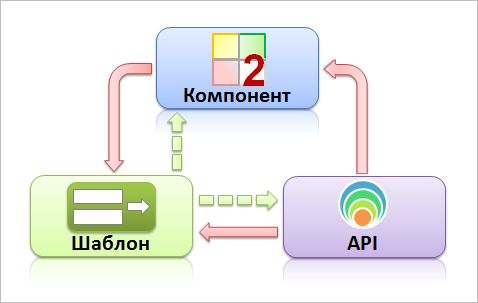

# Архитектура продукта

**Навигация**
- [← Оглавление курса](index.md)
- [← Предыдущий: 3488 — HTTP POST запросы](lesson_3488.md)
- [Следующий: 2819 — Права доступа →](lesson_2819.md)

Официальная страница урока: https://dev.1c-bitrix.ru/learning/course/index.php?COURSE_ID=43&LESSON_ID=2817

Тему урока можно изучить в новом формате — [в документации по Bitrix Framework](https://docs.1c-bitrix.ru/pages/framework/architecture.html). В ней улучшена структура, описание, примеры.

Любое программное обеспечение, развиваясь, должно соответствовать заявленной изначально цели. Эту задачу решает архитектурное проектирование. Архитектура продукта - подход к проектированию, гарантирующий, что программное обеспечение будет отвечать своему предназначению.

> **Архитектура программного обеспечения** -  (англ. software architecture) — это структура программы или вычислительной системы, которая включает программные компоненты, видимые снаружи свойства этих компонентов, а также отношения между ними.

Архитектура Bitrix Framework решает следующие задачи:

- **Преемственность**. Каждый новый релиз продуктов поддерживает все предыдущие решения и технологии. Это позволяет осуществлять переход на новые версии продуктов сайтов, созданных на практически любой предыдущей версии.
- **Единство принципов работы** с любой версией и любым решением на базе системы.
- **Безопасность**. Архитектура позволяет создать достаточный уровень безопасности для сайтов любой направленности.
- **Масштабируемость**. Не наложено никаких ограничений на развитие проектов по мере роста контента, сервисов, числа пользователей.
- **Производительность**. Скорость работы системы зависит от качества настройки ее элементов, то есть в большей степени на производительность влияет уровень подготовки разработчика проекта, возможности хостинга.
- **Возможность развития системы** усилиями сторонних разработчиков. Архитектура не накладывает никаких ограничений на создание собственных модулей, компонентов, решений.

### Архитектура MVC для Bitrix Framework

Шаблон **MVC** для Bitrix Framework:

- **Модель** - это API;
- **Представление** - это шаблоны;
- **Контроллер** - это компонент.

Сплошные линии - прямые связи, пунктир - косвенные связи.

## Немного теории

> **MVC** (Model-view-controller, «Модель-представление-поведение», «Модель-представление-контроллер») — архитектура программного обеспечения, в которой модель данных приложения, пользовательский интерфейс и управляющая логика разделены на три отдельных компонента, так, что модификация одного из компонентов оказывает минимальное воздействие на другие компоненты.

Шаблон MVC позволяет разделить данные, представление и обработку действий пользователя на три отдельных компонента.

- **Модель (Model)**. Модель предоставляет данные (обычно для **Представления**), а также реагирует на запросы (обычно от **Контроллера**), изменяя своё состояние.
- **Представление (View)**. Отвечает за отображение информации (пользовательский интерфейс).
- **Поведение (Controller)**. Интерпретирует данные, введённые пользователем, и информирует модель и представление о необходимости соответствующей реакции.

Важно отметить, что как **Представление**, так и **Поведение**, зависят от **Модели**. Однако **Модель** не зависит ни от **Представления**, ни от **Поведения**. Это одно из ключевых достоинств подобного разделения. Оно позволяет строить **Модель** независимо от визуального **Представления**, а также создавать несколько различных **Представлений** для одной **Модели**.

### Структура

Bitrix Framework по уровням архитектуры структуру можно описать так:

| **Bitrix Framework**:
 модули
 компоненты
 файлы страниц | **сайт**:
 шаблон
 компоненты
 страница | **компонент**:
 вызов
 параметры
 шаблон | **страница**:
 header
 workarea
 footer |
| --- | --- | --- | --- |

### Элементы структуры Bitrix Framework

#### Модули

> **Модуль** - это **модель** данных и API для доступа к этим данным.  Статические методы классов модуля могут вызываться в компонентах, шаблонах, других модулях. Также внутри контекста *Bitrix Framework* могут создаваться экземпляры классов.

Несколько десятков модулей системы содержат набор функций, необходимых для реализации какой-то глобальной, большой задачи: веб-формы, работа интернет-магазина, организация социальной сети и другие. Модули также содержат инструментарий для администратора сайта для управления этими функциями.

**Внимание!** На уровне ядра и модулей вмешательство в работу системы запрещено.

**Ядро продукта** - файлы, находящиеся в директории `/bitrix/modules/`, а также файлы системных компонентов: `/bitrix/components/bitrix/`.

#### Компоненты

> **Компонент** - это **контроллер** и **представление** для использования в публичном разделе. Компонент с помощью API одного или нескольких модулей манипулирует данными. Шаблон компонента (представление) выводит данные на страницу.

Компоненты входят в состав модулей, но решают более узкую, частную задачу — например, выводят список новостей или товаров. Вносить свои изменения в код продукта рекомендуется на уровне компонентов. Программист может модифицировать их как угодно, использовать свои наработки и использовать неограниченное число шаблонов на каждый из компонентов. На одной странице сайта может располагаться несколько компонентов, кроме того, их можно включать в шаблон сайта. Таким образом, программист имеет возможность собрать сайт как конструктор, после чего доработать необходимые компоненты для получения желаемого результата как в функциональном, так и в визуальном плане.

Чтобы работать с API нужно просто понять структуру компонентов Bitrix Framework.

**Примечание**: Модуль - это набор каких-либо сущностей. Компонент - это то, что этими сущностями управляет.

Посмотрим на примере модуля **Инфоблоки**. Этот модуль представляет собой совокупность таблиц в базе данных и php-классов, которые могут проводить какие-либо операции с данными из таблиц (например, *CIBlockElement::GetList()* или *CIBlockElement::GetByID ()*). Компонентом является уже, например, **Новость детально**, который имеет собственные настройки (показывать дату, картинку и т.д. и т.п.) и работает с методами php-классов модуля.

#### Страница

Страница представляет из себя PHP файл, состоящий из пролога, тела страницы (основной рабочей области) и эпилога. Формирование страницы сайта производится динамически на основе используемого шаблона страницы, данных выводимых компонентами и статической информации, размещенной на странице.

|  |
| --- |

Видео по теме:

- [Программная архитектура веб-систем на Битриксе: от простого сайта до веб-кластера](https://rutube.ru/video/b860564737e9d32b75763a867b4407cd/)
- [Особенности проектирования под Битрикс](https://rutube.ru/video/b8216b9a35d0cd577d798a310c7a2400/)
