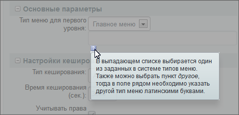

# Структура компонента

**Навигация**
- [← Оглавление курса](index.md)
- [← Предыдущий: 2827 — Простые и комплексные компоненты](lesson_2827.md)
- [Следующий: 2749 — Структура комплексного компонента →](lesson_2749.md)

Официальная страница урока: https://dev.1c-bitrix.ru/learning/course/index.php?COURSE_ID=43&LESSON_ID=2818

Компонент хранит все, что ему нужно для работы, в своей папке. Поэтому их можно легко переносить между проектами.


### Структура


**Важно**: файлы компонентов нельзя использовать по отдельности. Компонент - это единое целое, он обладает свойством неделимости.

#### Структура файлов

Папка компонента может содержать следующие подпапки и файлы:

- подпапку `/lang`, в которой расположены файлы языковых сообщений (переводов) компонента. В ней также могут размещаться папки помощи `/help`.
- подпапку `/templates`, в которой расположены шаблоны вывода (отображения) компонента. Эта подпапка может отсутствовать, если у компонента нет шаблонов вывода.
- файл **component.php**, который содержит логику (код) компонента. Задача этого файла - сформировать из полученных параметров (`$arParams`) массив `$arResult`, который впоследствии попадет в шаблон компонента.  Этот файл должен присутствовать в папке компонента, если только логика компонента не размещена в файле **class.php**.
- файл [.description.php](lesson_2828.md), который содержит название, описание компонента и его положение в дереве логического размещения (для редактора). Этот файл должен всегда присутствовать в папке компонента. Его отсутствие не скажется на работе компонента, но размещение компонента через визуальный редактор станет невозможным.
- файл [.parameters.php](lesson_2132.md), который содержит описание входных параметров компонента для редактора. Если у компонента есть входные параметры, то этот файл должен присутствовать в папке компонента.
- файл [class.php](lesson_2028.md) для поддержки ООП-компонентов. В этом файле так же может размещаться логика (код) компонента.
- файл **script.js**, может подключаться из шаблона, а может из
  			кода компонента
                      $APPLICATION-&gt;AddHeadScript($this-&gt;GetPath().'/script.js');
  		.
- любые другие папки и файлы с ресурсами, необходимыми компоненту, например, папка `/images`.

#### Общая структура компонента

```
<?if(!defined("B_PROLOG_INCLUDED") || B_PROLOG_INCLUDED!==true)die();?>
<?
	//Проверяем и инициализируем входящие параметры компонента
	if(вывод компонента находится в валидном кеше)
		{
		//Вывод данных из кеша
		}
	else
		{
		//Запрос данных и формирование массива $arResult в соответствии со
		//структурой,описанной в файле помощи компонента
		$this->IncludeComponentTemplate();
		//Кеширование вывода
		}
?>
```

### Папки локализаций

Компоненты и их шаблоны поддерживают возможность вывода пользовательских сообщений на различных языках. Так, например, если компонент выводит содержимое инфоблока, это содержимое может понадобиться предварить строковой константой. Например, «Здесь вы видите содержимое инфоблока». Пользователь же может перейти, например, в англоязычную версию сайта - и в этом случае эта константа может быть для него автоматически выведена на английском языке.

Для реализации этой функции при выводе строковых констант выводится не сама константа, а вызывается спецфункция, а в качестве аргумента ей передаётся идентификатор этой константы.

**Пример**:

В файле **template.php** без локализации:

```
<?echo “Торговый каталог”?>
```

В файле **template.php** с локализацией:

```
<?echo GetMessage(“CATALOG”)?>
```

В этом случае в файле `/lang/ru/template.php` пишем:

```
<?$MESS[“CATALOG”] = “Торговый каталог”;?>
```

В папке `/lang` для каждой языковой версии создаётся папка с названием языка (например, `/ru`, `/en` и т.п.), в которой и размещаются файлы языковых сообщений. Рекомендуется называть файл языковых сообщений для какого-либо файла компонента так же, как называется этот файл. В этих файлах находятся массивы, ключами для которых являются идентификаторы констант, а значениями - сами константы, переведенными на соответствующий язык.

Рекомендуется располагать файлы в той же иерархии относительно папки `/lang/код_языка/`, в которой файл располагается относительно папки компонента. Например, языковой файл с английскими фразами для файла `/install/uninstall.php` рекомендуется располагать по пути `/lang/en/install/uninstall.php`. Подпапка `/lang` может отсутствовать, если в компоненте нет зависящих от языка фраз.

Папки локализаций создаются отдельно для компонентов и для каждого из шаблонов.

**Как поменять стандартные надписи в интерфейсе**.

Скопировать шаблон компонента для того, чтобы его можно было кастомизировать (если он еще не кастомизирован).
Затем либо:

- С помощью модуля **Перевод**: Настройки &gt; Локализация.
- Либо же вручную редактируете языковые файлы `/bitrix/templates/имя_шаблона_сайта/components/имя­_компонента/templates/имя_шаблона/lang/ru/template­.php`.

**Подключение языкового файла (файла перевода) компонента**

Языковые файлы в компоненте и всех его стандартных файлах (**component.php**, **.description.php**, **.parameters.php**) подключаются автоматически. В других файлах компонента языковые файлы можно подключить командой:

`$this->IncludeComponentLang($relativePath = "", $lang = False)`

где:

`$relativePath`- путь к файлу относительно папки компонента,

`$lang`- язык. Если передается **False**, то используется текущий язык.

Пример: `$this->IncludeComponentLang("myfile.php");`

### Подсказки в компонентах

*Bitrix Framework* позволяет создать подсказки к параметрам компонента:



Файл создаётся в языковой папке `/lang`. В файле - массив `$MESS`, в котором ключами являются параметры компонента c добавлением суффикса `_TIP`, значениями - подсказки. В качестве примера:

```
$MESS["IBLOCK_TYPE_TIP"] = "Это подсказка для типа инфоблока";
$MESS["IBLOCK_ID_TIP"] = "Это подсказка для ID инфоблока";
$MESS["SORT_BY1_TIP"] = "Это подсказка для первой сортировки";
```

Нет необходимости создавать отдельный lang-файл с подсказками. Их достаточно сохранить в lang-файле **.parameters.php** (как для компонента, так и для шаблона компонента). Формат подсказок прежний.

Подсказки для параметров компонента `IBLOCK_TYPE`, `IBLOCK_ID`, `SORT_BY1` и `SORT_ORDER1`.

Ряд стандартных параметров (`CACHE_TIME`, `AJAX_MODE` и другие) имеет несколько подсказок. Для `CACHE_TIME`:

- `CACHE_TIME` - время кеширования;
- `CACHE_TYPE` - тип кеширования.


Для страничной адресации:

- `DISPLAY_TOP_PAGER` - показывать постраничку над списком;
- `DISPLAY_BOTTOM_PAGER` - показывать постраничку под списком;
- `PAGER_TITLE` - название элементов в постраничке;
- `PAGER_SHOW_ALWAYS` - показывать постраничку всегда;
- `PAGER_TEMPLATE` - имя шаблона постранички;
- `PAGER_DESC_NUMBERING` - обратная адресация;
- `PAGER_DESC_NUMBERING_CACHE_TIME` - время кеширования обратной адресации.

**Внимание!** Нельзя делать подсказки про запас (создать, но оставить пустыми): перестанут показываться настройки компонента.
