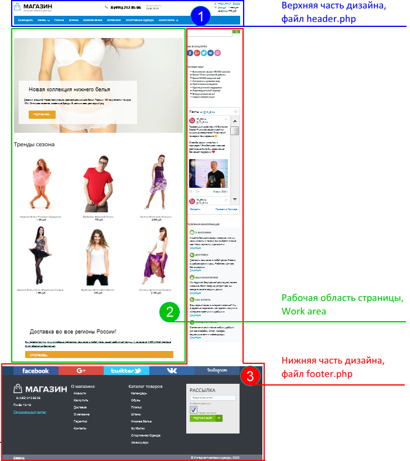
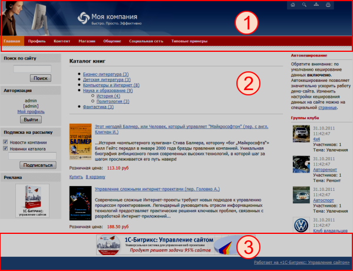
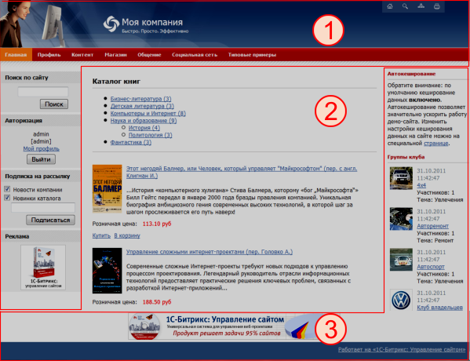
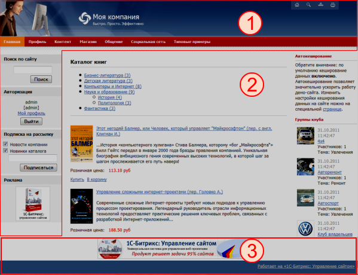
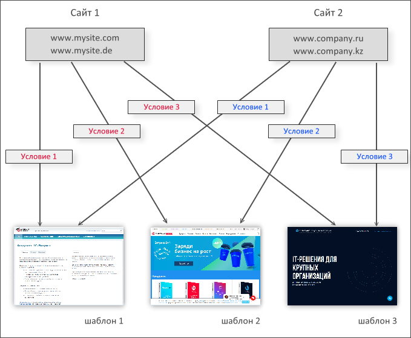

# Что такое Шаблон сайта

**Навигация**
- [← Оглавление курса](index.md)
- [← Предыдущий: 3213 — Техническое задание на сайт](lesson_3213.md)
- [Следующий: 3232 — Создание и управление шаблоном →](lesson_3232.md)

Официальная страница урока: https://dev.1c-bitrix.ru/learning/course/index.php?COURSE_ID=43&LESSON_ID=2820

Тему урока можно изучить в новом формате — [в документации по Bitrix Framework](https://docs.1c-bitrix.ru/pages/cms-basics/site-templates.html). В ней улучшена структура, описание, примеры.


### Файлы и композиция

> **Шаблон дизайна** - это внешний вид сайта, в котором определяется расположение различных элементов на сайте, художественный стиль и способ отображения страниц. Включает в себя программный html-код, графические элементы, таблицы стилей, дополнительные файлы для отображения контента. Может также включать в себя шаблоны компонентов, шаблоны готовых страниц и сниппеты.

В общем случае шаблон сайта задает «обрамление» страницы, а за вывод динамической информации отвечают [Визуальные компоненты](https://dev.1c-bitrix.ru/learning/course/index.php?COURSE_ID=43&CHAPTER_ID=758).

Шаблон сайта определяет:

- оформление сайта (дизайн, верстку страниц, набор основных каскадных стилей);
- типы меню и их расположение;
- наличие рекламных областей (областей для размещения баннеров);
- наличие включаемых областей в шаблоне и страницах сайта;
- наличие в дизайне сайта формы авторизации, оформления подписки и т.д.

|  | #### Файлы шаблона |
| --- | --- |

В шаблон сайта входят:

- каталог `/components` – предназначен для шаблонов компонентов;
- каталог `/images` – предназначен для картинок шаблона (которые не зависят от просматриваемой страницы), копируется из верстки сайта;
- каталог `/include_areas` – содержит включаемые области шаблона;
- каталог `/lang` – содержит файлы языковых сообщений;
- каталог `/page_templates` – для шаблонов страниц и редактируемых областей;
- каталог `/snippets` – содержит сниппеты – маленькие фрагменты html-кода для ускорения работы контент-менеджера по созданию часто встречающихся блоков кода;
- каталог `/themes` – тема оформления шаблона;
- файл **header.php** – часть шаблона ДО контента;
- файл **footer.php** – часть шаблона ПОСЛЕ контента;
- файл **description.php** – название и описание шаблона;
- файл **.styles.php** – описания стилей для визуального редактора страниц;
- файл **template_styles.css** – стили шаблона (стили применяемые в самом шаблоне дизайна сайта);
- файл **styles.css** – стили для контента и включаемых областей. Эти стили можно применять в визуальном редакторе.

|  | #### Композиция шаблона |
| --- | --- |

Композицию шаблона сайта строят из трех основных частей:



**Header** - верхняя часть дизайна, заголовок. Включает в себя, как правило, верхнюю и левую часть дизайна со статической информацией (логотипом, слоганом и так далее), верхним горизонтальным меню и левым меню (если они есть в дизайне). Может включать в себя информационные динамические материалы. Хранится в отдельном файле `.../<идентификатор_шаблона>/header.php`.

**Work area** - рабочая область страницы, в которой размещаются собственно информационные материалы сайта. Рабочая область - это все создаваемые пользователями документы, хранящиеся в файлах `<имя_документа>.php` в соответствующих папках сайта. В шаблоне сайта рабочая область помечается разделителем `#WORK_AREA#`, который используется для указания границы между верхней и нижней частью дизайна. В этом месте будет выполняться подключение рабочей области страницы сайта. Сохранение шаблона без этого разделителя невозможно.

**Footer** - нижняя часть дизайна со статической информацией (как правило: контактная информация, сведения об авторе и владельце сайта и так далее), нижним горизонтальным меню и правым меню (если они есть в дизайне). Может включать в себя информационные материалы. Хранится в отдельном файле `.../<идентификатор_шаблона>/footer.php`.

Композиция может быть любой, главное: не нарушить порядок следования составных частей.

## Несколько типовых примеров композиций

1. Header
2. Work Area
3. Footer







Выбор того или иного варианта композиции сайта - дело опыта и вкуса. Каждый из них имеет свои плюсы и минусы. Чтобы правильно выбрать вариант композиции для своего сайта, нужно понимать принципы работы со статической информацией, компонентами, динамически выводящими информацию, и то, как они взаимодействуют между собой. Кроме того, необходимо ясно представлять квалификацию тех, кто будет заниматься поддержкой сайта, и, собственно, сам тип выводимой информации.

Статическая информация, которая не нуждается (либо редко нуждается) в замене, как правило, размещается в статических зонах **Footer** и **Header**. Заменить ее можно в кодах самих файлов, но делать это придется квалифицированному разработчику, либо разработчик должен организовать такую замену с помощью компонентов системы силами редакторов сайта.

Помимо статической информации, в шаблоне и в рабочей области могут располагаться:

- Визуальные компоненты
- Включаемые области
- Произвольный PHP-код

Эти элементы сайта предназначены для вывода динамической информации.

### Хранение и подключение

|  | #### Где хранятся шаблоны |
| --- | --- |

Все используемые в системе шаблоны хранятся в отдельных папках каталога `/bitrix/templates/` (например, `/bitrix/templates/demo/` или `/bitrix/templates/template1/`), либо, начиная с версии 14.0.0, в `/local/templates/`. Также существует специальная папка `.default`, которая не является полноценным шаблоном сайта, а содержит шаблоны компонентов и файлы, общие для остальных шаблонов сайта.

Для собственных, не штатных, шаблонов рекомендуется использовать папку `/local/templates/`.

**Внимание!** Шаблон Битрикс24, используемый в дистрибутивах "1С-Битрикс: Корпоративный портал" является системным, то есть некастомизируемым шаблоном. Шаблон расположен в папке `/bitrix/templates/bitrix24/`.

|  | #### Подключение частей дизайна |
| --- | --- |

Сборка типовых страниц сайта выполняется путем подключения верхней и нижней частей дизайна для каждой страницы сайта. В общем случае структура страницы сайта выглядит так:

```
<?require($_SERVER["DOCUMENT_ROOT"]."/bitrix/header.php");$APPLICATION->SetTitle("1C-Битрикс: Управление сайтом");?>Тело документа. Содержательная часть.<?require($_SERVER["DOCUMENT_ROOT"]."/bitrix/footer.php");?>
```

### Сколько может быть шаблонов

Количество используемых на сайте шаблонов дизайна не ограничено. Для каждого шаблона определяется условие, при котором данный шаблон будет применяться к страницам сайта:



Настройка условий применения того или иного шаблона определяется отдельно для каждого сайта (в форме создания и редактирования сайта: *Настройки &gt; Настройки продукта &gt; Сайты &gt; Список сайтов*):


Стили шаблона сайта подключаются последними - это крайняя возможность переопределить, например, стили стандартных компонентов. Иначе потребуется масштабная кастомизация шаблонов компонентов. Если есть необходимость подключить свои стили последними, то это можно сделать с помощью функции [CMain::AddHeadString](http://dev.1c-bitrix.ru/api_help/main/reference/cmain/addheadstring.php).

Список ссылок по теме:

- [Применение шаблона дизайна](https://dev.1c-bitrix.ru/learning/course/index.php?COURSE_ID=34&LESSON_ID=1994) в курсе **Контент-менеджер**
- [Шаблоны дизайна](http://dev.1c-bitrix.ru/learning/course/index.php?COURSE_ID=35&LESSON_ID=1979) в курсе **Администратор. Базовый**
