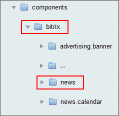
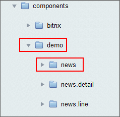

# Размещение в системе и подключение компонента

**Навигация**
- [← Оглавление курса](index.md)
- [← Предыдущий: 2749 — Структура комплексного компонента](lesson_2749.md)
- [Следующий: 2828 — Описание компонента →](lesson_2828.md)

Официальная страница урока: https://dev.1c-bitrix.ru/learning/course/index.php?COURSE_ID=43&LESSON_ID=2826

### Размещение

Компоненты в Bitrix Framework должны храниться только в определенных местах:

- в папке `/bitrix/components/bitrix` (по умолчанию);
- в папке `/bitrix/components/собственное пространство имен`.
- в папке `/local/components/` (рекомендуется для собственных компонентов сторонних разработчиков)

Системные компоненты находятся в папке `/bitrix/components/bitrix/`. Содержимое этой папки обновляется системой обновлений и не может изменяться пользователями.


**Внимание!** Изменение содержимого папки `/bitrix/components/bitrix/` может привести к непредсказуемым последствиям.

Пользовательские компоненты могут находиться в любых других подпапках папки `/bitrix/components/` или прямо в папке `/bitrix/components/`, но рекомендуется папка `/local/components/`.

### Именование

Название подпапки директории `/bitrix/components/` образует пространство имен (**namespace**) компонентов. Например, все системные компоненты расположены в пространстве имен **bitrix**. При создании пользовательских компонентов рекомендуется создать какое-либо пространство имен и размещать свои наработки в нем.


Например, существует системный компонент **news**, который расположен в пространстве имен **bitrix**. Если необходим пользовательский компонент **news**, который имеет другую функциональность, не реализуемую с помощью шаблона системного компонента, то рекомендуется создать некоторое пространство имен (подпапку) в папке `/bitrix/components/` (например, **demo**) и расположить пользовательский компонент news в этом пространстве имен. Таким образом будут доступны два компонента news, но лежащие в разных пространствах имен: **bitrix:news** и **demo:news**.

|  |  |  |
| --- | --- | --- |


Имена компонентов имеют вид **идентификатор1.идентификатор2...**. Например, **catalog**, **catalog**.**list**, **catalog**.**section**.**element** и т.п. Рекомендуется строить имена иерархически, начиная с общего понятия и заканчивая конкретным назначением компонента. Например, компонент, показывающий список товаров данной группы, может называться **catalog**.**section**.**elements**. Полное имя компонента - это имя с указанием пространства имен. Полное имя имеет вид **пространство_имен**:**имя_компонента**. Например, **bitrix**:**catalog.list**. Если компонент лежит вне пространства имен, то пространство имен не указывается. Например, **catalog**.**section**.

### Подключение

В самом общем виде подключение компонента осуществляется следующим образом:

```
<?$APPLICATION->IncludeComponent(
   $componentName,         // имя компонента
   $componentTemplate,     //его шаблон, пустая строка если шаблон по умолчанию
   $arParams=array(),      // параметры
   $parentComponent=null,  // null или объект родительского компонента
   $arFunctionParams=array()
);?>
```

Внутри компонента (файл **component.php**) доступны следующие предопределенные переменные:

`$componentName` – полное название компонента (например: **bitrix:news.list**).

`$componentTemplate` – шаблон, с которым он вызывается.

`$arParams` – входные параметры (т.е. параметры с которыми вызывается компонент). Параметры доступны также по их именам.

`$componentPath` – путь к компоненту относительно корня сайта (пример: `/bitrix/components/bitrix/news.list`).

`$parentComponentName` – название родительского компонента (пустое, если нет родителя).

`$parentComponentPath` – путь к родительскому компоненту относительно корня сайта (пустой, если нет родителя).

`$parentComponentTemplate` – шаблон родительского компонента (пустой, если нет родителя).

`$arResult` — результат, чтение/изменение. Затрагивает одноименный член класса компонента.

`$this` — естественно ссылка на текущий вызванный компонент (объект класса [CBitrixComponent](http://dev.1c-bitrix.ru/api_help/main/reference/cbitrixcomponent/index.php)), можно использовать все методы класса.

Кроме того, в компоненте объявлены глобальными переменные `$APPLICATION, $USER, $DB.`

**Примечание**: Компонент получает все параметры вызова следующим образом:

1. В ключах, начинающихся с ~, данные содержатся в исходном виде (т.е. без всякой обработки).
  Если это комплексный компонент или в шаблоне компонента вызывается другой и часть параметров передается ему, то необходимо передавать значение ключей с ~.
2. В ключах без ~ данные приведены к безопасному виду с помощью метода [htmlspecialcharsEx](https://dev.1c-bitrix.ru/api_help/main/functions/string/htmlspecialcharsex.php). Если ключ содержит массив, то будут обработаны строковые ключи массива (тоже с помощью htmlspecialcharsEx).
