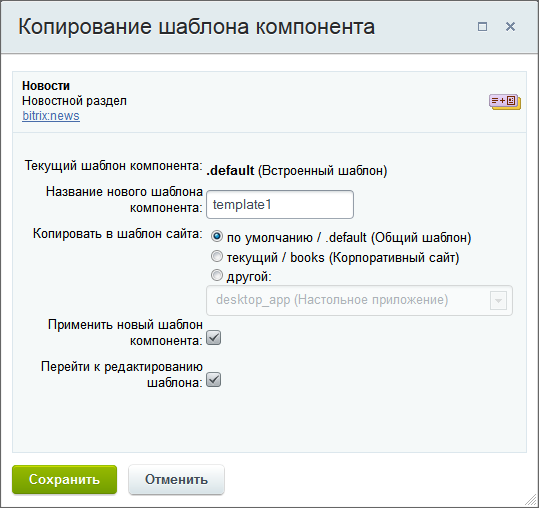

# Шаблоны компонента

**Навигация**
- [← Оглавление курса](index.md)
- [← Предыдущий: 2132 — Параметры компонента](lesson_2132.md)
- [Следующий: 3215 — Типичные ошибки →](lesson_3215.md)

Официальная страница урока: https://dev.1c-bitrix.ru/learning/course/index.php?COURSE_ID=43&LESSON_ID=2829

> **Шаблон компонента** – программный код, преобразующий данные, подготовленные компонентом, непосредственно в HTML-код.

  [Переменные](#variables)
  [Шаблон простого компонента](#tamplate_simple)
  [Шаблон комплексного компонента](#tamplate_compl)
  [Как система ищет шаблон](#template_search)
  [Подключение шаблона](#tamplate_unclude)
  [Редактирование шаблона](#tamplate_edit)
  [Особенности работы с ajax](#ajax)
  [Пример шаблона](#tamplate_example)

Шаблоны компонента делятся на **системные** и **пользовательские**:

- Системные шаблоны поставляются вместе в дистрибутиве и лежат в подпапке **templates** папки компонента.
- Пользовательские шаблоны компонента - шаблоны, которые изменены под нужды конкретного сайта. Они должны лежать в папках шаблонов сайтов (т.е. в `/local/templates/шаблон_сайта/`). При таком расположении шаблона при копировании шаблона средствами системы, они будут расположены по следующему пути: `/local/templates/шаблон_сайта/components/namespace/название_компонента/название_шаблона`.

Шаблоны компонента определяются по именам. Шаблон по умолчанию имеет имя **.default**. Если в настройках параметра компонента не указывается имя шаблона, вызывается тот, что по умолчанию. Остальные шаблоны могут называться произвольно.

Шаблоны компонента могут быть папками или файлами. Если шаблону не требуется перевод на другие языки, собственные стили и прочие ресурсы, то его можно расположить в файле. В противном случае шаблон следует располагать в папке.

Каждый шаблон компонента является неделимым целым. Если требуется изменить системный шаблон под конкретный сайт, то его нужно целиком скопировать в папку шаблона сайта и только потом править под потребности проекта.

Например, у компонента **bitrix:main.site.selector** есть системный шаблон **dropdown**, который лежит в подпапке **templates** папки компонента. Если его требуется изменить под конкретный сайт, то папку шаблона **dropdown** следует скопировать в папку `/local/templates/шаблон_сайта/components/bitrix/main.site.selector/` и изменить по своему усмотрению.

При включении компонента на страницу сайта администратор настраивает, какой именно шаблон вывода будет использоваться в данном конкретном случае.

#### Переменные, доступные в шаблоне компонента

Используются следующие переменные:

- `$templateFile` – путь к шаблону относительно корня сайта, например `/bitrix/components/bitrix/iblock.list/templates/.default/template.php`).
- `$arResult` –  массив результатов работы компонента.
- `$arParams` – массив входящих параметров компонента, может использоваться для учета заданных параметров при выводе шаблона (например, отображении детальных изображений или ссылок).
- `$arLangMessages` – массив языковых сообщений (для php шаблонов не устанавливается).
- `$templateFolder` – путь к папке с шаблоном от DOCUMENT_ROOT (например `/bitrix/components/bitrix/iblock.list/templates/.default`).
- `$parentTemplateFolder` - путь относительно корня сайта к папке шаблона комплексного компонента, в составе которого подключается данный компонент (если компонент подключается самостоятельно, то эта переменная пуста).
- `$component` – ссылка на текущий вызванный компонент (тип [CBitrixComponent](http://dev.1c-bitrix.ru/api_help/main/reference/cbitrixcomponent/index.php)).
- `$this` - ссылка на текущий шаблон (объект, описывающий шаблон, тип [CBitrixComponentTemplate](http://dev.1c-bitrix.ru/api_help/main/reference/cbitrixcomponenttemplate/index.php))
- `$templateName` – имя шаблона (например: **.dеfault**)
- `$componentPath` – путь к папке с компонентом от DOCUMENT_ROOT (напр. `/bitrix/components/bitrix/iblock.list`)
- `$templateData` – массив для записи, обратите внимание, таким образом можно передать данные из **template.php** в файл **component_epilog.php**, причем эти данные попадают в кеш, т.к. файл **component_epilog.php** исполняется на каждом хите.

Кроме того внутри PHP шаблона объявлены глобальными переменные `$APPLICATION`, `$USER`, `$DB`.

#### Шаблон простого компонента


Папка шаблона простого компонента может содержать следующие подпапки и файлы:

- подпапку `/lang`, в которой расположены файлы языковых сообщений (переводов);
- файл [result_modifier.php](http://dev.1c-bitrix.ru/learning/course/index.php?COURSE_ID=43&CHAPTER_ID=02830), который подключается непосредственно перед подключением шаблона компонента. Этот файл получает на вход массив результатов работы компонента `$arResult` и массив параметров его вызова `$arParams`. Таким образом, можно, например, изменить массив результатов работы компонента под конкретный шаблон.
- файл [component_epilog.php](https://dev.1c-bitrix.ru/learning/course/index.php?COURSE_ID=43&CHAPTER_ID=02975), который подключается после исполнения шаблона.
- файл **style.css**, который определяет необходимые стили.
- файл **script.js**, который определяет и подключает необходимые яваскрипты. Этот файл может отсутствовать.
- файл **.description.php**, который содержит название и описание шаблона для визуального редактора.
  ## Пример файла .description.php
  ```
  <?
  if (!defined("B_PROLOG_INCLUDED") || B_PROLOG_INCLUDED!==true) die();
  $arTemplateDescription = array(
  	"NAME" => GetMessage("ADV_BANNER_NAME"),
  	"DESCRIPTION" => GetMessage("ADV_BANNER_DESC"),
  );
  ?>
  ```
- файл **.parameters.php**, который содержит описание дополнительных входных параметров шаблона для визуального редактора.
  ## Пример файла .parameters.php
  ```
  <?
  if (!defined("B_PROLOG_INCLUDED") || B_PROLOG_INCLUDED!==true)die();
  if (!CModule::IncludeModule("advertising"))
  	return;
  $arTypeFields = Array("-" =>GetMessage("ADV_SELECT_DEFAULT"));
  $res = CAdvType::GetList($by, $order, Array("ACTIVE" => "Y"),$is_filtered, "Y");
  while (is_object($res) && $ar = $res->GetNext())
  {
  	$arTypeFields[$ar["SID"]] = "[".$ar["SID"]."] ".$ar["NAME"];
  }
  $arTemplateParameters = [
  	"TYPE" => [
  		"NAME" => GetMessage("ADV_TYPE"),
  		"PARENT" => "BASE",
  		"TYPE" => "LIST",
  		"DEFAULT" => "",
  		"VALUES" => $arTypeFields,
  		"ADDITIONAL_VALUES" => "N",
  	],
  	"NOINDEX" => [
  		"NAME" => GetMessage("adv_banner_params_noindex"),
  		"PARENT" => "BASE",
  		"TYPE" => "CHECKBOX",
  		"DEFAULT" => "N",
  	],
  	"QUANTITY" => [
  		"NAME" => GetMessage("ADV_QUANTITY"),
  		"PARENT" => "BASE",
  		"TYPE" => "STRING",
  		"DEFAULT" => "1",
  	],
  	"CACHE_TIME" => ["DEFAULT"=>"0"],
  ];
  if ($templateProperties['NEED_TEMPLATE'] == 'Y')
  {
  	$templates = array('-' => GetMessage("ADV_NOT_SELECTED"));
  	$arTemplates = CComponentUtil::GetTemplatesList('bitrix:advertising.banner.view');
  	if (is_array($arTemplates) && !empty($arTemplates))
  	{
  		foreach ($arTemplates as $template)
  		{
  			$templates[$template['NAME']] = $template['NAME'];
  		}
  	}
  	$arTemplateParameters['DEFAULT_TEMPLATE'] = [
  		"NAME" => GetMessage("ADV_DEFAULT_TEMPLATE"),
  		"PARENT" => "BASE",
  		"TYPE" => "LIST",
  		"VALUES" => $templates,
  		"DEFAULT" => '',
  		"ADDITIONAL_VALUES" => "N",
  	];
  	unset($templateProperties['NEED_TEMPLATE']);
  }
  ```
- файл **template.ext**, который и является собственно шаблоном. Расширение **ext** зависит от того, какой движок шаблонизации нужно подключать. По умолчанию расширение равно **php**. Этот файл должен обязательно присутствовать.
- любые другие папки и файлы с ресурсами, необходимыми шаблону компонента. Например, папка **image**, содержащая изображения.

#### Шаблон комплексного компонента

Шаблон комплексного компонента содержит все те же папки, что и шаблон простого, и дополнительно к ним:

- шаблоны простых компонентов, которые входят в состав комплексного. Эти шаблоны располагаются в папках вида `/пространство_имен/название_простого_компонента/` относительно папки шаблона комплексного компонента.
- простые компоненты, входящие в состав комплексного, подключаются на шаблонах страниц комплексного компонента.

#### Как система ищет шаблон


Применяется следующий алгоритм поиска подходящего шаблона:

- Если используется шаблон сайта из папки
  			\local
                      Папка `\local` - папка для разработки в рамках ядра D7 [Подробнее](lesson_5119.md#local)...
  		, то система сначала ищет его в папке `/local/templates/текущий_шаблон_сайта/components/`.
  Если там шаблон не найден, то берётся папка `/local/templates/.default/components/`. Если шаблон найден, то поиск прекращается.
- Если используется шаблон сайта из папки `/bitrix/templates/`, то берется папка `/bitrix/templates/текущий_шаблон_сайта/components/`. В этой папке в пути `/пространство_имен_компонента/название_компонента/` проверяется последовательно наличие файла или папки с именем шаблона. Если таковых нет, то проверяется наличие файла **имя_шаблона.ext**, где в качестве ext берутся последовательно все доступные расширения всех установленых на сайте движков шаблонизации. Если шаблон найден, то алгоритм завершается.
- Если на шаге 1 шаблон не найден, то берется папка `/bitrix/templates/.default/components/`. И применяется алгоритм, описанный в шаге 1. Если шаблон найден, то алгоритм завершается.
- Если на шаге 2 шаблон не найден, то производится поиск среди системных шаблонов.

Особенности поиска:

- Если имя шаблона не задано, то ищется шаблон с именем **.default**.
- Если шаблон задан именем папки, то в случае простого компонента в этой папке ищется файл **template.ext**, а в случае комплексного - **название_страницы.ext**. Расширение ext сначала принимается равным php, а затем расширениям других доступных на сайте движков шаблонизации.


**Например**, требуется показать компонент **bitrix:catalog.list** с помощью шаблона **table**. Пусть на сайте, кроме стандартного движка шаблонизации (файлы с расширением php), доступен так же движок Smarty (файлы с расширением tpl). Система проверит сначала папку `/local/templates/текущий_шаблон_сайта/components/bitrix/catalog.list/` на наличие файла или папки с именем **table**. Если таковых нет, система проверит эту же папку на наличие файлов **table.php** и **table.tpl**. Если ничего не найдено, система изучит папки `/bitrix/templates/.default/components/bitrix/catalog.list/` и `/bitrix/components/bitrix/catalog.list/templates/`.

Если папка компонента найдена, в этой папке сначала ищется файл **template.php**, и если этот файл не найден, то ищется **template.tpl**. Если шаблон задан в виде `table/template.php`, то сразу берется указанный файл.

Если простой компонент вызывается в составе комплексного, то его шаблон сначала ищется в составе шаблона комплексного компонента, а потом (если не найден) в собственных шаблонах. Чтобы это правило работало, при вызове простых компонентов в составе комплексного не забывайте указывать четвертым параметром переменную `$component`, указывающую на родительский компонент. Т.е. код вызова простого компонента должен иметь вид:

```
$APPLICATION->IncludeComponent("custom:catalog.element", "", array(...), $component);
```

**Примечание**:

В одной папке (например, `/bitrix/templates/текущий_шаблон_сайта/components/`) есть шаблоны двух компонентов, комплексного и простого:

- **catalog** (комплексный, в котором есть еще простой **catalog.section**)
- **catalog.section** (простой)

По условиям работы сайта необходимо чтобы для двух вхождений **catalog.section** использовался один единственный шаблон. В этом случае нужно, чтобы этот шаблон имел имя, отличное от **.default**, иначе он не будет подхвачен.

#### Подключение шаблона

В коде подключения указывается только &lt;namespace&gt;, имя компонента, имя шаблона (и параметры самого компонента). При обработке кода ядро сначала проверяет наличие шаблона компонента в шаблоне текущего сайта: `/local/templates/<имя шаблона сайта>/components/<namespace>/<имя компонента>/<имя шаблона>/template.php`.

Если  - **bitrix** (`/bitrix/components/bitrix`), то это папка для шаблонов стандартных компонентов. Если  - выбранное вами &lt;имя&gt; (`/local/components/<имя>`), то это папка для шаблонов ваших компонентов.

Если файла шаблона нет, проверяется шаблон сайта по умолчанию: `/bitrix/templates/.default/components/<namespace>/<имя компонента>/<имя шаблона>/template.php`.

И только после этого происходит подключение шаблона компонента из папки компонента.

Шаблон подключается командой:

`$this->IncludeComponentTemplate($templatePage = "");`

Где `$templatePage` – для комплексного компонента имя текущей страницы, для обычного – пустая строка.

Примеры подключения шаблона компонента:

1. Подключим шаблон текущего комплексного компонента для страницы section:
  `$this->IncludeComponentTemplate("section");`
2. Подключим шаблон текущего простого компонента:
  `$this->IncludeComponentTemplate();`

#### Редактирование

Редактирование шаблона - один из способов получения нужного результата работы компонента под требования сайта. Редактировать системный шаблон не рекомендуется в силу того, что при первом же обновлении он восстановит свое прежнее состояние. Редактировать и применять можно только пользовательский шаблон.

Копирование выполняется по команде **Копировать шаблон компонента** при включенном режиме **Правка**:


При копировании шаблона можно сразу задать его применение к компоненту и открыть форму для редактирования шаблона:



При отмеченной опции **Перейти к редактированию шаблона** сразу будет осуществлен переход на страницу редактирования шаблона компонента.

Редактирование допускает добавление в него логики действий, но такую модификацию лучше выносить в файлы **result_modifier.php** и **component_epilog.php** (которые должны быть расположены в папке шаблона) для более сложного изменения результата работы.

#### Особенности работы с ajax

Использование режима ajax имеет свои особенности. Чтобы строка навигации в открываемой по ajax странице имела в цепочке навигации своё название, необходимо, чтобы в шаблоне компонента обязательно присутствовал элемент с `id="navigation"`. Это необязательно должен быть `div`, это может быть `span`, `h1`, `p` и так далее.

Аналогично, для заголовка обязательно наличие элемента с `id="pagetitle"`.

#### Пример шаблона

| \| **Шаблон компонента Меню** \|  \|<br>\| --- \| --- \|<br>\| Проверка включения \| &lt;?if (!defined("B_PROLOG_INCLUDED")
<br>\\|\\| B_PROLOG_INCLUDED!==true)die();?&gt; \|<br>\| Старт скрипта \| &lt;?if (!empty($arResult)):?&gt; \|<br>\| Открытие тега &lt;ul&gt; — ненумерованный список \| &lt;ul class="…"&gt; \|<br>\| Старт цикла поиска \| &lt;?foreach ($arResult as $arItem):?&gt; \|<br>\| Ссылка активная \| &lt;?if($arItem["SELECTED"]):?&gt; \|<br>\| Вывод ссылки \| &lt;li&gt;&lt;a href="&lt;?=$arItem["LINK"]?&gt;" class=
<br>"selected"&gt;&lt;?=$arItem["TEXT"]?&gt;&lt;/a&gt;&lt;/li&gt; \|<br>\| Проверка на продолжение цикла \| &lt;?else:?&gt; \|<br>\| Ссылка неактивная \| &lt;li&gt;&lt;a href="&lt;?=$arItem["LINK"]?&gt;"&gt;
<br>&lt;?=$arItem["TEXT"]?&gt;&lt;/a&gt;&lt;/li&gt; \|<br>\| Завершение вывода ссылки \| &lt;?endif;?&gt; \|<br>\| Завершение цикла поиска \| &lt;?endforeach;?&gt; \|<br>\| Закрытие тега &lt;ul&gt; — ненумерованный список \| &lt;/ul&gt; \|<br>\| Завершение скрипта \| &lt;?endif;?&gt; \| |
| --- |

|  |
| --- |

- [Пользовательские движки шаблонизации](lesson_2822.md)
