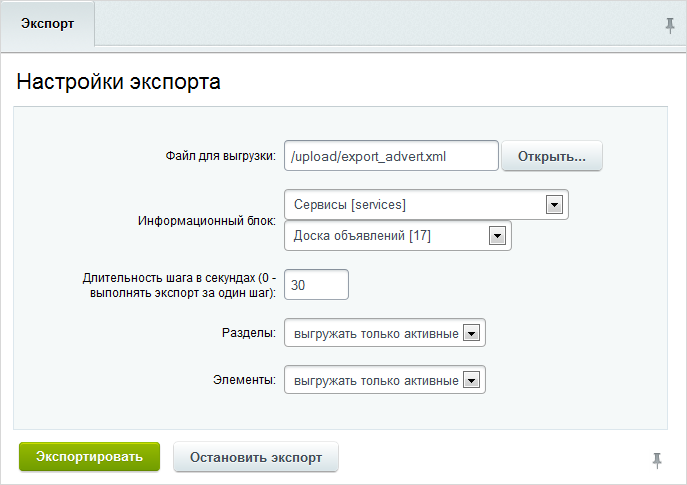

# Работа с инфоблоками штатными средствами

**Навигация**
- [← Оглавление курса](index.md)
- [← Предыдущий: 4610 — Инфоблоки](lesson_4610.md)
- [Следующий: 4780 — Кеширование компонентов (Автокеширование) →](lesson_4780.md)

Официальная страница урока: https://dev.1c-bitrix.ru/learning/course/index.php?COURSE_ID=43&LESSON_ID=2831

### Порядок работы

При создании раздела сайта с использованием информационных блоков желательно придерживаться определённого порядка действий. Этот порядок может отличаться в зависимости от степени готовности проекта и сложности конкретного ТЗ. Практически в любом случае вам потребуются следующие действия:

- Внимательное продумывание структуры инфоблоков.
- Создание нужного [типа инфоблоков](https://dev.1c-bitrix.ru/learning/course/index.php?COURSE_ID=34&LESSON_ID=2010) с настройкой параметров.
- [Создание самих инфоблоков](https://dev.1c-bitrix.ru/learning/course/index.php?COURSE_ID=34&CHAPTER_ID=02011) с настройкой параметров.
- Создание структуры внутри инфоблока.
- Создание элементов инфоблока.
- Создание физической страницы (в случае использования комплексного компонента) или страниц (при использовании простых компонентов) и размещение на ней компонента (компонентов) с последующей настройкой его свойств.
- Кастомизация работы компонента под потребности ТЗ и дизайна сайта (кастомизация шаблона компонента, использование файлов **result_modifier.php** или **component_epilog.php**, кастомизация собственно компонента).
- Настройка отображения данных инфоблока в административной части под нужды обычного пользователя. Как показывает практика, почти никто из Контент-менеджеров не желает ознакомиться с этой возможностью и не умеет [перенастраивать отображение структуры](/learning/course/index.php?COURSE_ID=34&LESSON_ID=1883) инфоблоков под себя.

### Штатные возможности

Штатные средства модуля **Информационные блоки** достаточно обширны. Не ограничено ни количество типов инфоблоков, ни число самих инфоблоков, ни количество свойств каждого инфоблока, ни количество разделов или элементов.

|  | **Советы от веб-разработчиков.** 
 [**Максим Месилов**](https://dev.1c-bitrix.ru/community/webdev/user/14686/): Для важных ИБ, которыми управляют несколько людей, желательно включать [журналирование](https://dev.1c-bitrix.ru/learning/course/index.php?COURSE_ID=35&LESSON_ID=3556). Так вы сможете быстро найти концы в случае непонятного удаления элементов или их редактирования.
 
 Настройки журналирования - вкладка в настройках ИБ. |
| --- | --- |

#### Свойства инфоблоков

Элементы каждого инфоблока имеют набор системных свойств, которые могут быть расширены пользовательскими свойствами. Свойства, задаваемые для инфоблока, различаются по своим типам:

- **Строка** - значение свойства задается в виде текстовой строки;
- **Число** - значение свойства задается в виде числа;
- **Список** - значение свойства выбирается из списка;
- **Файл** - в качестве значения свойства используется файл;
- **Привязка к разделам** - с помощью данного свойства можно задать связь между элементом данного инфоблока и разделами другого информационного блока;
- **Привязка к элементам** - задание связи между элементами информационных блоков «поштучно»;
- **HTML/текст** - значение свойства задается в виде текста с HTML-тегами;
- **Привязка к элементам по XML_ID** - привязка хранится как строка и значением является **XML_ID** привязанного элемента;
- **Привязка к карте Google Maps** - задается связь между элементом инфоблока и компонентом
  			Google Map
                      для использования компонентов Google необходимо иметь ключ доступа. Инструкция по получению ключа находится [в этом уроке](https://dev.1c-bitrix.ru/learning/course/index.php?COURSE_ID=41&LESSON_ID=6406#api).
- **Справочник** - задается связь между элементом инфоблока и highload блоками;
- **Привязка к Яндекс.Карте** - задается связь между элементом инфоблока и компонентом Яндекс.Карта;
- **Счетчик** - аналог **autoincrement** для БД. При добавлении элемента инфоблока значение будет больше на единицу, чем последнее. Стартовое значение задается произвольно. Можно использовать для журналов учета входящих документов и т.п., где должна быть непрерывная нумерация документов.
- **Привязка к пользователю** - с помощью данного свойства можно задать связь между элементом данного инфоблока и пользователями системы;
- **Дата/Время** - значение свойства задается в виде даты/времени;
- **Видео** - задается связь между элементом списка и медиафайлом;
- **Привязка к элементам в виде списка** - задание связи между элементами списком;
- **Привязка к теме форума** - с помощью данного свойства можно задать связь между элементом данного инфоблока и темами форума;
- **Привязка к файлу (на сервере)** - с помощью данного свойства можно задать связь между элементом инфоблока и файлом на удаленном сервере;
- **Привязка к элементам с автозаполнением** - задается связь с элементами с автозаполнением;
- **Привязка к разделам с автозаполнением** - задается связь с разделами с автозаполнением;
- **Привязка к товарам (SKU)** - задается связь с товарными предложениями ([SKU](https://dev.1c-bitrix.ru/learning/course/index.php?COURSE_ID=42&LESSON_ID=3155)).

Каждый тип свойств характеризуется собственным набором параметров, настраиваемых в соответствующих формах. Свойства могут быть множественными, обязательными для заполнения.

#### Свойства разделов инфоблока

Имеется возможность задавать [пользовательские свойства](https://dev.1c-bitrix.ru/user_help/settings/settings/userfield_admin.php) для разделов инфоблоков. Пользовательские поля в своем коде должны обязательно иметь приставку **UF_**. Список типов полей несколько меньше, чем для самого инфоблока:

- **Видео;**
- **Привязка к элементам highload-блоков;**
- **Строка;**
- **Целое число;**
- **Число;**
- **Дата со временем;**
- **Дата;**
- **Да/Нет;**
- **Файл;**
- **Список;**
- **Привязка к разделам инф. блоков;**
- **Привязка к элементам инф. блоков;**
- **Опрос;**
- **Шаблон.**

Как и свойства самого инфоблока, свойства разделов могут быть множественными и обязательными. Можно задать, будет ли участвовать в поиске и в фильтрации, может ли пользователь редактировать значение свойства, и будет ли оно отображаться в общем списке свойств. Кроме этого, у полей имеются дополнительные настройки, которые зависят от конкретного типа.

#### Экспорт-импорт

Добавление большого числа элементов инфоблоков вручную - очень трудоемкое занятие. С целью облегчения добавления информации можно применять
[импорт/экспорт данных](/learning/course/index.php?COURSE_ID=34&CHAPTER_ID=04532) с использованием разных форматов файлов. Поддерживаются форматы:

- **RSS**
- **CSV**
- **XML**

Экспорт и импорт [в формате RSS](http://dev.1c-bitrix.ru/api_help/iblock/rss.php) организуются с помощью специальных компонентов **RSS новости (экспорт) (bitrix:rss.out)** и **RSS новости (импорт) (bitrix:rss.show)** соответственно.

Экспорт данных из инфоблока в CSV файл выполняется с помощью формы **Выгрузка информационного блока** (Контент &gt; Информационные блоки &gt; Экспорт &gt; CSV). Импорт данных, хранящихся в отдельном [CSV файле](https://dev.1c-bitrix.ru/learning/course/index.php?COURSE_ID=34&LESSON_ID=2012), в информационный блок выполняется в форме **Загрузка информационного блока** (Контент &gt; Информационные блоки &gt; Импорт &gt; CSV).

**Примечание**: начиная с версии модуля 14.0.5, уровень глубины вложенности разделов для CSV-экспорта/импорта определяется настройками модуля **Информационные блоки**.

**Примечание**: если нужно осуществить экспорт инфоблока как торгового каталога, то необходимо воспользоваться путем Магазин &gt; Настройки &gt; Экспорт данных. Возможен и импорт из файла формата CSV: в качестве торгового каталога. В этом случае необходимо воспользоваться путем Магазин &gt; Настройки &gt; Импорт данных.

Функционал экспорта\импорта инфоблоков в формат **XML** позволяет переносить не только содержимое инфоблоков, но и их свойства и изображения. Экспорт производится на странице **Экспорт XML** (Контент &gt; Информ. блоки  &gt; Экспорт  &gt; XML). Импорт осуществляется на странице **Импорт XML** (Контент &gt; Информ. блоки &gt; Импорт &gt; XML).

#### Настройка форм

Добавление/редактирование информационных блоков возможно как с административной, так и с публичной части. С публичной части это осуществляют контент-менеджеры. Формы добавления\редактирования инфоблоков желательно кастомизировать. В этом случае работа контент-менеджеров станет более легкой и удобной. Функция [настройки форм](http://dev.1c-bitrix.ru/learning/course/index.php?COURSE_ID=34&LESSON_ID=1883) - штатная и не требует программирования. Система позволяет:

- Задать значения полей формы по умолчанию.
- Задать автоматическую обработку фотографий по предварительно обозначенным параметрам.
- Задать порядок следования закладок формы и полей на них.

Если разработчика не удовлетворяют возможности штатной настройки форм, то он может [создать собственные](https://dev.1c-bitrix.ru/api_help/iblock/custom.php).

#### Типы хранения инфоблоков

При создании информационных блоков рекомендуется хранить свойства инфоблока в отдельной таблице, причем все значения свойств одного элемента хранятся в одной строке. Эта технология называется **Инфоблоки 2.0** и позволяет существенно ускорить работу системы, а также снять ряд ограничений в предыдущей версии инфоблоков. Например, теперь нет необходимости в дополнительном запросе [CIBlockElement::GetProperty](http://dev.1c-bitrix.ru/api_help/iblock/classes/ciblockelement/getproperty.php) при выборе значений свойств функцией [CIBlockElement::GetList](https://dev.1c-bitrix.ru/api_help/iblock/classes/ciblockelement/getlist.php).

Возможности [инфоблоков 2.0](lesson_2723.md):

- При выборке элементов можно сразу получать значения свойств, т.к. количество присоединяемых таблиц в запросе не увеличивается с каждым свойством, а всегда равно единице.
- Фильтрация по значениям свойств происходит аналогично инфоблокам 1.0 (за исключением множественных).
- При выборке множественных свойств данные агрегируются на уровне СУБД, поэтому не возникает декартова произведения строк. Значения свойства возвращаются как массив, а не как дублирующиеся строки результата.
- Для комбинированных фильтров по немножественным (единичным) свойствам появилась возможность ручного создания составных индексов БД для ускорения операций выборки.
- Для инфоблоков 2.0 нет возможности "сквозной" выборки элементов, когда в фильтре указывается тип инфоблока и символьный код свойства. В фильтре необходимо указывать `IBLOCK_ID`.

Важным является полная совместимость API. Т.е. техника использования инфоблоков, свойств, элементов и их значений одинакова для обеих версий инфоблоков.

#### Связь между инфоблоками

*Bitrix Framework* допускает создание взаимосвязей между информационными блоками с помощью свойств типа *Привязка к элементам*, *Привязка к разделам*, *Привязка к элементам в виде списка*, *Привязка к элементам с автозаполнением*, *Привязка к разделам с автозаполнением* и *Привязка к товарам (SKU)*.
