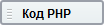
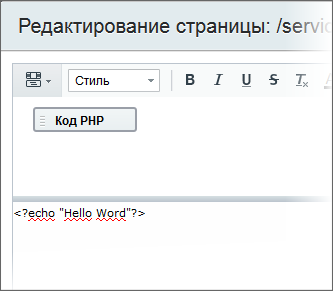

# Добавление произвольного PHP кода

**Навигация**
- [← Оглавление курса](index.md)
- [← Предыдущий: 4780 — Кеширование компонентов (Автокеширование)](lesson_4780.md)
- [Следующий: 3400 — Обновление, бекап и восстановление →](lesson_3400.md)

Официальная страница урока: https://dev.1c-bitrix.ru/learning/course/index.php?COURSE_ID=43&LESSON_ID=2885

**Внимание!** PHP-код непосредственно в теле страницы не рекомендуется!

Использование php-кода в теле страницы считается дурным тоном при разработке сайта и говорит о низкой квалификации разработчика.

В рабочую область страницы также может быть добавлен произвольный PHP-код, который в режиме редактирования в визуальном редакторе будет отображаться в виде значка  . Если установить курсор на этот значок, то в панели **Свойства** отобразится непосредственно сам код:

Таким образом, также можно реализовывать дополнительный функционал проекта. Этот способ рекомендуется использовать в крайнем случае. За правило должно браться изменение логики работы за счет кастомизации [подходящего компонента](http://dev.1c-bitrix.ru/learning/course/index.php?COURSE_ID=43&CHAPTER_ID=1000), либо [его шаблона](http://dev.1c-bitrix.ru/learning/course/index.php?COURSE_ID=43&CHAPTER_ID=999).

|  |
| --- |

Список ссылок по теме:

- [Работа с PHP скриптом](http://dev.1c-bitrix.ru/learning/course/index.php?COURSE_ID=35&LESSON_ID=1904) в курсе **Администратор. Базовый**.
