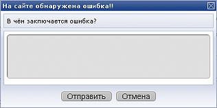
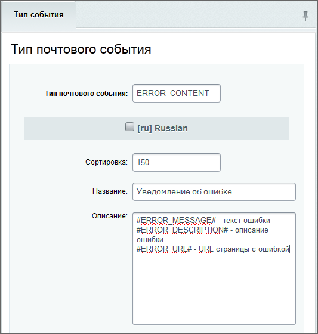
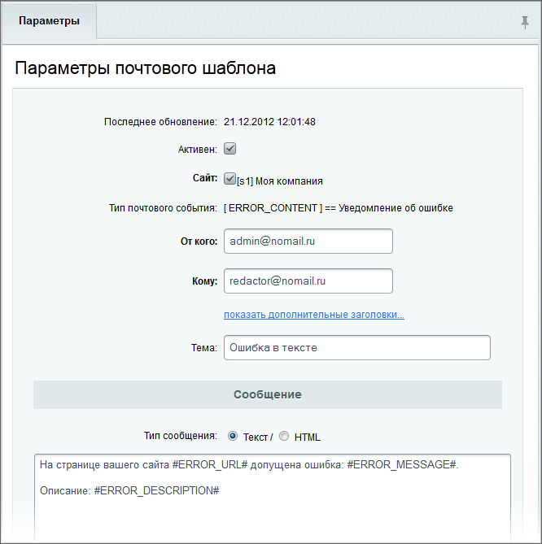

# Пример создания компонента

**Навигация**
- [← Оглавление курса](index.md)
- [← Предыдущий: 2305 — Простой пример создания компонента](lesson_2305.md)
- [Следующий: 2813 — Компонент интеграции визуального редактора →](lesson_2813.md)

Официальная страница урока: https://dev.1c-bitrix.ru/learning/course/index.php?COURSE_ID=43&LESSON_ID=2894

Рассмотрим пример создания компонента для сообщений администратору об ошибке.


### Описание

С помощью этого компонента можно реализовать функционал, который бы позволял пользователям сообщать ответственным за контент о найденной на сайте ошибке. Ошибка будет высылаться почтовым уведомлением. Алгоритм работы пользователя с компонентом очень простой: если пользователь находит на портале ошибку, то он выделяет текст, нажимает Ctrl+Enter и получает форму:




Форма заполняется и сообщение отправляется ответственному лицу.

### Создание почтового шаблона

Так как сообщение об ошибке будет отправлено на почту, то потребуется создать новый почтовый тип.

- Перейдите на страницу Настройки &gt; Настройки продукта &gt; Почтовые события &gt; Типы почтовых событий.
- Заполните поля формы:
  
- Перейдите на страницу Настройки &gt; Настройки продукта &gt; Почтовые события &gt; Почтовые шаблоны.
- Нажмите в контекстной панели на **Добавить шаблон**, откроется форма создания шаблона.
- Задайте шаблон для созданного типа почтового события:
  

### Создание компонента

Создайте в собственном пространстве имен папку **feedback.error** со следующей структурой:

- папка `/images`

  - файл **feedback.gif**
- папка `/templates`

  - папка `/.default`

    - файл **script.js**
    - файл **template.php**
- файл **.description.php**
- файл **.parameters.php**
- файл **component.php**

Файл **feedback.gif** - иконка, которая будет отображаться в визуальном редакторе.

код файла **script.js**:

```

BX.bind(document, "keypress", SendError);

function SendError(event, formElem)
{
	event = event || window.event;

	if((event.ctrlKey) && ((event.keyCode == 0xA)||(event.keyCode == 0xD)))
	{
		var Dialog = new BX.CDialog({
			title: "На сайте обнаружена ошибка!!",
			head: "В чём заключается ошибка?",
			content: 	'<form method="POST" id="help_form">\
					<textarea name="error_desc" style="height: 78px; width: 374px;"></textarea>\
					<input type="hidden" name="error_message"value="'+getSelectedText()+'">\
		 			<input type="hidden" name="error_url" value="'+window.location+'">\
					<input type="hidden" name="error_referer" value="'+document.referrer+'">\
					<input type="hidden" name="error_useragent" value="'+navigator.userAgent+'">\
					<input type="hidden" name="sessid" value="'+BX.bitrix_sessid()+'"></form>',
						resizable: false,
						height: '198',
						width: '400'});

		Dialog.SetButtons([
	{
		'title': 'Отправить',
		'id': 'action_send',
		'name': 'action_send',
		'action': function(){
			BX.ajax.submit(BX("help_form"));
			this.parentWindow.Close();
			}
	},
		{
		'title': 'Отмена',
		'id': 'cancel',
		'name': 'cancel',
		'action': function(){
			this.parentWindow.Close();
			}
	}
			]);
			Dialog.Show();
		}
}
function getSelectedText(){
	if (window.getSelection){
		txt = window.getSelection();
	}
	else if (document.getSelection) {
		txt = document.getSelection();
	}
	else if (document.selection){
		txt = document.selection.createRange().text;
	}
	else return;
	return txt;
}
```

код файла **template.php**:

```
<?
CUtil::InitJSCore(array('window', 'ajax'));
?>
```

код файла **.description.php**:

```
<?
if (!defined("B_PROLOG_INCLUDED") || B_PROLOG_INCLUDED!==true) die();

$arComponentDescription = array(
	"NAME" => "Send Error",
	"DESCRIPTION" => "Send Error",
	"ICON" => "/images/feedback.gif",
	"PATH" => array(
		"ID" => "utility",
	),
);
?>
```

код файла **.parameters.php**:

```
<?
if (!defined("B_PROLOG_INCLUDED") || B_PROLOG_INCLUDED!==true)die();

$arComponentParameters = array();
?>
```

код файла **component.php**:

```
<?
if (check_bitrix_sessid() && $_SERVER['REQUEST_METHOD'] == "POST" && !empty($_REQUEST["error_message"]) && !empty($_REQUEST["error_url"]))
{
	$arMailFields = Array();
	$arMailFields["ERROR_MESSAGE"] = trim ($_REQUEST["error_message"]);
	$arMailFields["ERROR_DESCRIPTION"] = trim ($_REQUEST["error_desc"]);
	$arMailFields["ERROR_URL"] = $_REQUEST["error_url"];
	$arMailFields["ERROR_REFERER"] = $_REQUEST["error_referer"];
	$arMailFields["ERROR_USERAGENT"] = $_REQUEST["error_useragent"];

	CEvent::Send("ERROR_CONTENT", SITE_ID, $arMailFields);
}
$this->IncludeComponentTemplate();
?>
```

Теперь подробнее для разработчиков о том, что находится в файле `feedback.error\templates\.default\script.js`.

Объявление функции-обработчика, которая выводится на `<body>`:

```
function SendError(event, formElem)
```

Ожидание нажатия *Ctrl+Enter*:

```
if((event.ctrlKey) && ((event.keyCode == 0xA)||(event.keyCode == 0xD)))
```

Определение параметров будущего окна и его содержимого:

```
var Dialog = new BX.CDialog({
	title: "На сайте обнаружена ошибка!!",
	head: "В чём заключается ошибка?",
	content:    '<form method="POST" id="help_form" action="/bitrix/templates/.default/send_error.php">\
		<textarea name="error_desc" style="height: 78px; width: 374px;"></textarea>\
		<input type="hidden" name="error_message"value="'+getSelectedText()+'">\
		<input type="hidden" name="error_url" value="'+window.location+'">\
		<input type="hidden" name="sessid" value="'+BX.bitrix_sessid()+'"></form>',
	resizable: false,
	height: '198',
	width: '400'});
```

Определение набора кнопок:

```
Dialog.SetButtons([
{
	'title': 'Отправить',
	'id': 'action_send',
	'name': 'action_send',
	'action': function(){
		BX.ajax.submit(BX("help_form"));
		this.parentWindow.Close();
	}
},
{
	'title': 'Отмена',
	'id': 'cancel',
	'name': 'cancel',
	'action': function(){
		this.parentWindow.Close();
	}
},
]);
```

Вывод окна:

```
Dialog.Show();
```

Функция `getSelectedText()` получает выделенный мышью текст. И далее идет отправка письма в тексте файла **component.php**:

```
if (check_bitrix_sessid() && $_SERVER['REQUEST_METHOD'] == "POST" && !empty($_REQUEST["error_message"]) && !empty($_REQUEST["error_url"]))
{
	$arMailFields = Array();
	$arMailFields["ERROR_MESSAGE"] = trim ($_REQUEST["error_message"]);
	$arMailFields["ERROR_DESCRIPTION"] = trim ($_REQUEST["error_desc"]);
	$arMailFields["ERROR_URL"] = trim ($_REQUEST["error_url"]);
	CEvent::Send("BX", SITE_ID, $arMailFields);
};
```

Список ссылок по теме:

- [Философия двух компонент](http://dev.1c-bitrix.ru/community/webdev/user/11948/blog/the-philosophy-of-the-two-components/) (блог)
