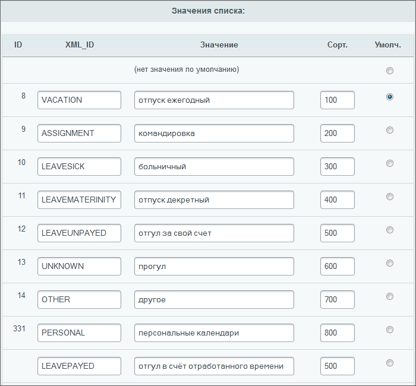
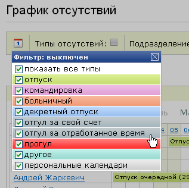

# Пример. Добавление типа отсутствия

**Навигация**
- [← Оглавление курса](index.md)
- [← Предыдущий: 2291 — Пример. Вывод голосования](lesson_2291.md)
- [Следующий: 2736 — Пример. Внешние файлы css →](lesson_2736.md)

Официальная страница урока: https://dev.1c-bitrix.ru/learning/course/index.php?COURSE_ID=43&LESSON_ID=2895

**Примечание**: С версии модуля intranet 11.0.4 в действиях, описанных ниже нет необходимости. Данный материал оставлен в курсе с целью ознакомления с возможностями системы.

В некоторых случаях для изменения вывода данных нужно в дополнение к модификации шаблона прибегать к изменению свойств информационных блоков, используемых компонентом.

В качестве примера рассмотрим такую задачу в рамках *коробочной версии "Битрикс24"*: необходимо добавить в Графике отсутствий (Сотрудники &gt; График отсутствий) новый Тип отсутствий, например: отсутствие Отгул в счет отработанного времени.


#### Задания свойств инфоблока

- В свойствах инфоблока (Контент &gt; Информ. блоки &gt; Типы информ. блоков &gt; Оргструктура &gt; график отсутствий) в закладке **Свойства** в строке Тип присутствия нажмите на кнопку с многоточием. Откроется форма **Настройка свойства** информационного блока:
- В **Значениях списка** добавьте новое значение **Отгул в счёт отработанного времени**. И смените параметры сортировки, чтобы расположить новый тип отсутствия в нужном месте.
  

#### Изменение шаблона

- Скопируйте шаблон и откройте его для редактирования.
- Найдите строки:
  ```
  GetMessage('INTR_ABSC_TPL_LEGEND_*************')?>'},
  			{NAME:'************',TITLE:'
  ```
- Вместо звездочек вставьте `XML_ID`, который вы использовали при добавлении значения свойства в форме настройки информационного блока.
- Сохраните внесенные изменения.
- Назначьте модифицированный шаблон для использования компонентом.


#### Изменение файла CSS шаблона

- Откройте для редактирования файл стилей этого шаблона.
- Найдите строки:
  ```
  div.bx-calendar-color-*************
     {background-image: url(/bitrix/components/bitrix/intranet.absence.calendar/templates/.default/images/calendar_grad_red.gif);}
  ```
- Добавьте свою аналогичную строку с файлом формата gif (или другого, это не важно) нужного вам цвета (предварительно загрузив файл в систему).
- Введите вместо звездочек `XML_ID`, который вы задали при добавлении значения свойства в форме настройки информационного блока.
- Сохраните внесенные изменения.

#### Добавление языкового сообщения

- Откройте для редактирования файл с языковыми сообщениями `\bitrix\templates\.default\components\bitrix\intranet.absence.calendar\_имя вашего шаблона_\lang\ru\template.php`.
- Добавьте строку:
  ```
  $MESS["INTR_ABSC_TPL_LEGEND_************"] = "отгул за отработанное время";
  ```
  Вместо звездочек используйте `XML_ID`, который вы задали при добавлении значения свойства в форме настройки информационного блока.
- Сохраните внесенные изменения.

Если теперь открыть список типов отсутствий, что после отгула за свой счет появился новый тип события: отгул за отработанное время:



