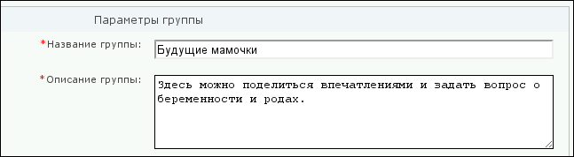
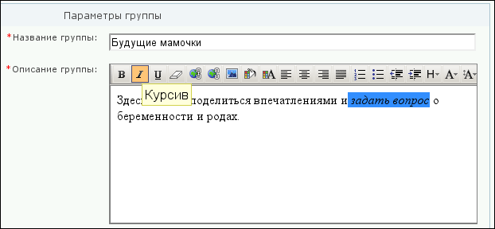

# Модификация шаблона простого компонента в составе комплексного

**Навигация**
- [← Оглавление курса](index.md)
- [← Предыдущий: 4778 — Кастомизация шаблона](lesson_4778.md)
- [Следующий: 2291 — Пример. Вывод голосования →](lesson_2291.md)

Официальная страница урока: https://dev.1c-bitrix.ru/learning/course/index.php?COURSE_ID=43&LESSON_ID=2896

Комплексный компонент обеспечивает взаимодействие простых компонентов с общей тематикой. Простые компоненты содержат код непосредственной работы с данными. Например, компоненты соцсети настраивать по отдельности неудобно.

Но если надо лишь изменить внешний вид некоторых элементов, это можно легко сделать, не отказываясь от остальных стандартных шаблонов.

Желательно обходиться без кастомизации компонента там, где в этом нет особой необходимости. В этом случае:

- не теряются обновления;
- легче решать проблемы через техподдержку (ТП не занимается решением проблем, возникающих в работе кастомного кода если явно не обозначена ошибка в работе API);
- в комплексных компонентах стандартно реализован AJAX.


В качестве примера возьмем компонент **Социальная сеть**. Задача: заменить форму редактирования описания группы (textarea) на визуальный редактор с возможностью вставки html.

**Внимание!** После решения этой задачи нужно модифицировать шаблон компонента вывода описания, чтобы не экранировались теги html. Но решение аналогичное и выходит за рамки этого описания.

#### Как сделать

- Скопируйте шаблон компонента **bitrix:socialnetwork.group_create.ex**.
- Сделайте замену в шаблоне:
  ```
  <textarea name="GROUP_DESCRIPTION"     style="width:98%" rows="5"><?= $arResult["POST"]["DESCRIPTION"]; ?></textarea>
  ```
  на
  ```
  <input type="hidden" name="GROUP_DESCRIPTION"><?
  $GLOBALS['APPLICATION']->IncludeComponent(
  	"bitrix:fileman.light_editor",
  	".default",
  	Array(
  		"CONTENT" => htmlspecialchars_decode($arResult["POST"]["DESCRIPTION"]),
  		"INPUT_NAME" => "GROUP_DESCRIPTION",
  		"WIDTH" => "98%",
  		"HEIGHT" => "200px",
  		"USE_FILE_DIALOGS" => "N",
  		"FLOATING_TOOLBAR" => "N",
  		"ARISING_TOOLBAR" => "N",
  	"VIDEO_ALLOW_VIDEO" => "N",
  	)
  );
  ?>
  ```
- В файлах group_edit.php, group_create.php комплексного компонента укажите, что в вызове простого компонента нужно использовать кастомный шаблон:
   `'POPUP_COMPONENT_NAME' => 'bitrix:socialnetwork.group_create.ex',
   'POPUP_COMPONENT_TEMPLATE_NAME' => 'test_template'`

Получаем результат. Было:




Стало:




При этом весь остальной код остаётся стандартный, т.е. будет обновляться и поддерживаться компанией *"1С-Битрикс"*.
