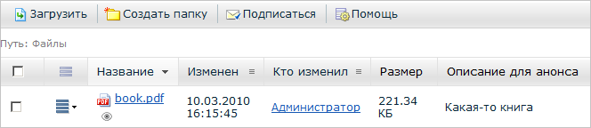
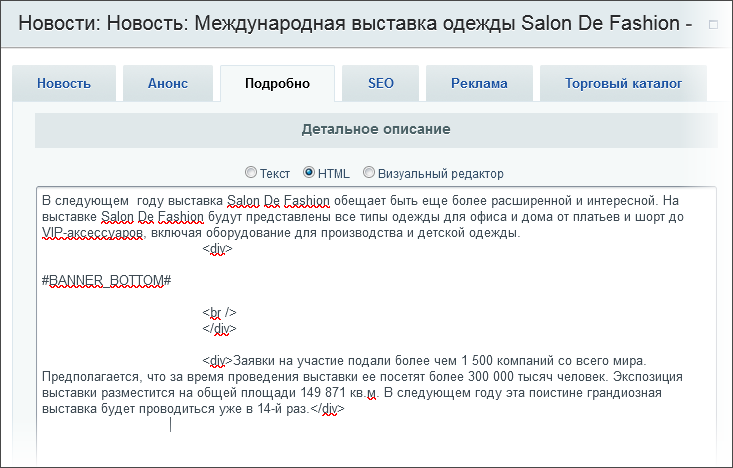

# Примеры решения задач

**Навигация**
- [← Оглавление курса](index.md)
- [← Предыдущий: 2028 — Классы компонентов](lesson_2028.md)
- [Следующий: 2993 — Пример. Выборка из Информационного блока →](lesson_2993.md)

Официальная страница урока: https://dev.1c-bitrix.ru/learning/course/index.php?COURSE_ID=43&LESSON_ID=2898

Несколько примеров решения задач с помощью файла **result_modifier**.


### Ограничение срока показа новых сотрудников

**Задача**: показывать новых сотрудников на корпоративном портале только небольшой период времени, допустим, месяц с момента их приема на работу, а не до тех пор, пока не будет принят кто-то еще.

Чтобы решить задачу можно слегка изменить результаты работы компонента **intranet.structure.informer.new**, на основе которого работает гаджет **Новые сотрудники**.

- Копируем шаблон **.default** компонента в шаблон портала. В файл **result_modifier.php** добавляем код:
  ```
  //show only users hired in the last N days
  $period_days = 30;
  foreach ($arResult['ENTRIES'] as $key => $arEntry) {
  	$user_reg_timestamp = MakeTimeStamp($arEntry["DATE_ACTIVE_FROM"] , "MM/DD/YYYY HH:MI:SS");
  	$from = strtotime("-".$period_days." days");
  	if ($user_reg_timestamp < $from) {
  		unset($arResult['ENTRIES'][$key]);
  	}
  }
  ```
  В коде задается количество дней: в данном случае гаджет будет показывать только сотрудников, принятых в течение месяца. Дата приема сотрудника будет сравниваться с текущей датой и, если сотрудник принят больше, чем месяц назад, то он выводиться не будет.
- Нужно предусмотреть ситуацию, если новых сотрудников за данный период нет. В таком случае можно выводить сообщение (добавляется в код шаблона):
  ```
  <?
  if (count($arResult['ENTRIES']) == 0) {
  	echo GetMessage('INTR_NO_ENTRIES');
  }
  ?>
  ```

Само текстовое сообщение будет находиться в файле шаблона `/lang/ru/template.php`

```
$MESS['INTR_NO_ENTRIES'] = "Новых сотрудников в последнее время не было";
```


После изменений гаджет **Новые сотрудники** сможет показывать новых сотрудников в соответствии с выбранными параметрами.

### Показ описания файлов

**Примечание**: добавляемый в примере функционал уже есть в продукте с версии 10.5. Описание оставлено для примера работы с файлом **result_modifier.php**.

На тех страницах корпоративного портала, где используется комплексный компонент **Библиотека** (**bitrix:webdav**), можно настроить список полей для показа. Но на вкладке Файлы на персональной странице или на вкладке Файлы в рабочих группах штатно список полей для показа настроить нельзя.

Если надо показывать описание файла на персональной странице или в рабочих группах, то сделайте следующее. Скопируйте компонент в собственное пространство имён. Далее в каталог `/local/components/_ваше_пространство_имен_/webdav.section.list/templates/.default/` добавьте файл **result_modifier.php** со следующим кодом:

```
<?
if (!defined('B_PROLOG_INCLUDED') || B_PROLOG_INCLUDED!==true)die();
$arParams['COLUMNS'][] = 'PREVIEW_TEXT';
?>
```

В результате имеем дополнительную колонку **Описание для анонса**:




### Рекламный баннер внутри текста

Для размещения рекламного баннера внутри текста новости используйте разделитель `#BANNER_BOTTOM#`, где `BOTTOM` - тип баннера, который будет показан.

В режиме визуального редактора код может выглядеть следующим образом:



Используйте **result_modifier.php**, который следует поместить рядом с соответствующим шаблоном показа новости или статьи. Шаблон компонента предварительно скопирован в текущий шаблон сайта:

```
<?if(!defined("B_PROLOG_INCLUDED") || B_PROLOG_INCLUDED!==true) die();
$arResult["DETAIL_TEXT"] = preg_replace(
	"/#BANNER_([A-Za-z-0-9]+)#/e",
	'CAdvBanner::GetHTML(CAdvBanner::GetRandom("\1"))',
	$arResult["DETAIL_TEXT"]
);
?>
```

В итоге на сайте это будет выглядеть следующим образом:


### Ресайз изображения в списочном компоненте

```
foreach ($arResult['ITEMS'] as $key => $item) {

	if (!empty($item['PREVIEW_PICTURE']['SRC'])) {

		$resizeImg = CFile::ResizeImageGet(
			$item['PREVIEW_PICTURE'],
			[
				'width'  => 300,
				'height' => 300,
			]
		);

		if (!empty($resizeImg['src'])) {
			$resizeImg = array_change_key_case($resizeImg, CASE_UPPER);
			$arResult['ITEMS'][$key]['PREVIEW_PICTURE'] = $resizeImg;
		}
	}
}
```

Еще примеры:

- [Иерархичное меню и result_modifier](http://dev.1c-bitrix.ru/community/webdev/user/25535/blog/hierarchical-menus-and-resultmodifier/)
