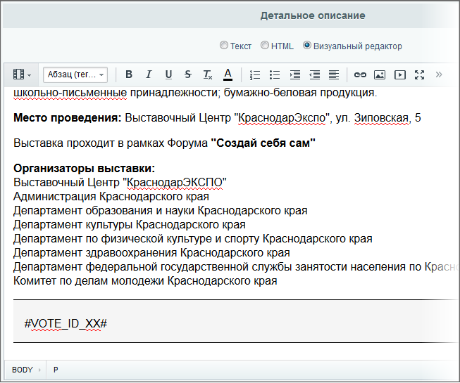

# Пример. Компонент в элементе ИБ

**Навигация**
- [← Оглавление курса](index.md)
- [← Предыдущий: 2897 — Модификация шаблона или создание result_modifier?](lesson_2897.md)
- [Следующий: 2995 — Пример. Исключение шаблона компонента из кэша →](lesson_2995.md)

Официальная страница урока: https://dev.1c-bitrix.ru/learning/course/index.php?COURSE_ID=43&LESSON_ID=2899

Задача не частая, но встречающаяся: разместить в теле элемента информационного блока какой-либо компонент. Например, опрос. Попробуем реализовать эту задачу.

- Обозначьте маркер для замены на текущий опрос. Пусть этот маркер будет `#VOTE_ID_XX#`, где XX это ID нужного нам опроса. Этот маркер вставьте в тело новости в нужное место:
  
- Настройте компонент (в нашем случае это **bitrix:voting.current**) на отдельной странице так, как вам нужно. Деталь: отключите работу в AJAX-режиме.
- Скопируйте шаблон новости в свой шаблон для редактирования. Откройте шаблон для детального просмотра и создайте два файла: **result_modifier.php** и **component_epilog.php**:
  **result_modifier.php** такого содержания:
  ```
  <?if(!defined("B_PROLOG_INCLUDED") || B_PROLOG_INCLUDED!==true)die();?>
  <?$this->__component->SetResultCacheKeys(array("CACHED_TPL"));?>
  ```
  **component_epilog.php** такого:
  ```
  <?if(!defined("B_PROLOG_INCLUDED") || B_PROLOG_INCLUDED!==true)die();?>
  <?
  echo preg_replace_callback(
  	"/#VOTE_ID_([\d]+)#/is".BX_UTF_PCRE_MODIFIER,
  	function ($matches) {
  		ob_start();
  		/*component here*/
  		$retrunStr = @ob_get_contents();
  		ob_get_clean();
  		return $retrunStr;
  	},
  	$arResult["CACHED_TPL"]);
  ?>
  ```
- Вместо `/*component here*/` в **component_epilog.php** вставьте вызов нашего компонента (для большей наглядности этот код пишем отдельно от общего кода):
  ```
  $GLOBALS["APPLICATION"]->IncludeComponent(
  	"bitrix:voting.current",
  	"main_page",
  	Array(
  		"CHANNEL_SID" => "ANKETA",
  		"VOTE_ID" => $matches[1],
  		"CACHE_TYPE"   =>   "A",
  		"CACHE_TIME"   =>   "3600",
  		"AJAX_MODE" => "N",
  		"AJAX_OPTION_SHADOW" => "Y",
  		"AJAX_OPTION_JUMP" => "Y",
  		"AJAX_OPTION_STYLE" => "Y",
  		"AJAX_OPTION_HISTORY" => "N",
  	)
  );
  ```
  **Примечание**: Обратите внимание, что вместо обычного `$APPLICATION` написано `$GLOBALS["APPLICATION"]`. Так надо для видимости объекта внутри временной функции. В остальном это полностью код компонента **bitrix:voting.current**.
  И обратите внимание на `$matches[1]`. Это единственный динамический параметр в вызываемом компоненте. Динамический в том плане, что он будет зависеть от того какой маркер мы меняем. Для `#VOTE_ID_1#` он будет равен 1, для `#VOTE_ID_2#` 2 и так далее.
- Теперь надо изменить **template.php**. На второй строчке впишите конструкцию:
  ```
  <?ob_start();?>
  ```
  а в самом конце:
  ```
  <?
  $this->__component->arResult["CACHED_TPL"] = @ob_get_contents();
  ob_get_clean();
  ?>
  ```


Манипуляции с **component_epilog.php** сделаны чтобы обойти кеширование.

Что получили в итоге:


В этом примере от файла result_modifier.php можно избавиться совсем (лишняя файловая операция все же). То есть `$component->SetResultCacheKeys(array("CACHED_TPL"));` можно добавить прямо в файл **template.php**. Здесь **result_modifier.php** был создан только для следования академическим правилам написания кода в *Bitrix Framework*.

**Примечание**: Указанный способ не подходит для случая, когда внутренним компонентом выступает, к примеру, **catalog.smart.filter**, у которого ajax-режим подразумевает очистку буфера вывода. В результате, из-за вложенности буфера вывода, вы можете получить неадекватный вывод компонента.
