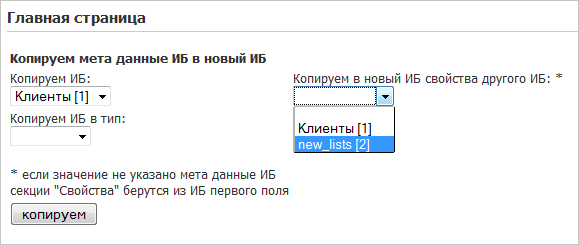

# Практика. Копирование инфоблока

**Навигация**
- [← Оглавление курса](index.md)
- [← Предыдущий: 3484 — Вывод свойств элемента инфоблока](lesson_3484.md)
- [Следующий: 3015 — Некоторые ошибки при работе с инфоблоками →](lesson_3015.md)

Официальная страница урока: https://dev.1c-bitrix.ru/learning/course/index.php?COURSE_ID=43&LESSON_ID=2915

В *Bitrix Framework* штатно не предусмотрена возможность копирования инфоблоков. Иногда возникает такая потребность и ее можно решить. Автоматизация этого процесса и будет примером использования API инфоблоков.


### Использование импорта XML

Копирование инфоблоков можно осуществить через функцию импорта/экспорта XML:

- Создайте инфоблок в который будете копировать данные.
- Выгрузите необходимый инфоблок экспортом в XML.
- Откройте для редактирования файл XML и аккуратно в нужных местах скорректируйте ID инфоблока-донора на ID инфоблока-реципиента. В начале XML можно поменять узел **ИД** и узел **Наименование**:
  ```
  <?xml version="1.0" encoding="UTF-8"?>
  <КоммерческаяИнформация ВерсияСхемы="2.021" ДатаФормирования="2010-03-20T09:55:13">
  	<Классификатор>
  		<Ид>2
  		<Наименование>ноутбуки
  		<Свойства>
  			<Свойство>
  				<Ид>CML2_CODE
  				<Наименование>Символьный код
  ```
  после описания инфоблока и его свойств найдите код:
  ```
  <Каталог>
  	<Ид>2
  	<ИдКлассификатора>2
  	<Наименование>ноутбуки
  ```
  установите данные в соответствии с внесенными изменениями выше в узлах ИД, ИД классификатора и Наименование.

### Автоматизация копирования

Есть небольшой инструмент для импорта метаданных с ранее созданного информационного блока при генерации нового:




Настройка копирования метаданных задается тремя полями:

- **Копируем ИБ**. Поле обязательно для заполнения и всегда предустановлено. В данной секции указывается с какого ИБ будут импортироваться метаданные (за исключением описания свойств).
- **Копируем в новый ИБ свойства другого ИБ**. Поле не обязательное, может быть использовано для импорта в новый информационный блок только метаданных свойств любого инфоблока. В случае если поле не заполнено, метаданные свойств берутся из инфоблока указанного в поле **Копируем ИБ**.
- **Копируем ИБ в тип**. Поле не обязательное и может быть указано, в случае если новый информационный блок необходимо сгенерировать в каком либо типе ИБ. Если настройка не указана, используется тип инфоблока, указанного в поле **Копируем ИБ**.
  Новый инфоблок после копирования будет иметь имя старого с суффиксом **_new**.

Код скрипта:

```
CModule::IncludeModule("iblock");
	if(intval($_REQUEST["IBLOCK_ID_FIELDS"])>0){
		$bError = false;
		$IBLOCK_ID = intval($_REQUEST["IBLOCK_ID_FIELDS"]);
		$ib = new CIBlock;
		$arFields = CIBlock::GetArrayByID($IBLOCK_ID);
		$arFields["GROUP_ID"] = CIBlock::GetGroupPermissions($IBLOCK_ID);
		$arFields["NAME"] = $arFields["NAME"]."_new";
		unset($arFields["ID"]);
		if($_REQUEST["IBLOCK_TYPE_ID"]!="empty")
			$arFields["IBLOCK_TYPE_ID"]=$_REQUEST["IBLOCK_TYPE_ID"];
		$ID = $ib->Add($arFields);
			if(intval($ID)<=0)
				$bError = true;
		if($_REQUEST["IBLOCK_ID_PROPS"]!="empty")
			$iblock_prop=intval($_REQUEST["IBLOCK_ID_PROPS"]);
		else
			$iblock_prop=$IBLOCK_ID;
	$iblock_prop_new = $ID;
	$ibp = new CIBlockProperty;
	$properties = CIBlockProperty::GetList(Array("sort"=>"asc", "name"=>"asc"), Array("ACTIVE"=>"Y", "IBLOCK_ID"=>$iblock_prop));
	while ($prop_fields = $properties->GetNext()){
		if($prop_fields["PROPERTY_TYPE"] == "L"){
			$property_enums = CIBlockPropertyEnum::GetList(Array("DEF"=>"DESC", "SORT"=>"ASC"), Array("IBLOCK_ID"=>$iblock_prop, "CODE"=>$prop_fields["CODE"]));
			while($enum_fields = $property_enums->GetNext()){
				$prop_fields["VALUES"][] = Array(
					"VALUE" => $enum_fields["VALUE"],
					"DEF" => $enum_fields["DEF"],
					"SORT" => $enum_fields["SORT"]
				);
			}
		}
		$prop_fields["IBLOCK_ID"]=$iblock_prop_new;
		unset($prop_fields["ID"]);
		foreach($prop_fields as $k=>$v){
			if(!is_array($v))$prop_fields[$k]=trim($v);
			if($k[0]=='~') unset($prop_fields[$k]);
		}
		$PropID = $ibp->Add($prop_fields);
		if(intval($PropID)<=0)
			$bError = true;
		}
        if(!$bError && $IBLOCK_ID>0)
LocalRedirect($APPLICATION->GetCurPageParam("success=Y",array("success","IBLOCK_ID_FIELDS")));
	else
LocalRedirect($APPLICATION->GetCurPageParam("error=Y",array("success","IBLOCK_ID_FIELDS")));
	}
	$str .='<form action='.$APPLICATION->GetCurPageParam().' method="post"><table>';
	if($_REQUEST["success"]=="Y") $str .='<tr><td><font color="green">ИБ успешно скопирован</font><b></td></tr>';
	elseif($_REQUEST["error"]=="Y") $str .='<tr><td><font color="red">Произошла ошибка</font><br/></td></tr>';
	$str .='<tr><td>Копируем мета данные ИБ в новый ИБ</b><br/></td></tr>';
	$res = CIBlock::GetList(Array(),Array(),true);
		while($ar_res = $res->Fetch())
			$arRes[]=$ar_res;
	$str .='<tr><td>Копируем ИБ:<br><select name="IBLOCK_ID_FIELDS">';
	foreach($arRes as $vRes)
		$str .= '<option value='.$vRes['ID'].'>'.$vRes['NAME'].' ['.$vRes["ID"].']</option>';
	$str .='</select></td>';
	$str .='<td>Копируем в новый ИБ свойства другого ИБ: *<br><select name="IBLOCK_ID_PROPS">';
	$str .='<option value="empty">';
	foreach($arRes as $vRes)
		$str .= '<option value='.$vRes['ID'].'>'.$vRes['NAME'].' ['.$vRes["ID"].']</option>';
	$str .='</select></td></tr>';
	$str .='<tr><td>Копируем ИБ в тип:<br><select name="IBLOCK_TYPE_ID">';
	$str .='<option value="empty">';
	$db_iblock_type = CIBlockType::GetList();
	while($ar_iblock_type = $db_iblock_type->Fetch()){
		if($arIBType = CIBlockType::GetByIDLang($ar_iblock_type["ID"], LANG))
			$str .= '<option value='.$ar_iblock_type["ID"].'>'.htmlspecialcharsex($arIBType["NAME"])."</option>";
	}
	$str .='</select></td></tr>';
	$str .='<tr><td><br/>* если значение не указано мета данные ИБ секции "Свойства" берутся из ИБ первого поля</td></tr>';
	$str .='<tr><td><input type="submit" value="копируем"></td></tr>';
	$str .='</table></form>';
	echo $str;
```

Скрипт может оказать неоценимую помощь например при копировании ИБ не прибегая к использованию механизмов  XML экспорта и XML импорта информационных блоков.

Удобнее всего этот инструмент использовать для инфоблоков в которых много списочных свойств или вообще большое количество свойств требующих детальной настройки.

Скрипт должен быть размещен в корне сайта.

Список ссылок по теме:

- Бесплатное решение [Инфоблоки, инструменты](http://marketplace.1c-bitrix.ru/solutions/asd.iblock/) от Антона Долганина.
