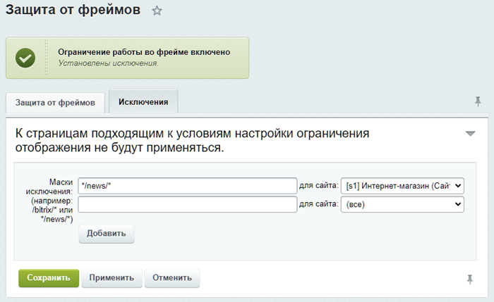

# Защита от фреймов

**Навигация**
- [← Оглавление курса](index.md)
- [← Предыдущий: 3408 — Санитайзер](lesson_3408.md)
- [Следующий: 8017 — Защита от троянов →](lesson_8017.md)

Официальная страница урока: https://dev.1c-bitrix.ru/learning/course/index.php?COURSE_ID=43&LESSON_ID=2922

Тему урока можно изучить в новом формате — [в документации по Bitrix Framework](https://docs.1c-bitrix.ru/pages/security/frame-protection.html). В ней улучшена структура, описание, примеры.

На странице **Защита от фреймов** (Настройки &gt; Проактивная защита &gt; Защита от фреймов) можно включить/отключить ограничение работы во фрейме, а также задать исключения на действие защиты.



Запрет на использование кросс-доменных фреймов, ссылающихся на страницы ресурса, задается установкой заголовка (header) `X-Frame-Options` в значение `SAMEORIGIN`.

> **X-Frame-Options**
>
>
>
> Такой заголовок указывает браузеру, можно ли загружать страницы сайта через `<frame>/<iframe>`.
>
>
>
>
> - `DENY` — значение  запретит загрузку через фреймы
> - `SAMEORIGIN` — значение  разрешит загрузку, но только если и фрейм, и страница, его загружающая, находятся на одном домене (**Same Origin Policy**)
>
>
>
>
>
> Основная функция такой защиты — предотвращение кликджекинга. А в качестве дополнительного бонуса это позволит предотвратить атаку, описанную Ben Schmidt.

#### Защита от фреймов в коробочных продуктах на BitrixVM

Защита от фреймов присутствует не только в административных настройках коробочных продуктов 1С-Битрикс, а и в виртуальной машине BitrixVM. Вы найдете header для защиты от фреймов в файле конфигурации nginx по пути /etc/nginx/bx/conf/general-add_header.conf. Запись имеет вид:

```
add_header X-Frame-Options SAMEORIGIN;
```

Когда вы включаете защиту от фреймов через модуль проактивной защиты, добавляется такой же заголовок. Причем есть возможность настроить исключения, если такой хедер не нужен, например, для Яндекс.Метрики.

При стандартных настройках BitrixVM может возникнуть ситуация, когда конфиг nginx перекроет системную настройку защиты от фремов. В этом случае хедер будет присутствовать всегда, даже если он выключен в административных настройках. А при включённой защите от фремов, хедер будет дублироваться и сайты, которые добавлены в исключения защиты, не будут корректно работать.

Вариант решения такой ситуации — использовать только один инструмент. Рекомендуем пользоваться инструментом проактивной защиты **Защита от фрейма** в продукте, чтобы не менять регулярно конфигурационные файлы сервера. Тогда в BitrixVM вы можете один раз закомментировать хедер в файле /etc/nginx/bx/conf/general-add_header.conf:

```
#add_header X-Frame-Options SAMEORIGIN;
```

А затем включить защиту от фреймов через Проактивная защита &gt; Защита от фреймов.

Теперь заголовок X-Frame-Options будет записан верно и вы сможете добавлять исключения через админку, не внося изменений в конфигурационные файлы сервера.
