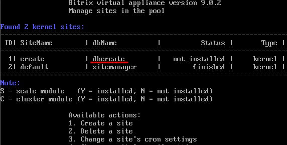
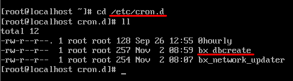

# Запуск агентов из cron

**Навигация**
- [← Оглавление курса](index.md)
- [← Предыдущий: 2290 — Примеры агентов](lesson_2290.md)
- [Следующий: 2942 — Ещё об агентах →](lesson_2942.md)

Официальная страница урока: https://dev.1c-bitrix.ru/learning/course/index.php?COURSE_ID=43&LESSON_ID=2943

Тему урока можно изучить в новом формате — [в документации по Bitrix Framework](https://docs.1c-bitrix.ru/pages/framework/background-jobs.html). В ней улучшена структура, описание, примеры.

### Об агентах

Агент может вносить ощутимое ожидание на хите пользователя. Но тут надо взвесить различные факторы. Например, агент выполняющийся 0.5 секунд раз в сутки не причинит ощутимого вреда, а такой же агент раз в 30 минут уже будет досаждать. Всецело можно сказать одно: если агенты занимают несколько десятых долей секунды, то уже стоит задуматься о переносе агентов на *cron*. "Тяжелым" считается агент, который выполняется более 10 секунд.

Не стоит забывать и про накопительный эффект агентов. Если агенты запускаются на хитах, то при маленькой посещаемости и при длительном окне без посетителей может скопиться достаточное количество агентов, ожидающих запуска. Тогда следующего посетителя встретят не самые быстрые секунды на вашем сайте.

### Обобщённое решение

Обобщенное решение для выполнения всех агентов из-под *cron*.

Для начала полностью отключим выполнение агентов на хите. Для этого выполним следующую команду в php консоли:

```
COption::SetOptionString("main", "agents_use_crontab", "N");
echo COption::GetOptionString("main", "agents_use_crontab", "N");

COption::SetOptionString("main", "check_agents", "N");
echo COption::GetOptionString("main", "check_agents", "Y");
```

В результате выполнения должно быть "NN".

После этого убираем из файла `/bitrix/php_interface/dbconn.php` определение следующих [констант](https://dev.1c-bitrix.ru/api_help/main/general/constants.php):

```
define("BX_CRONTAB_SUPPORT", true);
define("BX_CRONTAB", true);
```

И добавляем в этот файл:

```
if(!(defined("CHK_EVENT") && CHK_EVENT===true))
	define("BX_CRONTAB_SUPPORT", true);
```


Создаем файл проверки агентов и рассылки системных сообщений `/bitrix/php_interface/cron_events.php`:

```
<?php
$_SERVER["DOCUMENT_ROOT"] = realpath(dirname(__FILE__)."/../..");
$DOCUMENT_ROOT = $_SERVER["DOCUMENT_ROOT"];

define("NO_KEEP_STATISTIC", true);
define("NOT_CHECK_PERMISSIONS",true);
define('BX_NO_ACCELERATOR_RESET', true);
define('CHK_EVENT', true);
define('BX_WITH_ON_AFTER_EPILOG', true);

require($_SERVER["DOCUMENT_ROOT"]."/bitrix/modules/main/include/prolog_before.php");

@set_time_limit(0);
@ignore_user_abort(true);

CAgent::CheckAgents();
define("BX_CRONTAB_SUPPORT", true);
define("BX_CRONTAB", true);

if(CModule::IncludeModule('sender'))
{
	\Bitrix\Sender\MailingManager::checkPeriod(false);
	\Bitrix\Sender\MailingManager::checkSend();
}

require($_SERVER['DOCUMENT_ROOT']."/bitrix/modules/main/tools/backup.php");
CMain::FinalActions();
?>
```

И добавляем данный скрипт в *cron*:

```
*/1 * * * * /usr/bin/php -f /home/bitrix/www/bitrix/php_interface/cron_events.php
```

После этого все агенты и отправка системных событий будут обрабатываться из-под cron,

			раз в 1 минуту

                    Обратите внимание, некоторым системным агентам может быть недостаточно такой частоты запуска.

		.

**Примечание**: Время выполнения можно скорректировать в соответствие с проектом. Кроме того, есть возможность через установку большого значения `mail_event_bulk` сделать более "быстрой" доставку почтовых уведомлений. Установка проверки раз в минуту вместе с отправкой за раз 100 сообщений, сделает для пользователей незаметным данную задержку.

Чтобы не увеличивалась очередь отправки почтовых сообщений, рекомендуется изменить параметр отвечающий за количество почтовых событий обрабатываемых за раз. Для этого выполняем в php консоли следующую команду:

```
COption::SetOptionString("main", "mail_event_bulk", "20");
echo COption::GetOptionString("main", "mail_event_bulk", "5");
```

Если в файле dbconn.php присутствует определение `CACHED_b_event`, его значение должно быть установлено в false для отправки системных писем:

```
define("CACHED_b_event", false);
```

Если очередной запуск **cron_events.php** произошёл до завершения работы ранее запущенного скрипта, то запуска агентов не произойдет и скрипт завершит свою работу. (Так как агенты блокируются на время выполнения.) В данном случае обработка ничем не отличается от обработки на хите, новый хит может произойти в тот момент когда еще не отработали агенты на предыдущем.

Как правило, скрипты выполненные из-под *cron*, не имеют ограничения на время исполнения. Но если в скриптах используются методы для работы с БД, то можно столкнуться с ошибкой выполнения вложенных скриптов. Для избежания этой ошибки можно подправить значение в **dbconn.php**:

```
// если скрипт выполняется кроном, то лимит подключения к БД - 600 секунд, иначе - 60
@set_time_limit(php_sapi_name() == "cli" ? 600 : 60);
```

### Механизм запуска

Перейдите на страницу Настройки &gt; Инструменты &gt; Командная PHP-строка и исполните следующий код:

```
COption::SetOptionString("main", "agents_use_crontab", "Y");
echo COption::GetOptionString("main", "agents_use_crontab", "N");
```

Увидели "Y". С этой секунды на хитах будут исполняться только

			периодические агенты

                    Тип агента зависит от программиста, который написал код агента. Программист может сделать агента, который повторится бесконечное число раз. Или только 2-3 раза в зависимости от условий.

[Подробнее ...](https://dev.1c-bitrix.ru/learning/course/index.php?COURSE_ID=43&CHAPTER_ID=03436)

		.

Перейдите на страницу Настройки &gt; Настройки продукта &gt; Агенты и настройте показ колонки **Периодичность**. И отредактируйте нужные вам агенты выставив флажки в **Периодичность выполнения: через заданный интервал**.

В *cron* добавьте команду на выполнение:

```
*/10 * * * * /usr/bin/php -f /home/bitrix/www/bitrix/modules/main/tools/cron_events.php
```

Где: `*/10 * * * *` - означает

			раз в десять минут

                    Обратите внимание, это лишь пример. Если вашему агенту требуется запуск хотя бы раз в 2-3 минуты, то он никогда не будет идти в ногу со временем. Обычно (в зависимости от разрешений хостера и личных предпочтений) частота времени запуска разнится от 1 до 5 минут.

		.

## Файл для cron в BitrixEnv

Команду нужно записывать в специальный файл для Cron. В окружении BitrixEnv он создаётся автоматически при включении Cron для сайта при его создании или через меню BitrixEnv (6. Configure pool sites &gt; 3. Change cron tasks on site).

Для сайта по умолчанию настройки Cron хранятся в файле `/etc/crontab`.
Для сайтов, созданных из меню, — в `/etc/cron.d/bx_dbName`, где dbName — имя базы данных сайта.

Например, имеется два сайта: сайт по умолчанию с базой данных **sitemanager** и сайт с базой **dbcreate**.



Для сайта с базой **dbcreate** будет создан соответствующий файл для Cron **bx_dbcreate**:



**Примечание**: Непосредственно перед выполнением задания процедура запуска агентов пытается отменить ограничение:

```
@set_time_limit(0);
ignore_user_abort(true);
```

Если `set_time_limit` разрешен, то время выполнения может превышать то, что стоит в настройках файла **php.ini**.

Но необходимо помнить, что есть ограничения со стороны хостера: на объем памяти, время выполнения, периодичность запуска и т.д.

## Пример кода запуска старых рассылок на кроне.

Запуск рассылок старого модуля [Подписка и рассылки](https://dev.1c-bitrix.ru/learning/course/index.php?COURSE_ID=139&CHAPTER_ID=04696) (не E-mail маркетинг) можно осуществить следующим образом:

```
if (CModule::IncludeModule("subscribe"))
{
CPostingTemplate::Execute();
	$cPosting = new CPosting;
	$cPosting->AutoSend();
}
```

### Права доступа

Интерпретатор php из консоли на сервере должен быть запущен с такими же настройками, как и веб-сервер. Иначе возможна ситуация, что при запуске php из-под *cli* параметры будут отличаться. Это приводит к трудно-отлаживаемым ошибкам.

Пользователь, из-под которого выполняется скрипт агентов, должен быть тем же самым, что и пользователь веб-сервера. Часто возникают ошибки, связанные с правами, если например, агент создает кеш, а веб-сайт не может его прочитать или удалить.

Если задание необходимо добавлять от имени другого пользователя (например, root), то в записи *crontab* нужно указать имя этого пользователя:

```
*/1 * * * * USERNAME /usr/bin/php -f /home/bitrix/www/bitrix/php_interface/cron_events.php
```

### Некоторые проблемы

**Стандартная надпись**

**Вопрос**:
А нужно ли при данных настройках отключать в кроне стандартную запись?

```
* * * * * bitrix test -f /home/bitrix/www/bitrix/modules/main/tools/cron_events.php && { /usr/bin/php -f /home/bitrix/www/bitrix/php_interface/cron_events.php
```

Да, если штатный переделывается на свой скрипт, то стандартный лучше закомментировать.

**Отправка писем агентом через postfix**

После настройки может возникнуть проблема: postfix каждую минуту отправляет письма примерно такого содержания:

```

Nov 21 15:39:02 s052d79c2 postfix/pickup[10895]: C15E8BE8D9: uid=600 from=
Nov 21 15:39:02 s052d79c2 postfix/cleanup[10914]: C15E8BE8D9: message-id=<20201121053902.C15E8BE8D9@example.com>
Nov 21 15:39:02 s052d79c2 postfix/qmgr[10896]: C15E8BE8D9: from=, size=858, nrcpt=1 (queue active)
Nov 21 15:39:02 s052d79c2 postfix/local[10916]: C15E8BE8D9: to=, orig_to=, relay=local, delay=0.4, delays=0.4/0/0/0, dsn=2.0.0, status=sent (delivered to mailbox)
Nov 21 15:39:02 s052d79c2 postfix/qmgr[10896]: C15E8BE8D9: removed
```

Решение проблемы следующее:

Изначально строка запуска скрипта из cron из инструкции выглядит следующим образом:

`*/1 * * * * bitrix /usr/bin/php -f /home/bitrix/ext_www/example.com/bitrix/php_interface/cron_events.php`

Соответственно каждый раз при вызове скрипта отправляется письмо. Чтобы отключить вывод, необходимо перенаправить вывод в "никуда", добавив директиву `> /dev/null 2>&1` в конец строки.
