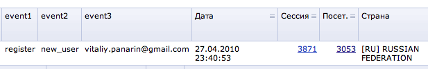

# Учет регистрации нового пользователя в статистике

**Навигация**
- [← Оглавление курса](index.md)
- [← Предыдущий: 2812 — Добавление закладки в социальную сеть](lesson_2812.md)
- [Следующий: 1978 — Зацикливание обработчиков событий →](lesson_1978.md)

Официальная страница урока: https://dev.1c-bitrix.ru/learning/course/index.php?COURSE_ID=43&LESSON_ID=2949

Для многих проектов важно отслеживать все новые регистрации на сайте в статистике для дальнейшего подробного анализа (например, откуда приходят пользователи, которые регистрируются). Отслеживать лучше всего через механизм Событий. При использовании Событий, появляется возможность смотреть отчеты по числу регистраций за день и строить график регистраций по времени.

Для решения задачи используется обработчик события [OnAfterUserRegister](http://dev.1c-bitrix.ru/api_help/main/events/onafteruserregister.php). Код обработчика будет таким:


```
AddEventHandler("main", "OnAfterUserRegister", "OnUserEmailLoginRegisterHandler");

function OnUserEmailLoginRegisterHandler(&$arFields)
{

	if(CModule::IncludeModule("statistic") && intval($_SESSION["SESS_SEARCHER_ID"]) <= 0)
	{
		$event1 = "register";
		$event2 = "new_user";
		$event3 = $arFields["EMAIL"];
		CStatistic::Set_Event($event1, $event2, $event3);
	}
	return $arFields;
}
```

В результате в отчетах модуля статистики появятся данные о регистрациях:


