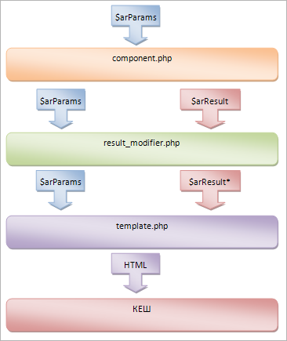

# Пример. Выборка из Информационного блока

**Навигация**
- [← Оглавление курса](index.md)
- [← Предыдущий: 2898 — Примеры решения задач](lesson_2898.md)
- [Следующий: 2897 — Модификация шаблона или создание result_modifier? →](lesson_2897.md)

Официальная страница урока: https://dev.1c-bitrix.ru/learning/course/index.php?COURSE_ID=43&LESSON_ID=2993

#### Типичная ошибка

Вот как выглядит типичная попытка начинающего разработчика осуществить выборку из Информационного блока в явном виде в теле страницы:

```
<?
require($_SERVER["DOCUMENT_ROOT"]."/bitrix/header.php");
$APPLICATION->SetTitle("Прямой вызов API Битрикса на странице");
?>
<h1><?=$APPLICATION->ShowTitle()?></h1>
<div class="box">
<?
$IBLOCK_ID = intval($arParams['IBLOCK_ID']);
if ($IBLOCK_ID <=0) $IBLOCK_ID = 1;

if(!CModule::IncludeModule("iblock"))
	die('iblock module is not included!');
//делаем выборку из Инфоблока
$arSort = Array("SORT"=>"ASC", "NAME"=>"ASC");
$arFilter = Array("IBLOCK_ID"=>$IBLOCK_ID,"ACTIVE"=>"Y");
$obIBlockResult = CIBlockElement::GetList($arSort, $arFilter);

//выводим результат выборки в виде списка
echo "<ol>";
while($arFields = $obIBlockResult->GetNext())
{
	echo "<li>{$arFields["NAME"]}</li>";
}
echo "</ol>";
?>
</div>
<?require($_SERVER["DOCUMENT_ROOT"]."/bitrix/footer.php");?>
```

#### Чем же плохо такое решение?

Основных проблем несколько:

- отсутствие кеширования на такой странице (в отличие от компонента);
- отсутствие внятной и явной передачи параметров (в отличие от компонента);
- риск открытия страницы визуальным редактором с заменой спецсимволов, приводящей к неработающему коду на странице.

Эти проблемы можно решить поместив код в шаблон пустого компонента, не потеряв при этом в скорости разработки за счет использования правильных инструментов.

#### Переход на использование компонента

Предлагается использовать **result_modifier.php**, который находится в папке шаблона компонента и изначально предназначен для модификации массива `$arResult` перед его выводом в файле шаблона **template.php**.

Рассмотрим классическую схему работы компонента с **result_modifier.php** в шаблоне, представленную на рисунке:



В данном случае, в **result_modifier.php** будет помещен непосредственно код, который до этого планировалось разместить прямо на странице.

Общая схема решения выглядит следующим образом:

1. На странице вместо кода с вызовами API помещается вызов пустого компонента **system.empty** со специальным шаблоном (например, **get_list**)
2. В этом шаблоне компонента создается файл **result_modifier.php**, в который помещается необходимый код с вызовами API. Файл **template.php** оставляется пустым. (Но в дальнейшем возможно его использование стандартным образом – для этого в **result_modifier.php** нужно будет сформировать массив `$arResult`, который и будет выводиться в шаблоне.)
3. В результате, на странице остается только вызов компонента, параметры которому можно передавать через массив параметров функции [IncludeComponent()](http://dev.1c-bitrix.ru/api_help/main/reference/cmain/includecomponent.php)

**Примечание**: компонент **system.empty** отсутствует в штатной поставке. Его нужно создавать самостоятельно.

Пример кода страницы:

```
<?
require($_SERVER["DOCUMENT_ROOT"]."/bitrix/header.php");
$APPLICATION->SetTitle("Компонентный подход: вызов API Битрикса в шаблоне компонента");
?>
<h1><?=$APPLICATION->ShowTitle()?></h1>
<div class="box">
<?
//задаем Инфоблок
$IBLOCK_ID = 1;

//подключаем пустой компонент, где логика лежит в шаблоне get_list в файле result_modifier.php
$APPLICATION->IncludeComponent(
	"bitrixonrails:system.empty",
	"get_list",
	Array(
		"IBLOCK_ID" => $IBLOCK_ID,
		"CACHE_TYPE" => "A",
		"CACHE_TIME" => "3600"
	),
false
);?>

</div>
<?require($_SERVER["DOCUMENT_ROOT"]."/bitrix/footer.php");?>
```

Перенесенный в **result_modifier.php** исходный код:

```
<?
//получаем идентификатор Инфоблока из параметров компонента
$IBLOCK_ID = intval($arParams['IBLOCK_ID']);
if ($IBLOCK_ID <=0) $IBLOCK_ID = 1;

if(!CModule::IncludeModule("iblock"))
	die('iblock module is not included!');
//делаем выборку из Инфоблока
$arSort = Array("SORT"=>"ASC", "NAME"=>"ASC");
$arFilter = Array("IBLOCK_ID"=>$IBLOCK_ID,"ACTIVE"=>"Y");
$obIBlockResult = CIBlockElement::GetList($arSort, $arFilter);

//выводим результат выборки в виде списка
echo "<ol>";
while($arFields = $obIBlockResult->GetNext())
{
	echo "<li>{$arFields["NAME"]}</li>";
}
echo "</ol>";
?>
```

Если необходимы и другие вставки кода, то просто создается новый шаблон (можно просто копированием шаблона **get_list**) и в его **result_modifier.php** вставляется нужный код. В результате получается множество шаблонов ("квази-компонентов"), каждый из которых соответствует исходной странице.
