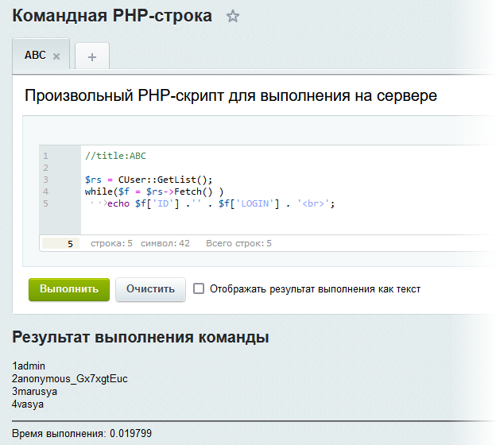

# Командная PHP-строка

**Навигация**
- [← Оглавление курса](index.md)
- [← Предыдущий: 5196 — Практика. Ограничение области поиска разделом](lesson_5196.md)
- [Следующий: 5119 — Система контроля версий →](lesson_5119.md)

Официальная страница урока: https://dev.1c-bitrix.ru/learning/course/index.php?COURSE_ID=43&LESSON_ID=3055

Иногда бывают ситуации, когда нужно быстро исполнить некоторый код, вызывающий функции API **Bitrix Framework** без создания новых страниц на сайте для этого. В этом случае поможет удобный и простой инструмент — командная PHP-строка, позволяющий запускать произвольный код на PHP с вызовами функций.

Инструмент расположен в административной части сайта по следующему пути: Настройки &gt; Инструменты &gt; Командная PHP-строка и имеет адрес `/bitrix/admin/php_command_line.php`.

Вот как выглядит результат выполнения кода, использующего функции класса [CUser](http://dev.1c-bitrix.ru/api_help/main/reference/cuser/index.php) Главного модуля:

С помощью кнопки "+" можно создавать новые закладки и сохранять в них частоиспользуемый php-код. Для переименования закладки используйте `//title:***` в начале вашего кода.

**Примечание**: Аналогичный [инструмент](http://dev.1c-bitrix.ru/learning/course/index.php?COURSE_ID=35&LESSON_ID=2029) есть и для работы с БД.
