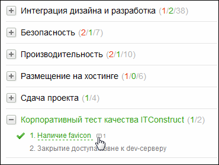
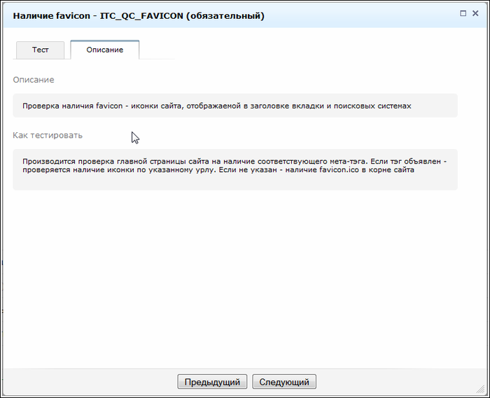

# Модификация тестов

**Навигация**
- [← Оглавление курса](index.md)
- [← Предыдущий: 3084 — Способы использования](lesson_3084.md)
- [Следующий: 4971 — Несколько советов →](lesson_4971.md)

Официальная страница урока: https://dev.1c-bitrix.ru/learning/course/index.php?COURSE_ID=43&LESSON_ID=3082

Система допускает модификацию тестов под нужды разработчика используя штатный механизм Событий **Bitrix Framework**.

Разработчики, при необходимости, могут сами добавить свои тесты и разделы в **Монитор качества**.

Так же инструмент можно адаптировать под нужды конкретной задачи, создав собственные разделы и тесты. Например:

- Тесты по SEO-оптимизации;
- Тест на CodeStyle;
- Тест на корректность работы биллинга под нагрузкой;
- и другие.

#### Как дополнить штатные тесты

Сначала нам необходимо описать свои тесты и их разделы. Для этого вешаем обработчик на событие Главного модуля *onCheckListGet*. Событие вызывается в конструкторе *CCheckList* с аргументом **$arCheckList** следующего вида:

```
array(2) {
	["CATEGORIES"]=>
	array(10) {
		["QDESIGN"]=>
		array(0) {
		}
		["DESIGN"]=>
		array(1) {
		["PARENT"]=>
		string(7) "QDESIGN"
		}
		["MODEL"]=>
		array(1) {
		["PARENT"]=>
		string(7) "QDESIGN"
		}
	["STANDART"]=>
	array(1) {
		["PARENT"]=>
		string(7) "QDESIGN"
		}
	}
	["POINTS"]=>
	array(65) {
		["QD0010"]=>
		array(2) {
			["PARENT"]=>
			string(6) "DESIGN"
		["REQUIRE"]=>
		string(1) "Y"
		}
		["QD0020"]=>
		array(5) {
			["REQUIRE"]=>
			string(1) "Y"
			["PARENT"]=>
			string(6) "DESIGN"
			["AUTO"]=>
			string(1) "Y"
			["CLASS_NAME"]=>
			string(10) "CAutoCheck"
			["METHOD_NAME"]=>
			string(14) "CheckTemplates"
	}
)
```

Нетрудно заметить, что **CATEGORIES** содержит список разделов чеклиста, которые могут быть вложенными, а **POINTS** - сами тесты.

Ключ массива **CATEGORIES** — ID раздела, значение — массив параметров:

- NAME - наименование раздела;
- LINKS
- PARENT - родительский раздел.


Пример описания раздела:

```
$checkList['CATEGORIES']['ITC_QC'] = array(
	'NAME' => 'Корпоративный тест качества ITConstruct',
	'LINKS' => ''
);
```

Ключом элементов POINTS является символьный идентификатор теста, а значение представляет собой массив следующих параметров:

- **NAME** - наименование теста;
- **DESC** - краткое описание теста (вкладка **Рекомендации**, блок **Описание**);
- **HOWTO** - длинный текст о том, что будет проверяться (вкладка **Рекомендации**, блок **Как тестировать**);
- **LINKS** - аналогично разделам;
- **PARENT** - ID раздела, обязательное;
- **REQUIRE** - флаг обязательности теста (Y/N);
- **AUTO** - "Y", если является автотестом;
- **CLASS_NAME** - имя класса теста (для автотеста);
- **METHOD_NAME** - имя метода теста (для автотеста);
- **FILE_PATH** - подключение файла теста, если он вынесен в отдельный скрипт (для автотеста). Путь - относительно **DOCUMENT_ROOT**;
- **PARAMS** - массив дополнительных параметров, передаваемых первым аргументом при вызове метода автотеста.

**Примечание**: Такие ключи как **NAME**, **DESC** и **LINKS** можно не определять в массиве описания теста, они являются языкозависимыми и жесткое определение их прямо в обработчике лишает возможности локализации.

Достаточно подключить свой языковой файл примерно с таким содержанием:

```
$MESS["CL_ITC_QC_FAVICON_NAME"] = 'Наличие favicon';
$MESS["CL_ITC_QC_FAVICON_DESC"] = 'Проверка наличия favicon - иконки сайта';
$MESS["CL_ITC_QC_FAVICON_LINKS"] ='блаблабла';
```

И эти языковые фразы будут подтягиваться в поля **NAME**, **DESC** и **LINKS** теста с кодом **ITC_QC_FAVICON**.
К **HOWTO** это тоже будет относиться, но пока его можно определить только в массиве описания пункта.

Пример:

```
$checkList['POINTS']['ITC_QC_FAVICON'] = array(
	'PARENT' => 'ITC_QC',
	'REQUIRE' => 'Y',
	'AUTO' => 'Y',
	'CLASS_NAME' => __CLASS__,
	'METHOD_NAME' => 'checkFavicon',
	'NAME' => 'Наличие favicon',
	'DESC' => 'Проверка наличия favicon - иконки сайта, отображаемой в заголовке вкладки и поисковых системах',
	'HOWTO' => 'Производится проверка главной страницы сайта на наличие соответствующего мета-тэга.
		Если тэг объявлен - проверяется наличие иконки по указанному урлу.
		Если не указан - наличие favicon.ico в корне сайта',
	'LINKS' => 'links'
);
```

Обработчик события может возвращать как изменённый **$arCheckList**, так и новый массив с разделами и тестами - если категория/тест с неким ID уже существует, то он не заменится, т.е. подкорректировать системные тесты не получится.

Теперь необходимо объявить метод для автотеста. Для альфа-версии логика теста будет тривиальна:

```
$check = file_exists($_SERVER['DOCUMENT_ROOT'] . '/favicon.ico')
```

По результатам проверки мы должны вернуть массив. Автотест может быть одно- или многошаговым. Если тест многошаговый и текущая итерация не является конечной, необходимо вернуть массив следующего вида:

```
$arResult = array(
	'IN_PROGRESS' => 'Y',
	'PERCENT' => '42',
);
```

**PERCENT** служит лишь для визуализации прогресса на странице и никуда не сохраняется для последующего использования. Промежуточные данные для идентификации прогресса шага надо сохранять самим - в сессию, временный файл, базу (в зависимости от объёма данных и прочих условий).

Если же тест закончен, сообщаем статус массивом, содержащим следующие ключи:

- **STATUS**- результат теста. **true**, если успешно, нечто иное, если тест провалился. В коде проверяется так:
  `if ($result['STATUS'] == "true")`
- **MESSAGE** - разъяснения результата:

  - **PREVIEW** - краткий текст результата;
  - **DETAIL** - расширенное объяснение, открываемое во всплывающем окне.

Готовый метод теста фавиконки имеет вид:

```
static public function checkFavicon($arParams)
{
	$arResult = array('STATUS' => 'F');
	$check = file_exists($_SERVER['DOCUMENT_ROOT'] . '/favicon.ico');

	if ($check === true) {
		$arResult = array(
			'STATUS' => true,
			'MESSAGE' => array(
			'PREVIEW' => 'Favicon найдена - ' . '/favicon.ico',
			),
		);
	} else {
		$arResult = array(
			'STATUS' => false,
			'MESSAGE' => array(
				'PREVIEW' => 'Favicon не найдена',
				'DETAIL' => 'Тест очень старался, но так и не смог найти фавыконку. Ну и чёрт с ней',
			),
		);
	}

	return $arResult;
}
```

#### Результат

Тест в мониторе качества:



Справочная информация о тесте:



#### Код

Код обработчика и тесты целиком:

```

AddEventHandler('main', 'OnCheckListGet', array('CItcCheckListTests', 'onCheckListGet'));

class CItcCheckListTests
{
	static public function onCheckListGet($arCheckList)
	{
		$checkList = array('CATEGORIES' => array(), 'POINTS' => array());

		$checkList['CATEGORIES']['ITC_QC'] = array(
			'NAME' => 'Корпоративный тест качества ITConstruct',
		'LINKS' => ''
		);

		$checkList['POINTS']['ITC_QC_FAVICON'] = array(
			'PARENT' => 'ITC_QC',
			'REQUIRE' => 'Y',
			'AUTO' => 'Y',
			'CLASS_NAME' => __CLASS__,
			'METHOD_NAME' => 'checkFavicon',
			'NAME' => 'Наличие favicon',
			'DESC' => 'Проверка наличия favicon - иконки сайта, отображаемой в заголовке вкладки и поисковых системах',
			'HOWTO' => 'Производится проверка главной страницы сайта на наличие соответствующего мета-тэга.
				Если тэг объявлен - проверяется наличие иконки по указанному урлу.
				Если не указан - наличие favicon.ico в корне сайта',
			'LINKS' => 'links'
		);

		$checkList['POINTS']['ITC_QC_DENY_DEV'] = array(
			'PARENT' => 'ITC_QC',
			'REQUIRE' => 'N',
			'AUTO' => 'N',
			'NAME' => 'Закрытие доступа извне к dev-серверу',
			'DESC' => 'Согласовать с менеджером закрытие доступа ко внутреннему серверу разработок из внешнего мира',
			'HOWTO' => 'Попинговать с телефона после апдейта днса',
		);

		return $checkList;
	}

	static public function checkFavicon($arParams)
	{
		$arResult = array('STATUS' => 'F');
		$check = file_exists($_SERVER['DOCUMENT_ROOT'] . '/favicon.ico');

		if ($check === true) {
			$arResult = array(
			'STATUS' => true,
			'MESSAGE' => array(
				'PREVIEW' => 'Favicon найдена - ' . '/favicon.ico',
				),
			);
	} else {
 	           $arResult = array(
			'STATUS' => false,
			'MESSAGE' => array(
				'PREVIEW' => 'Favicon не найдена',
				'DETAIL' => 'Тест очень старался, но так и не смог найти фавыконку. Ну и чёрт с ней',
				),
			);
	}

	return $arResult;
	}
}
```
