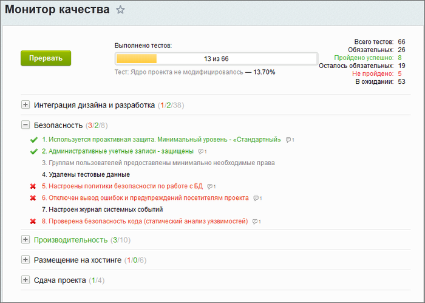
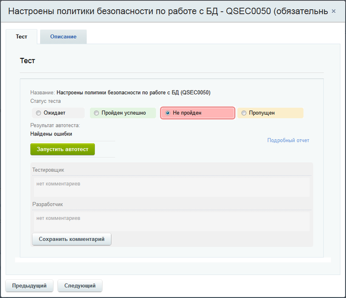
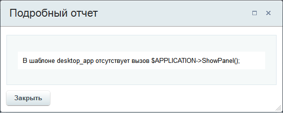
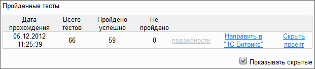

# Сдача проекта

**Навигация**
- [← Оглавление курса](index.md)
- [← Предыдущий: 3439 — Как добавить поле к любому объекту](lesson_3439.md)
- [Следующий: 3084 — Способы использования →](lesson_3084.md)

Официальная страница урока: https://dev.1c-bitrix.ru/learning/course/index.php?COURSE_ID=43&LESSON_ID=3083

### Сдача проекта

Сдача проекта производится на странице **Монитор качества** (Настройки &gt; Инструменты &gt; Монитор качества). При первом открытии отобразится страница с вводной информацией. Запуск тестов произойдёт после нажатия на кнопку , после чего откроется дерево тестов с предложением запуска автотестирования. Автотестирование можно отложить и запустить его позже.

### Тесты

#### Автоматизированный тест

После запуска автоматизированого теста система соберет данные и предложит отобразить тесты, которые по ее мнению пройдены, а какие - нет:

По результатам одного только автоматического тестирования проект сдать не получится, даже если все автоматические тесты будут пройдены.

#### Ручной тест

Необходимо открыть непройденные или ручные тесты и вручную перевести их в тот или иной статус и дать, при необходимости описание.

### Прохождение тестов

Тест открывается кликом по его названию. Форма автоматического теста (в форме ручного теста отсутствует кнопка **Запустить автотест**):

Если тест не пройден, то по ссылке Подробный отчет можно просмотреть причины непрохождения:

В закладке **Рекомендации** можно посмотреть условия теста, и какие параметры в системе нужно проверить и исправить для правильного его прохождения.

После исправления ошибок можно:

- запустить повторно автоматический тест;
- вручную сменить статус ручного теста.

**Примечание**: ручной перевод обязательного теста в  статус **Пропущен** требует обязательного добавления комментария.

После прохождения всех обязательных тестов веб-проект можно успешно сдать, после чего отчет по тестированию попадает в архив.

### Архив

Отчеты можно просмотреть в любое время, получив подробную информацию по каждому тесту (в том числе и системные сообщения автотестов).

**Примечание**: Отчёт можно послать в компанию "1С-Битрикс" для участия в программе монитора качества. Для этого используйте ссылку Направить в 1С-Битрикс и заполните открывшуюся форму.
