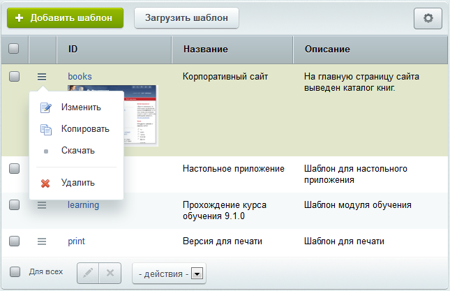
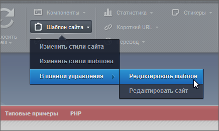
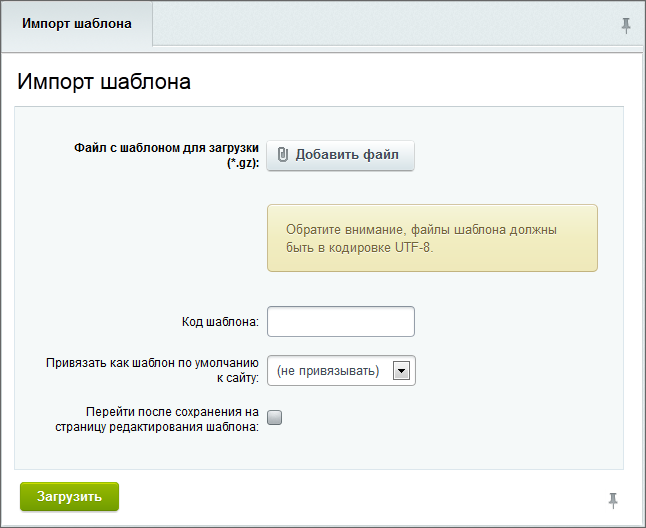

# Создание и управление шаблоном

**Навигация**
- [← Оглавление курса](index.md)
- [← Предыдущий: 2820 — Что такое Шаблон сайта](lesson_2820.md)
- [Следующий: 3234 — Разработка шаблона дизайна →](lesson_3234.md)

Официальная страница урока: https://dev.1c-bitrix.ru/learning/course/index.php?COURSE_ID=43&LESSON_ID=3232

Тему урока можно изучить в новом формате — [в документации по Bitrix Framework](https://docs.1c-bitrix.ru/pages/cms-basics/site-templates.html). В ней улучшена структура, описание, примеры.

Управление шаблонами дизайна осуществляется в административном разделе на странице **Шаблоны сайта** (Настройки &gt; Настройки продукта &gt; Сайты &gt; Шаблоны сайтов), где можно:

- [Создать новый](#new);
- [Отредактировать существующий](#edit);
- [Импортировать/Экспортировать шаблон](#import);

|  |
| --- |

#### Создание шаблона

Шаблон дизайна сайта может быть создан непосредственно в системе с помощью формы **Новый шаблон**, для перехода к которой служит кнопка **Добавить шаблон**, расположенная на контекстной панели.

При создании нового шаблона через интерфейс задается:

- его идентификатор;
- название;
- описание для показа в списке;
- порядок следования в общем списке;
- тип;
- код внешнего вида сайта;
- таблицы стилей:

  - Закладка **Стили сайта** служит для описания таблиц каскадных стилей (CSS), используемых на страницах сайта. Описание стилей хранится в файле **styles.css** в папке шаблона сайта.
  - Закладка **Стили шаблона** служит для описания таблиц каскадных стилей (CSS), используемых в шаблоне. Описание стилей хранится в файле **template_styles.css** в папке шаблона сайта.
- набор используемых включаемых компонентов и картинок.

При сохранении шаблона автоматически создается поддиректория `/bitrix/templates/<идентификатор_шаблона>`.

Все используемые графические элементы рекомендуется размещать в директории `/bitrix/templates/<идентификатор_шаблона>/images/`.

**Примечание:** На время создания шаблона рекомендуется отключить кеширование.

Для наглядного представления шаблона в списке может использоваться его скриншот. Скриншот размещается в папке соответствующего шаблона в файле с именем **screen.gif** (например, `/bitrix/templates/books/screen.gif`).

|  |
| --- |

#### Редактирование шаблона

Чтобы просмотреть или поменять структуру и программный код шаблона, перейдите в режим редактирования, выбрав в меню действий пункт **Изменить** в списке шаблонов, либо используйте пункт

			Редактировать шаблон

                    

		 меню кнопки **Шаблон сайта** на административной панели в Публичном разделе.

Ранее была возможность редактировать шаблон дизайна, как с использованием визуального редактора, так и работая с исходным кодом. С версии 14.0 эта опция отключена.

**Внимание!** В шаблоне дизайна сайта категорически не рекомендуется использовать комплексные компоненты.

|  |
| --- |

#### Экспорт/Импорт шаблона

С помощью интерфейса системы используемый на сайте шаблон может быть выгружен в файл формата **&lt;имя_шаблона&gt;.tar.gz**. Для выгрузки шаблона служит пункт контекстного меню **Скачать**.

Готовый шаблон можно импортировать в виде комплекта файлов с помощью менеджера файлов либо с помощью специального интерфейса системы. На странице со списком шаблонов имеется специальная кнопка контекстной панели **Загрузить шаблон**.

При нажатии на кнопку открывается форма:

- С помощью кнопки **Обзор...** укажите файл с шаблоном для загрузки.
  **Примечание:** Файлы шаблона должны быть в кодировке UTF-8.
- Чтобы использовать другой идентификатор, а сам шаблон был размещён в папке с соответствующим именем, в поле **Код шаблона** указывается нужный код.
- Также можно привязать загруженный шаблон как шаблон по умолчанию для выбранного сайта с помощью соответствующей опции.
