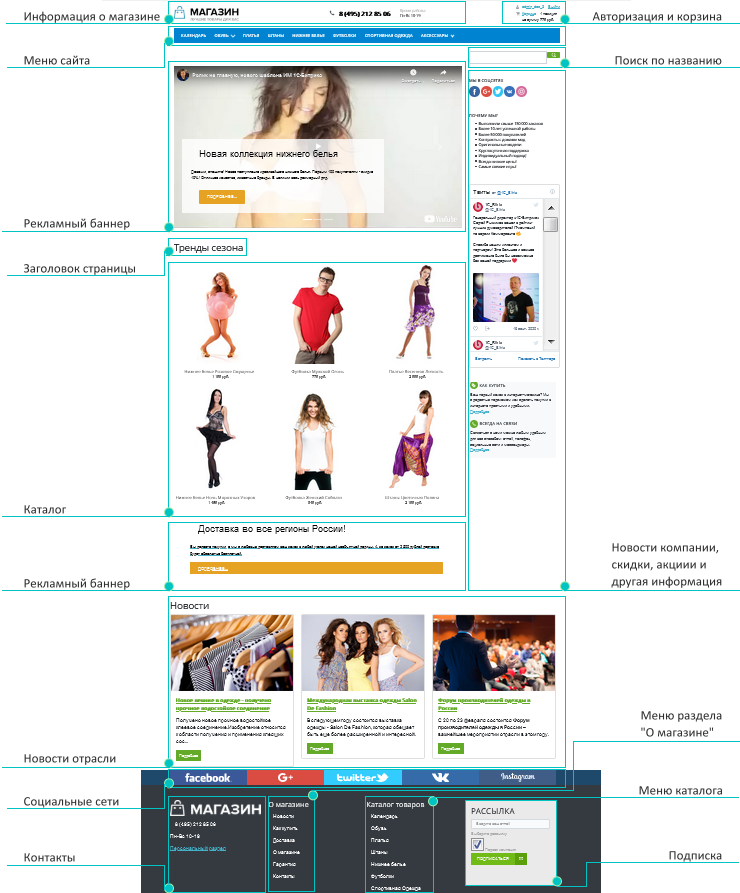
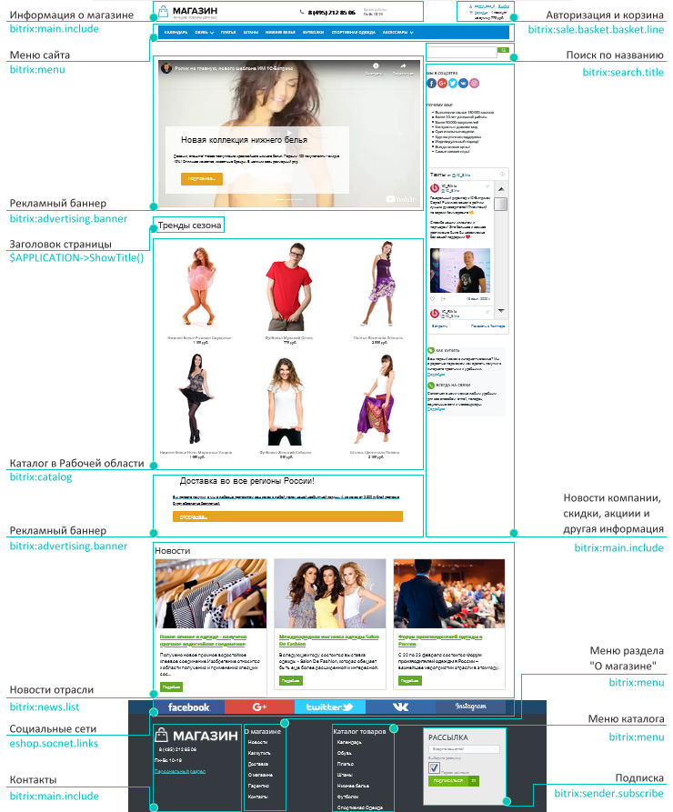
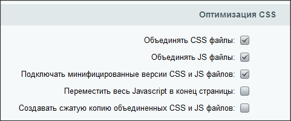

# Разработка шаблона дизайна

**Навигация**
- [← Оглавление курса](index.md)
- [← Предыдущий: 3232 — Создание и управление шаблоном](lesson_3232.md)
- [Следующий: 5409 — Пример. Использование Включаемых областей →](lesson_5409.md)

Официальная страница урока: https://dev.1c-bitrix.ru/learning/course/index.php?COURSE_ID=43&LESSON_ID=3234

Тему урока можно изучить в новом формате — [в документации по Bitrix Framework](https://docs.1c-bitrix.ru/pages/cms-basics/site-templates.html). В ней улучшена структура, описание, примеры.


Процесс создания шаблона сайта включает два основных этапа:


### Разработка прототипа

Прототип представляет собой сверстанный в html шаблон дизайн сайта. При верстке в шаблоне выделяются функциональные области, например:



- заголовок страницы;
- меню;
- цепочка навигации;
- форма авторизации;
- форма поиска;
- включаемые области и файлы;
- рекламные области;
- и т.д.

### Создание полнофункционального шаблона

На втором этапе выполняется замена HTML элементов дизайна на соответствующие функциональные элементы: программный код и вызовы компонентов. В результате чего уже получается PHP-шаблон дизайна сайта.



**Примечание:** При создании шаблона сайта возможно использование различных программных условий, влияющих на отображение тех или иных элементов шаблона для различных разделов сайта. В этом случае для раздела сайта нужно определить

			некоторое свойство

                    Управление свойствами страницы в Административном разделе, независимо от выбранного редактора, осуществляется в форме редактирования страницы...

[Подробнее ...](http://dev.1c-bitrix.ru/learning/course/index.php?COURSE_ID=35&LESSON_ID=1929)

		, значение которого будет проверяться в шаблоне сайта:

```

<?if ($APPLICATION->GetProperty(“SECT_PROP”)=="Y"):?>
```

Подобные условия можно вводить для любых элементов шаблона. Например, можно отключать показ включаемых областей или управлять показом навигационной цепочки, и т.п.

|  |
| --- |

### Рекомендации по созданию шаблона

Основные моменты, которые нужно учитывать при создании шаблона:

- При подготовке графического дизайна следует заранее разметить линию раздела дизайна на пролог (**header.php**) и эпилог (**footer.php**).
- Следует выделить основные элементы дизайна, для последующей модификации таблицы стилей: шрифты, цвета заливки и т.п.
- Разрабатывая дизайн меню различных уровней, желательно выделять повторяющиеся элементы - для упрощения создания шаблона меню и дальнейшего управления этими меню.
- Для облегчения сопровождения различных языковых версий сайта по возможности следует использовать вместо графических  элементов текстовые.
- При нарезке графического дизайна и подготовке HTML шаблона, необходимо заранее предусмотреть место расположения основных компонентов системы управления сайтом. Выделить области меню, рекламные области, области размещения дополнительных форм. Рекомендуется верстать компоненты независимо от основного шаблона. Чтобы в будущем, при перемещении компонента в другое место или другой шаблон, не поехала верстка.
- Для удобства отладки верстки, рекомендуется отключить
  			сжатие и объединение css и js файлов
  Одним из способов повышения производительности является
   использование штатной функции объединения и сжатия
  **css** и **js** файлов, которое включается в настройках
   главного модуля:
  
  [Подробнее ...](/learning/course/index.php?COURSE_ID=35&LESSON_ID=4469)
  		.
- Размещать графические изображения, относящиеся к шаблону сайта, следует в папке `/bitrix/templates/<имя_шаблона>/images`.
- Каскадные стили, используемые в шаблоне, рекомендуется разделять на две таблицы стилей, хранящиеся в двух разных файлах. Оба файла находятся в директории `/bitrix/templates/<идентификатор_шаблона>/`. Файл **styles.css** содержит стили для представления информационного содержания страницы на сайте. Файл **template_styles.css**  содержит стили для отображения текстов в самом шаблоне дизайна.
  В крайнем случае
                      По "фен шую" это неправильно, так как ресурсы нужно подключать через API, чтобы для них работало объединение в один файл, подключение минифицированных версий, кэширование и т.д
  		 допускается подключение в `<head>` любое количество стилевых файлов, дополнительно к **styles.css** и **template_styles.css**, подключаемым через **showhead()**. Делается это обычными линками перед закрытием тэга `</head>`, а дополнительные стилевые файлы положите в любую папку. Эффект будет тот же самый, как если бы вы собрали все ваши дополнительные стили и дописали их в два файла шаблона сайта со стандартными наименованиями.

Создание шаблона сайта рекомендуется выполнять на локальной демо-версии продукта. Готовый шаблон необходимо экспортировать средствами системы в виде комплекта файлов формата **tar.gz** на удаленный сервер и развернуть его.


**Примечание**: Крайне не рекомендуется использование комплексных компонентов в шаблоне дизайна. Так как в этом случае правила переписывания адресов начинают работать для всего сайта. Это может отражаться на работе

			ЧПУ

                    Правила обработки адресов настраиваются отдельно для каждого сайта и каждое правило должно содержать уникальное в рамках сайта условие выполнения.

[Подробнее ...](https://dev.1c-bitrix.ru/learning/course/index.php?COURSE_ID=35&LESSON_ID=12057)

		 других компонентов и страницы `/404.php`. Комплексные компоненты должны находиться в `#WORKAREA`.

Как правило, для сайта разрабатывается несколько шаблонов: Для главной, для раздела, для детальной и так далее. Если различия между шаблонами незначительны, то лучше использовать один шаблон:

- либо с внедрённой в него проверкой того, какая страница сейчас открыта,
- либо с использованием включаемых областей.

Практика показывает, что это решение намного дешевле в сопровождении сайта.

**Опыт веб-разработчиков.**

[**Роман Петров**](http://dev.1c-bitrix.ru/community/webdev/user/11573/): Мы, например, интегрируем готовую верстку в Битрикс и поэтому в большинстве случаев у нас стили задаются для всего сайта сразу, стили компонентов мы чаще всего удаляем, а сами шаблоны компонентов складываем в **.default** потому что это сильно экономит время при наличии нескольких шаблонов сайта.

Мы складываем все шаблоны в **.default** потому, что если на сайте несколько шаблонов дизайна, очень тяжело вносить правки в каждый из них. Гораздо проще поменять в одном месте.

[**Sergey Leshchenko**](http://dev.1c-bitrix.ru/community/webdev/user/2854/): Значит, я храню в:

**.default** - все шаблоны компонентов, все стили всех шаблонов сайтов, картинки/спрайты, js и прочее с преследованием цели минимизации обращений к веб-серверу, но без фанатизма.

`site_template_name/` - **styles.css** со стилями для визуального редактора, шаблоны общих компонентов специфичные только под данным шаблоном сайта.

[**Евгений Малков**](http://dev.1c-bitrix.ru/community/webdev/user/1848/): Все стили храню в папке шаблона сайта в одном файле **styles.css**. Картинки, используемые в css, в `/images/` в корне сайта.
Когда точно знаю, что будет 1 сайт то храню шаблоны компонент в **.default**, когда несколько сайтов - в шаблоне сайта.
Иногда, при другом шаблоне для ряда страниц (например для главной), в **styles.css** этого шаблона подключаю стиль основного шаблона.
От верстальщика приходит 1 файл стилей на все шаблоны и делить его, особенно для компонент, сложно.
