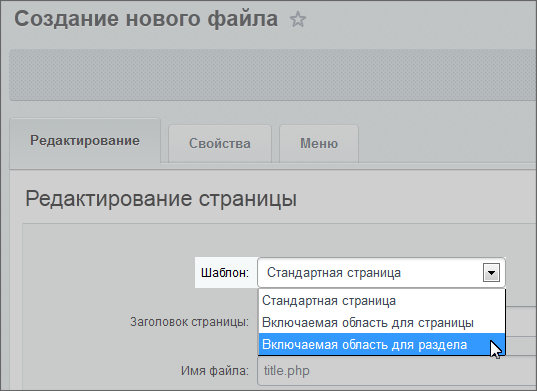

# Разработка шаблонов страниц

**Навигация**
- [← Оглавление курса](index.md)
- [← Предыдущий: 3855 — Как вывести произвольный контент в шаблоне сайта и компонента](lesson_3855.md)
- [Следующий: 3095 — Общие правила оформления кода →](lesson_3095.md)

Официальная страница урока: https://dev.1c-bitrix.ru/learning/course/index.php?COURSE_ID=43&LESSON_ID=3235

Тему урока можно изучить в новом формате — [в документации по Bitrix Framework](https://docs.1c-bitrix.ru/pages/cms-basics/page-templates.html). В ней улучшена структура, описание, примеры.

Система Bitrix Framework позволяет создавать и использовать шаблоны для рабочей и включаемых областей страницы сайта. Использование таких заготовок особенно полезно и эффективно в тех случаях, когда страницы сайта имеют довольно сложную структуру (верстку).

Шаблоны страниц и редактируемых областей хранятся в папке `/page_templates/`, находящейся в каталоге соответствующего шаблона сайта или в папке `/bitrix/templates/.default/`, если предполагается использование одинаковых шаблонов страниц для всех шаблонов сайта.

При создании страницы в режиме визуального HTML-редактора достаточно выбрать из списка нужную  заготовку, по которому будет создана страница, и добавить необходимую информацию.

Детально о создании шаблонов страниц описано в курсе

			Администратор. Базовый

                    На проектах с большим содержанием статических страниц возникает задача оптимизации труда контент-менеджеров. Решить эту задачу можно с помощью создания шаблонов. Есть несколько вариантов шаблонизации контента статики.

[Подробнее ...](https://dev.1c-bitrix.ru/learning/course/index.php?COURSE_ID=35&CHAPTER_ID=03090&LESSON_PATH=3906.4493.4500.3090)
