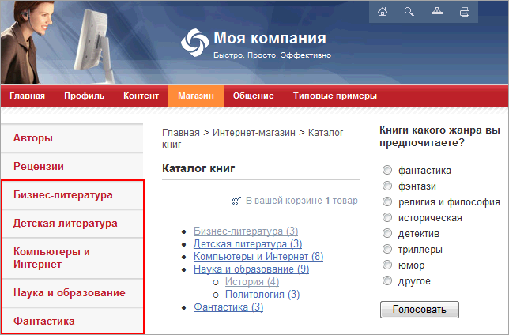

# Построение и показ меню

**Навигация**
- [← Оглавление курса](index.md)
- [← Предыдущий: 3531 — Примеры работы с навигационной цепочкой](lesson_3531.md)
- [Следующий: 3473 — Шаблоны меню →](lesson_3473.md)

Официальная страница урока: https://dev.1c-bitrix.ru/learning/course/index.php?COURSE_ID=43&LESSON_ID=3254

В общем случае задача формирования меню включает:

- выделение HTML элементов для построения меню;
- создание шаблона меню (создание шаблона компонента **Меню**);
- включение функции показа меню (вызов компонента **Меню**) в общем шаблоне ("прологе" и "эпилоге");
- заполнение меню в соответствии со структурой сайта.


## Структура меню

Любое меню на сайте строится на основе двух составляющих:

- массива данных `$aMenuLinks`, определяющего состав меню, задает названия и ссылки для всех пунктов меню. Управление массивом данных осуществляется через административный интерфейс;
- шаблона внешнего представления меню. Шаблон меню – это PHP код, определяющий внешний вид меню (шаблон компонента **Меню**). Шаблон меню обрабатывает массив данных, выдавая на выходе HTML-код.

### Массив данных меню

Данные для каждого типа меню хранятся в отдельном файле, имя которого имеет следующий формат: **.&lt;тип меню&gt;.menu.php**. Например, для хранения данных меню типа **left** будет использоваться файл **.left.menu.php**, а для хранения данных меню типа **top** - файл **.top.menu.php**.

Меню является иерархически наследуемым. Файлы меню размещаются в папках тех разделов сайта, где требуется показ соответствующих типов меню. Если для данного раздела не создан соответствующий файл меню, система производит поиск файла в каталоге уровнем выше.

Например, т.к. основное меню (в демо-версии продукта, это меню типа **top**) должно выводиться во всех разделах, то файл данного меню помещается только в корневой каталог сайта.

Соответственно меню второго уровня (в демо-версии продукта, это меню **left**) выводится отдельно для каждого раздела сайта. Поэтому в папке каждого раздела создается свой файл для данного типа меню.

**Ещё пример**: посетитель находится в разделе `/ru/company/about/`. Для показа меню типа left файл меню ищется системой в следующей последовательности:

1. `/ru/company/about/.left.menu.php`
2. `/ru/company/.left.menu.php`
3. `/ru/.left.menu.php`
4. `/.left.menu.php`

Если в одном из каталогов найдено меню, то поиск останавливается и в вышележаших каталогах уже не ищется.

Система Bitrix Framework позволяет также создавать

			меню динамического типа

                    Для этого требуется в компоненте Меню включить опцию **Подключать файлы с именами вида .тип_меню.menu_ext.php** ("USE_EXT" =&gt; "Y"), которая по умолчанию выключена.

		. Т.е. массив данных таких меню генерируется автоматически на основании некоторых данных, получаемых с помощью программного кода. Данный код должен храниться в папке соответствующего раздела сайта в файле с именем **.&lt;тип меню&gt;.menu_ext.php.**

Основная задача подобных файлов - это манипуляция массивом `$aMenuLinks`. Данные файлы не редактируются визуально в модуле **Управление структурой**, поэтому они не смогут быть случайно отредактированы при визуальном редактировании меню. При создании этого файла используйте компонент **Пункты меню** (**bitrix:menu.sections**).

**Примечание**: В абзаце выше речь идёт только о дополнении созданного меню названиями разделов инфоблоков. Например, для дополнения меню названиями форумов этот вариант не годится.

**Внимание!** Если  в качестве пунктов меню используются разделы каталога без ЧПУ, необходимо указывать переменные в значимых переменных запроса.

Примером такого меню может служить левое меню раздела **Каталог книг**, представленное в старой демо-версии продукта. Здесь первые два пункта меню **Авторы** и **Рецензии** созданы обычным способом, а остальные (**Бизнес-литература**, **Детская литература** и т.д.) формируются динамически.



В данном случае в качестве пунктов меню используются названия групп каталога **Книги**, созданного на основе информационных блоков. Программный код, на основе которого генерируется меню, хранится в файле **.left.menu_ext.php** в папке `/e-store/books/`.

В файлах **.&lt;тип меню&gt;.menu.php** могут использоваться следующие стандартные переменные:

- `$sMenuTemplate` - абсолютный путь к шаблону меню (данная переменная используется крайне редко);
- `$aMenuLinks` - массив, каждый элемент которого описывает очередной пункт меню.
  Структура данного массива:
  ```
  Array
  (
  	[0] => пункт меню 1
  		Array
  			(
  				[0] => заголовок пункта
  				[1] => ссылка на пункте
  				[2] => массив дополнительных ссылок для подсветки пункта:
  					Array
  						(
  							[0] => ссылка 1
  							[1] => ссылка 2
  							...
  						)
  				[3] => массив дополнительных переменных передаваемых в шаблон меню:
  					Array
  						(
  							[имя переменной 1] => значение переменной 1
  							[имя переменной 2] => значение переменной 2
  							...
  						)
  				[4] => условие, при котором пункт появляется
  					это PHP выражение, которое должно вернуть "true"
  			)
  	[1] => пункт 2
  	[2] => пункт 3
  	...
  )
  ```

**Примеры файлов меню**


```
<?
// пример файла .left.menu.php

$aMenuLinks = Array(
	Array(
		"Каталог курсов",
		"index.php",
		Array(),
		Array(),
		""
	),

	Array(
		"Мои курсы",
		"mycourses.php",
		Array(),
		Array(),
		"\$GLOBALS['USER']->IsAuthorized()"
	),

	Array(
		"Журнал обучения",
		"gradebook.php",
		Array(),
		Array(),
		"\$GLOBALS['USER']->IsAuthorized()"
	),

	Array(
		"Анкета специалиста",
		"profile.php",
		Array(),
		Array(),
		"\$GLOBALS['USER']->IsAuthorized()"
	),
);
?>
```

```
<?
// пример файла .left.menu_ext.php

if(!defined("B_PROLOG_INCLUDED") || B_PROLOG_INCLUDED!==true)die();

global $APPLICATION;

$aMenuLinksExt = $APPLICATION->IncludeComponent(
	"bitrix:menu.sections",
	"",
	Array(
		"ID" => $_REQUEST["ELEMENT_ID"],
		"IBLOCK_TYPE" => "books",
		"IBLOCK_ID" => "30",
		"SECTION_URL" => "/e-store/books/index.php?SECTION_ID=#ID#",
		"CACHE_TIME" => "3600"
	)
);

$aMenuLinks = array_merge($aMenuLinks, $aMenuLinksExt);
?>
```

## Организация показа меню

Показ меню на страницах сайта выполняется с помощью компонента **Меню (bitrix:menu)**. Например, вызов верхнего меню на демо-сайте имеет следующий вид:

```
<?$APPLICATION->IncludeComponent(
	"bitrix:menu",
	"horizontal_multilevel",
	Array(
		"ROOT_MENU_TYPE" => "top",
		"MAX_LEVEL" => "3",
		"CHILD_MENU_TYPE" => "left",
		"USE_EXT" => "Y"
	)
);?>
```

Данный код помещается в предусмотренные для вывода меню области шаблона сайта.

### Построение меню сайта

Построение меню для показа происходит следующим образом:

- в общий шаблон показа включается вызов вывода меню на экран;
- при загрузке компонент проверяет наличие в текущем разделе сайта файла, содержащего массив значений для меню;
- затем компонент вызывает шаблон построения для данного типа меню и выводит HTML меню на экран.
