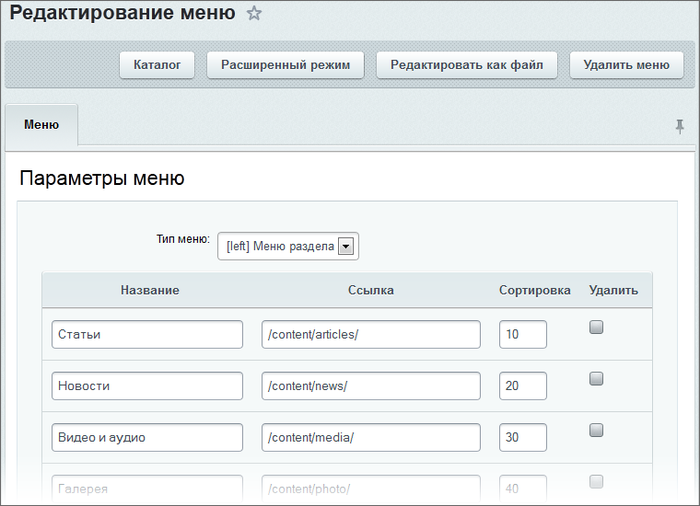
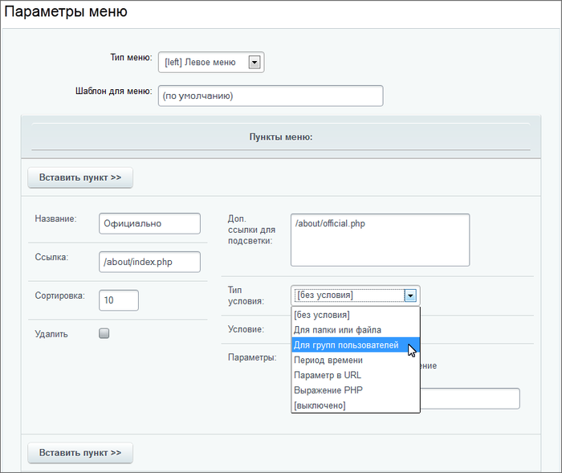

# Управление меню

**Навигация**
- [← Оглавление курса](index.md)
- [← Предыдущий: 3473 — Шаблоны меню](lesson_3473.md)
- [Следующий: 3498 — Примеры создания меню →](lesson_3498.md)

Официальная страница урока: https://dev.1c-bitrix.ru/learning/course/index.php?COURSE_ID=43&LESSON_ID=3256

Управление меню выполняется как с помощью средств административного, так и публичного раздела. Про работу с меню из публичного раздела читайте в курсе [Контент-менеджер](https://dev.1c-bitrix.ru/learning/course/index.php?COURSE_ID=34&LESSON_ID=10239).


### Создание меню

Перейти к созданию меню раздела из административного раздела можно с помощью команды **Добавить меню** кнопки **Добавить**, расположенной на контекстной панели **Менеджера файлов**:


    Меню будет создано для раздела, папка которого открыта в данный момент в Менеджере файлов.


**Примечание**: В результате данных операций создается файл данных меню с именем **.&lt;тип_ меню&gt;.menu.php**. Однако в Менеджере файлов имя файла данных автоматически представляется в виде ссылки **Меню типа**"**&lt;тип_меню&gt;**".

### Редактирование меню

**Примечание**: При редактировании меню выполняется изменение файла **.&lt;тип_ меню&gt;.menu.php** (например, **.top.menu.php**). Однако работа с данным файлом ведется через специальный интерфейс системы. Это позволяет исключить необходимость работы непосредственно с программным кодом и дает возможность редактировать пункты меню в визуальном режиме.

Перейти к редактированию из **административного раздела** можно открыв на редактирование файл соответствующего меню в Менеджере файлов.

В системе предусмотрено два режима редактирования меню (переключение между ними выполняется с помощью соответствующей кнопки, расположенной на контекстной панели страницы редактирования):

- **упрощенный режим** редактирования;
  
       Режим позволяет определить тип меню и указать название пункта меню, ссылку для перехода и значение индекса сортировки.
- **расширенный режим** редактирования.
  
       В этом режиме для управления доступны следующие данные:

  - тип редактируемого меню;
  - шаблон, на основе которого будет генерироваться меню (поле используется в случае, если создаваемое меню должно генерироваться на основе шаблона, отличного от используемого по умолчанию);
  - название пункта;
  - ссылка для перехода;
  - индекс сортировки;
  - набор дополнительных ссылок, которые соответствуют этому же пункту меню. В данном поле задается набор ссылок на страницы, при переходе на которые будет также подсвечиваться данный пункт меню. Например, чтобы при просмотре любой страницы раздела **Каталог книг** подсвечивался пункт меню **Каталог книг**, в данном поле нужно указать ссылку на папку, содержащую все страницы раздела (или перечислить необходимые страницы): `/e-store/books/`;
  - условия показа. Например, позволяет внести ограничения на показ данного пункта меню пользователям  с определенными правами доступа;
  - **дополнительные параметры** – набор произвольных параметров, которые могут быть обработаны в шаблоне показа меню и представлены соответствующим образом. Например, если пункт меню является заголовком секции, это может быть указано в параметрах пункта так: название параметра  - `SEPARATOR`, значение  - `Y`. При разработке шаблона можно проверять значение этого параметра и при показе выделять данный пункт меню разделителем.
    Параметры хранятся в ассоциированном массиве `$PARAMS` в виде пар `имя => значение`. При построении меню по шаблону, в самом шаблоне может быть добавлена проверка параметра, например:
    ```
    if ($PARAMS["MY_PARAM"]=="Y")
    ```
    **Примечание:** При желании количество дополнительных параметров в форме можно увеличить с помощью соответствующей опции в настройках модуля **Управление структурой**, секция **Настройки для сайтов**.

**Примечание:** Подробное описание всех полей формы можно посмотреть на странице [пользовательской документации](http://dev.1c-bitrix.ru/user_help/content/fileman/fileman/fileman_menu_edit.php).

В курсе [Администратор. Базовый](/learning/course/index.php?COURSE_ID=35&LESSON_ID=2018) есть пример настройки расширенного меню.
