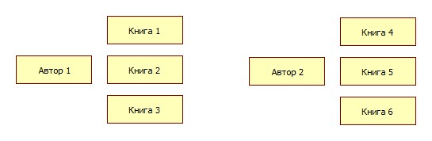

# Взаимосвязи между сущностями (устаревший вариант)

**Навигация**
- [← Оглавление курса](index.md)
- [← Предыдущий: 3250 — Выборки в отношениях 1:N и N:M](lesson_3250.md)
- [Следующий: 3030 — Фильтр ORM →](lesson_3030.md)

Официальная страница урока: https://dev.1c-bitrix.ru/learning/course/index.php?COURSE_ID=43&LESSON_ID=3269

**Примечание:** в уроке описан вариант отношений до версии 18.0.4 модуля **main**. Новый вариант приведен в главе [Отношения](/learning/course/index.php?COURSE_ID=43&CHAPTER_ID=011735).

Создание, обновление, удаление и выборка данных - вполне весомый функционал, достаточный для организации работы с несвязанными данными. Однако, веб-проекты чаще всего подразумевают взаимосвязи между сущностями, поэтому предусмотрены различные виды связывания сущностей:

  [отношения один к одному](#1to1)
  [один ко многим 1:N](#1toN)
  [много ко многим M:N](#NtoM)

#### Отношения 1:1

Самый простой тип связи - это когда элемент сущности ссылается на один элемент другой или этой же сущности. В описываемых примерах рассматривается каталог книг, но до сих пор в записях книг не было какого-либо указания на авторство. Реализуем это: прежде всего, опишем сущность **Автора книги**:

```
<?php

namespace SomePartner\MyBooksCatalog;

use Bitrix\Main\Entity;

class AuthorTable extends Entity\DataManager
{
	public static function getTableName()
	{
		return 'my_book_author';
	}

	public static function getMap()
	{
		return array(
			new Entity\IntegerField('ID', array(
				'primary' => true,
				'autocomplete' => true
			)),
			new Entity\StringField('NAME'),
			new Entity\StringField('LAST_NAME')
		);
	}
}
```

В данном примере считается, что у книги есть только один автор - это человек с именем и фамилией, запись о котором есть в сущности **Author**. При этом у одного автора может быть много книг. Таким образом, получается отношение "1 автор : N книг".



Описать такое отношение можно следующим образом:

```
class BookTable extends Entity\DataManager
{
	...
	public static function getMap()
	{
		return array(
			...
			new Entity\IntegerField('AUTHOR_ID'),
			new Entity\ReferenceField(
				'AUTHOR',
				'SomePartner\MyBooksCatalog\Author',
				array('=this.AUTHOR_ID' => 'ref.ID'),
			)
		);
	}
	...
}
```

В первую очередь нужно добавить числовое поле **AUTHOR_ID**, в котором будет храниться ID автора. На основе этого поля конфигурируется связь между сущностями через новый тип поля - **ReferenceField**. Это виртуальное поле, не имеющее фактического отражения в БД:

```
new Entity\ReferenceField(
	'AUTHOR',
	'SomePartner\MyBooksCatalog\Author',
	array('=this.AUTHOR_ID' => 'ref.ID'),
	array('join_type' => 'LEFT')
)
// LEFT JOIN my_book_author ON my_book.AUTHOR_ID = my_book_author.ID
```

| \| **Параметры** \| **Описание** \|<br>\| --- \| --- \|<br>\| Первый \| задается имя поля \|<br>\| Второй \| название сущности-партнера, с которым формируется отношение \|<br>\| Третий \| описывает, по каким полям связаны сущности, и задается в формате, похожем на фильтр для секции `\`select\`` в *getList*. Ключами и значениями являются имена полей с префиксами:
<br>- **this.** - поле текущей сущности,<br>- **ref.** - поле сущности-партнера. \|<br>\| Четвёртый, дополнительный \| можно указать тип подключения таблицы **`join_type`** - LEFT (по умолчанию), RIGHT, INNER. \| |
| --- |

Теперь можно воспользоваться описанным отношением при выборке данных:

```
BookTable::getList(array(
	'select' => array('TITLE', 'AUTHOR.NAME', 'AUTHOR.LAST_NAME')
));
```

```
SELECT
	`somepartner_mybookscatalog_book`.`TITLE` AS `TITLE`,
	`somepartner_mybookscatalog_author`.`NAME` AS `SOMEPARTNER_MYBOOKSCATALOG_AUTHOR_NAME`,
	`somepartner_mybookscatalog_author`.`LAST_NAME` AS `SOMEPARTNER_MYBOOKSCATALOG_AUTHOR_LAST_NAME`
FROM `my_book`
LEFT JOIN `my_book_author` `somepartner_mybookscatalog_author` ON `somepartner_mybookscatalog_book`.`AUTHOR_ID` = `somepartner_mybookscatalog_author`.`ID`
```

Переход в сущность Автор осуществляется записью "AUTHOR." - указывается имя Reference поля, и после точки контекст переключатся на данную сущность. Далее можно указать имя поля из этой сущности, в том числе Reference, перейдя таким образом еще дальше и образовав новое подключение таблицы:

```
'select' => array('AUTHOR.CITY.COUNTRY.NAME')
```

Примерно так выглядел бы запрос по выбору страны проживания автора книги, если бы была структура *Страны &gt; Города &gt; Живущие в городах авторы книг*.

Чтобы имена полей разных сущностей не пересекались, система генерирует уникальные алиасы для подключаемых сущностей, порой не очень читаемые. В таких случаях можно использовать уже знакомое вам переназначение алиасов:

```
BookTable::getList(array(
	'select' => array(
		'TITLE',
		'AUTHOR_NAME' => 'AUTHOR.NAME',
		'AUTHOR_LAST_NAME' => 'AUTHOR.LAST_NAME'
	)
));
```

```
SELECT
	`somepartner_mybookscatalog_book`.`TITLE` AS `TITLE`,
	`somepartner_mybookscatalog_author`.`NAME` AS `AUTHOR_NAME`,
	`somepartner_mybookscatalog_author`.`LAST_NAME` AS `AUTHOR_LAST_NAME`
FROM ...
```

И, аналогично исходной сущности, можно использовать символ **'*'** для выборки всех скалярных полей сущности, по желанию так же используя сокращение алиасов:

```
BookTable::getList(array(
	'select' => array(
		'TITLE',
		'AR_' => 'AUTHOR.*'
	)
));
```

```
SELECT
	`somepartner_mybookscatalog_author`.`ID` AS `AR_ID`,
	`somepartner_mybookscatalog_author`.`NAME` AS `AR_NAME`,
	`somepartner_mybookscatalog_author`.`LAST_NAME` AS `AR_LAST_NAME`
FROM `my_book` `somepartner_mybookscatalog_book`
LEFT JOIN `my_book_author` `somepartner_mybookscatalog_author` ON `somepartner_mybookscatalog_book`.`AUTHOR_ID` = `somepartner_mybookscatalog_author`.`ID`
```

Как было упомянуто выше, условия связывания сущностей описываются подобно фильтру. Это значит, что можно соединять таблицы по нескольким полям, а также применять SqlExpression:

```
$author_type = 5;

new Entity\ReferenceField(
	'AUTHOR',
	'SomePartner\MyBooksCatalog\Author',
	array(
		'=this.AUTHOR_ID' => 'ref.ID',
		'=ref.TYPE' => new DB\SqlExpression('?i', $author_type)
	)
)
// LEFT JOIN my_book_author ON my_book.AUTHOR_ID = my_book_author.ID AND my_book_author.TYPE = 5
```

Поле **ReferenceField**, как и другие поля, можно описывать при выборке данных в секции `\`runtime\`` и использовать для подключения других сущностей, с которыми изначально отношения не описаны.

При частом использовании поля соседней сущности можно воспользоваться ExpressionField и определить удаленное поле как локальное:

```
new Entity\ExpressionField('AUTHOR_NAME', '%s', 'AUTHOR.NAME')
```

В данном примере разница неочевидна, но, если вместо AUTHOR.NAME у вас будет более длинная цепочка переходов, то использовать одно короткое имя окажется удобным.

#### Отношение 1:N или обратный Reference

Концепция ReferenceField подразумевает, что это поле нужно размещать в сущности N отношения 1:N. То есть, Reference должен указывать строго на одну запись: в примере выше принято, что у книги может быть только 1 автор, и таким образом ReferenceField в сущности Книг указывает на одну запись сущности Автор.

Как выбрать автора книги понятно, поскольку в сущности Книги есть указание на связь с сущностью автора. Но как выбрать все книги автора, если в сущности Автора нет явного указания на Книги?

Дело в том, что описанного Reference в сущности книги уже достаточно для двусторонней выборки, нужно лишь использовать специальный синтаксис:

```
\SomePartner\MyBooksCatalog\AuthorTable::getList(array(
	'select' => array(
		'NAME',
		'LAST_NAME',
		'BOOK_TITLE' => '\SomePartner\MyBooksCatalog\BookTable:AUTHOR.TITLE'
	)
));
```

```
SELECT
	`somepartner_mybookscatalog_author`.`NAME` AS `NAME`,
	`somepartner_mybookscatalog_author`.`LAST_NAME` AS `LAST_NAME`,
	`somepartner_mybookscatalog_author_book_author`.`TITLE` AS `BOOK_TITLE`
FROM `my_book_author` `somepartner_mybookscatalog_author`
LEFT JOIN `my_book` `somepartner_mybookscatalog_author_book_author` ON `somepartner_mybookscatalog_author_book_author`.`AUTHOR_ID` = `somepartner_mybookscatalog_author`.`ID`
```

Вместо имени Reference, нужно указать "Название сущности, у которой есть Reference на текущую сущность":"Имя референса на текущую сущность". После такой конструкции контекст переключается на сущность Книга, и в ней уже можно выбрать поле TITLE и другие поля.

#### Отношения M:N

Любую книгу можно охарактеризовать с точки зрения жанра/категории, будь то деловая литература или художественная, исторические книги, обучающие и т.п., триллеры, комедии, драмы и т.п., книги по маркетингу, разработке, продажам и т.п. Для упрощения, назовем все это тегами и присвоим каждой книге несколько тегов.

Описываем сущность тегов:

```
<?php

namespace SomePartner\MyBooksCatalog;

use Bitrix\Main\Entity;

class TagTable extends Entity\DataManager
{
	public static function getTableName()
	{
		return 'my_book_tag';
	}

	public static function getMap()
	{
		return array(
			new Entity\IntegerField('ID', array(
				'primary' => true,
				'autocomplete' => true
			)),
			new Entity\StringField('NAME')
		);
	}
}
```

Чтобы связать эту сущность с Книгами по принципу N:M (у одной книги может быть несколько тегов, один тег может быть связан с несколькими книгами), необходимо создать промежуточную сущность с таблицей в БД, где будут храниться данные о связях книг с тегами.

```
<?php

namespace SomePartner\MyBooksCatalog;

use Bitrix\Main\Entity;

class BookTagTable extends Entity\DataManager
{
	public static function getTableName()
	{
		return 'my_book_to_tag';
	}

	public static function getMap()
	{
		return array(
			new Entity\IntegerField('BOOK_ID', array(
				'primary' => true
			)),
			new Entity\ReferenceField(
				'BOOK',
				'SomePartner\MyBooksCatalog\Book',
				array('=this.BOOK_ID' => 'ref.ID')
			),
			new Entity\IntegerField('TAG_ID', array(
				'primary' => true
			)),
			new Entity\ReferenceField(
				'TAG',
				'SomePartner\MyBooksCatalog\Tag',
				array('=this.TAG_ID' => 'ref.ID')
			)
		);
	}
}
```

Все, что в данном случае необходимо от этой сущности, это хранить связь "ID книги - ID тега", а соответствующие ReferenceField помогут программно описать данную связь.

Сама по себе промежуточная сущность может быть неинтересна, типовые задачи в данном случае - это получить список тегов для книги или получить список книг по тегу. Решаются с помощью описанных выше методов работы с Reference:

```
// теги для книги с ID = 5
\SomePartner\MyBooksCatalog\BookTable::getList(array(
	'filter' => array('=ID' => 5),
	'select' => array(
		'ID',
		'TITLE',
		'TAG_NAME' => 'SomePartner\MyBooksCatalog\BookTag:BOOK.TAG.NAME'
	)
));
```

```
SELECT
	`somepartner_mybookscatalog_book`.`ID` AS `ID`,
	`somepartner_mybookscatalog_book`.`TITLE` AS `TITLE`,
	`somepartner_mybookscatalog_book_book_tag_book_tag`.`NAME` AS `TAG_NAME`
FROM `my_book` `somepartner_mybookscatalog_book`
LEFT JOIN `my_book_to_tag` `somepartner_mybookscatalog_book_book_tag_book` ON `somepartner_mybookscatalog_book_book_tag_book`.`BOOK_ID` = `somepartner_mybookscatalog_book`.`ID`
LEFT JOIN `my_book_tag` `somepartner_mybookscatalog_book_book_tag_book_tag` ON `somepartner_mybookscatalog_book_book_tag_book`.`TAG_ID` = `somepartner_mybookscatalog_book_book_tag_book_tag`.`ID`
WHERE `somepartner_mybookscatalog_book`.`ID` = 5
```

Запись **`SomePartner\MyBooksCatalog\BookTag:BOOK.TAG.NAME`** может показаться сложной, но при рассмотрении ее поэтапно все должно проясниться:

| \| **Параметры** \| **Описание** \|<br>\| --- \| --- \|<br>\| BookTable::getList \| исходная сущность - BookTable \|<br>\| SomePartner\MyBooksCatalog\BookTag:BOOK \| переход в сущность BookTag через ее референс BOOK, текущая сущность - BookTag \|<br>\| TAG \| переход по референсу TAG из BookTag, текущая сущность - Tag \|<br>\| NAME \| поле из текущей сущности Tag \| |
| --- |

Для получения книг с определенным тегом цепочка вызова будет очень похожей:

```
// книги для тега с ID = 11
\SomePartner\MyBooksCatalog\TagTable::getList(array(
	'filter' => array('=ID' => 11),
	'select' => array(
		'ID',
		'NAME',
		'BOOK_TITLE' => 'SomePartner\MyBooksCatalog\BookTag:TAG.BOOK.TITLE'
	)
));
```

Таким образом, используя два вида перехода между сущностями - REFERENCE и Entity:REFERENCE - можно достаточно легко добраться до нужной связанной информации.
