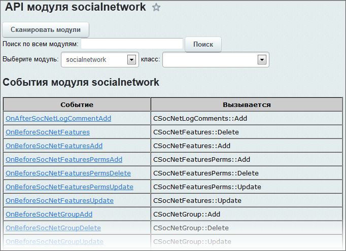
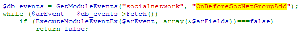
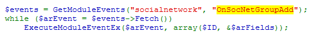

# Как написать обработчик события

**Навигация**
- [← Оглавление курса](index.md)
- [← Предыдущий: 3113 — События в D7](lesson_3113.md)
- [Следующий: 2812 — Добавление закладки в социальную сеть →](lesson_2812.md)

Официальная страница урока: https://dev.1c-bitrix.ru/learning/course/index.php?COURSE_ID=43&LESSON_ID=3395

Поставим перед собой абстрактную задачу: пусть для каждой создаваемой группы в соцсети (или в корпортале) в описание добавляется информация о том, что ругаться нельзя и некоторому пользователю вообще нельзя создавать группы.

#### Анализ вызова события

Для начала разберемся в событиях как таковых. Теорию вы уже [знаете](/learning/course/index.php?COURSE_ID=43&LESSON_ID=3493), рассмотрим на практике.

Вызов обработчиков всегда одинаковый, меняются только переменные и логика обработки ответа. Для анализа необходимо обратиться к исходным кодам. Это можно сделать просмотрев файлы системы, а лучше с использованием модуля [Живое АПИ](lesson_2534.md).



Выберем для примера событие [OnBeforeSocNetGroupAdd](http://dev.1c-bitrix.ru/api_help/socialnetwork/events/OnBeforeSocNetGroupAdd.php):



**Количество переменных**. В этом событии переменных всего одна (`$arFields`). Именно столько же переменных нам надо будет вызвать в нашем обработчике. Переменных также может быть две или больше, например в событии [OnSocNetGroupAdd](http://dev.1c-bitrix.ru/api_help/socialnetwork/events/OnSocNetGroupAdd.php):



**Переопределение переменных.** Если перед одной из переменных стоит **&**, значит ее можно переопределить (это называется передача по ссылке).

**Отмена действия.** В нашем случае для события *OnBeforeSocNetGroupAdd* есть такая возможность:, если мы в нашем обработчике сделаем `return false`, группа создана не будет. А, к примеру, в *OnSocNetGroupAdd* возможности отмены действия нет. Ибо действие уже произведено.

#### Создание обработчика события

Напомним теорию: для обработки событий в ваших модулях вам надо использовать [RegisterModuleDependences](http://dev.1c-bitrix.ru/api_help/main/functions/module/registermoduledependences.php). А для обработки в иных случаях вам надо использовать [AddEventHandler](http://dev.1c-bitrix.ru/api_help/main/functions/module/addeventhandler.php).

Имя модуля нам известно (**socialnetwork**), имя события известно (OnBeforeSocNetGroupAdd), пишем функцию/метод по правилам из теории и не забываем про:

- количество переменных
- возможность переопределения
- отмену действия

#### Как узнать что содержится в переменных, какие ключи массива и так далее?

Делаем вывод на экран переменных с завершением работы в теле функции:

```
echo ''; print_r($arFields); echo ''; die();
```

#### Отмена действий

Отмена действия с передачей ошибки в систему:

```
if ($GLOBALS['USER']->GetID() == 2) {
	$GLOBALS['APPLICATION']->throwException('Вы не можете создавать группы.');
	return false;
}
```

**Результат**

Мы собрали абстрактный обработчик, который добавляет к описанию группы правило, и запрещает пользователю с ID=2 создавать группы в принципе.

```
AddEventHandler('socialnetwork', 'OnBeforeSocNetGroupAdd', 'TestHandler');
function TestHandler(&$arFields) {
	$arFields['DESCRIPTION'] .= ' Ругаться матом запрещено!';
	if ($GLOBALS['USER']->GetID() == 2) {
		$GLOBALS['APPLICATION']->throwException('Вы не можете создавать группы.');
		return false;
	}
}
```

|  | **Совет от [Антона Долганина](http://dev.1c-bitrix.ru/community/webdev/user/11948/)**: Лучше не плодить функции, а создать класс ваших обработчиков (в идеале по одному классу на каждый модуль), и писать обработчики внутри классов. Например, *CForumHandlers::onBeforeTopicAdd();*. |
| --- | --- |
