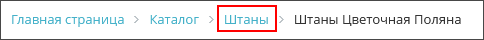
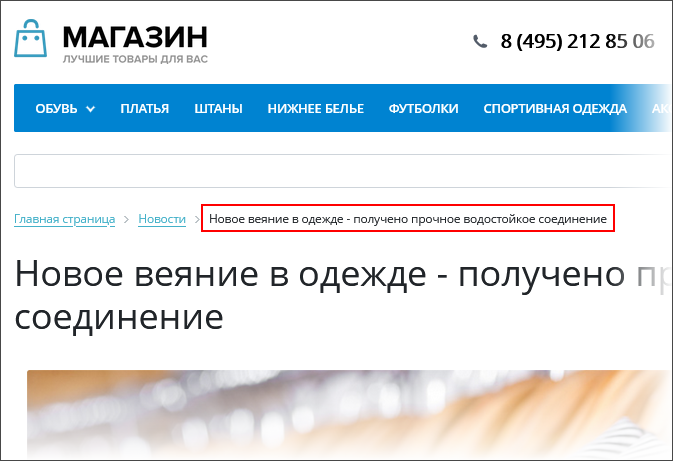
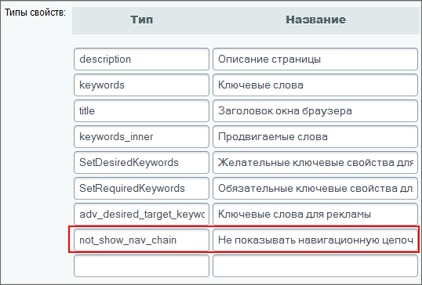
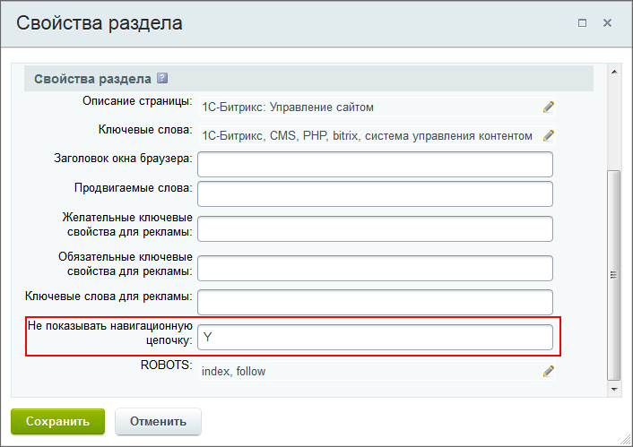

# Управление навигационной цепочкой

**Навигация**
- [← Оглавление курса](index.md)
- [← Предыдущий: 5409 — Пример. Использование Включаемых областей](lesson_5409.md)
- [Следующий: 3531 — Примеры работы с навигационной цепочкой →](lesson_3531.md)

Официальная страница урока: https://dev.1c-bitrix.ru/learning/course/index.php?COURSE_ID=43&LESSON_ID=3398

### Управление пунктами

По умолчанию в системе используется механизм управления названиями пунктов навигационной цепочки через свойства разделов с помощью поля **Заголовок** в форме настройки свойств раздела.

Переход к форме настройки свойств раздела можно осуществить из:

- публичного раздела
                      Сайты зачастую обладают сложной структурой и несколькими уровнями вложенности. Не потеряться на таком сайте поможет цепочка навигации .
  [Подробнее ...](http://dev.1c-bitrix.ru/learning/course/index.php?COURSE_ID=34&LESSON_ID=1863)
- административного раздела
                      Управление свойствами страницы в Административном разделе, независимо от выбранного редактора, осуществляется в форме редактирования страницы в таблице
  [Подробнее ...](http://dev.1c-bitrix.ru/learning/course/index.php?COURSE_ID=35&LESSON_ID=1929)
  		.

Чтобы изменить название ссылки на раздел в цепочке навигации, нужно отредактировать **Заголовок** папки. Название ссылки будет изменено сразу же после сохранения новых свойств раздела.

**Примечание**: Чтобы ссылка на какой-либо раздел не выводилась в навигационной цепочке сайта, нужно удалить название раздела из поля **Заголовок** и сохранить внесенные изменения.

Отдельные компоненты могут также добавлять в навигационную цепочку заголовок текущей страницы сайта или, например, заголовок текущей новости или товара каталога. Так, например, комплексный компонент **Новости (bitrix:news)** последовательно добавляет в навигационную цепочку названия каталогов и групп новостей по мере погружения вглубь по уровням, если это установлено в его настройках.

Аналогичным образом в навигационную цепочку добавляются названия форумов и тем форумов. В этом случае значение пункта навигационной цепочки для данной страницы определяется непосредственно в сущности.

### Управление показом пунктов

Показ навигационной цепочки может быть отключен на определенных страницах или в определенном разделе сайта. Управление отображением навигационной цепочки также осуществляется с помощью свойств страницы (раздела). Для этого необходимо:

- На странице настроек модуля **Управление структурой**, секция **Настройки для сайтов**, создать свойство для страниц **Не показывать навигационную цепочку** с кодом `not_show_nav_chain`.
    
- если навигационная цепочка не должна отображаться на определенной странице или страницах какого-либо раздела, то для этой страницы или раздела нужно установить значение данного свойства равным `Y`.
  

### Управление шаблоном

Цепочка навигации подключается в шаблоне дизайна сайта с помощью компонента

			Навигационная цепочка

                    Компонент выводит навигационную цепочку в шаблоне.

						[Описание компонента «Навигационная цепочка» в пользовательской документации.](http://dev.1c-bitrix.ru/user_help/detail.php?ID=63461)

		. Для него может быть создано любое количество шаблонов, т.е. внешних видов. Все они хранятся в папке компонента `/bitrix/components/bitrix/breadcrumb/templates/<название шаблона>/`. Все созданные шаблоны будут отображаться в настройках компонента. Таким образом для каждого шаблона сайта может быть установлен свой шаблон оформления компонента цепочки навигации. Структура шаблона показа навигационной цепочки аналогична структуре шаблона показа меню.

Управление навигационной цепочкой и ее шаблоном оформления осуществляется также, как при работе с другими компонентами 2.0. В режиме правки сайта с помощью кнопки управления вы можете быстро перейти к форме изменения параметров компонента либо скопировать шаблон компонента, а затем отредактировать его.
