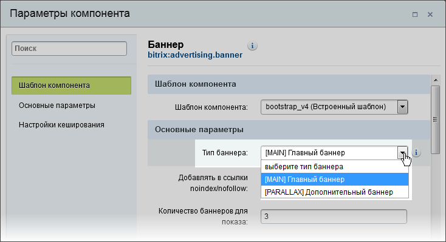
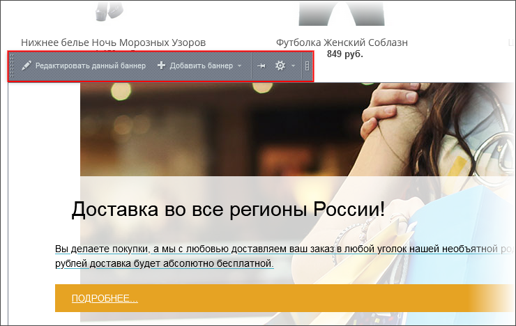

# Типы рекламы

**Навигация**
- [← Оглавление курса](index.md)
- [← Предыдущий: 3464 — Примеры решения частных задач в меню](lesson_3464.md)
- [Следующий: 4786 — Механизм управления показом с помощью ключевых слов →](lesson_4786.md)

Официальная страница урока: https://dev.1c-bitrix.ru/learning/course/index.php?COURSE_ID=43&LESSON_ID=3406

> **Тип рекламы** - это условное название группы рекламных баннеров, обладающих некоторым общим признаком. Например:
>
> - место показа – все баннеры должны показываться в определенном месте страницы сайта;
> - тематика (например, рекламируется один товар);
> - рекламодатель (реклама определенной компании);
> - и т.д.

Название типа рекламного блока задается администратором произвольно. Например, для верхней рекламы может быть установлен тип `TOP`, `MAIN`, `BOTTOM` и т.п.

**Важно!** Рекомендуется, чтобы баннеры из одной группы имели одинаковый размер. Это позволит избежать деформации страницы при показе рекламы.

Управление типами рекламы выполняется через административный интерфейс модуля [**Рекламы**](http://dev.1c-bitrix.ru/learning/course/index.php?COURSE_ID=41&CHAPTER_ID=04556) (Маркетинг &gt; Баннерная реклама &gt; Типы баннеров):

Приступить к управлению рекламным баннером или списком баннеров выбранной рекламной области можно непосредственно из публичной части сайта. Для этого перейдите в режим **правки** и воспользуйтесь одной из кнопок управления рекламной областью:

