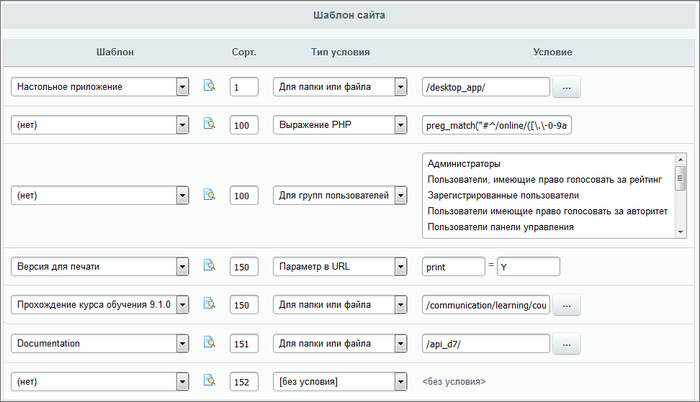

# Использование прав доступа

**Навигация**
- [← Оглавление курса](index.md)
- [← Предыдущий: 4786 — Механизм управления показом с помощью ключевых слов](lesson_4786.md)
- [Следующий: 3396 — Механизм реализации →](lesson_3396.md)

Официальная страница урока: https://dev.1c-bitrix.ru/learning/course/index.php?COURSE_ID=43&LESSON_ID=3414

При создании шаблона сайта достаточно часто возникает задача ограничения доступа к тем или иным элементам. Предусмотренный в системе механизм проверки прав доступа может быть использован в процессе создания шаблона сайта для управления:


### показом пунктов меню

При редактировании меню в расширенном режиме для каждого пункта может быть задано условие показа. Например:


Смотри также [Настройка пунктов меню](http://dev.1c-bitrix.ru/learning/course/index.php?COURSE_ID=35&LESSON_ID=2022) в курсе **Администратор. Базовый**.

### шаблоном меню

Уровень прав доступа пользователей может влиять на структуру шаблона меню, используемые элементы, изображения и т.д. Пример проверки уровня прав доступа пользователя для шаблона меню приводится ниже:


```
<?if (!defined("B_PROLOG_INCLUDED") || B_PROLOG_INCLUDED!==true)die();?>

<?if (!empty($arResult)):?>
<div class="blue-tabs-menu">
	<ul>
<?foreach($arResult as $arItem):?>

	<?if ($arItem["PERMISSION"] > "D"):?>
		<li><a href="<?=$arItem["LINK"]?>"><nobr><?=$arItem["TEXT"]?></nobr></a></li>
	<?endif?>

<?endforeach?>

	</ul>
</div>
<div class="menu-clear-left"></div>
<?endif?>
```


**Важно!** Условия, включающие проверку значения ключа массива `$PERMISSION` у переменной `$arItem`, используются только для меню сайта.

### шаблоном сайта

Для каждого шаблона дизайна может быть настроено условие его применения к сайту. Данная настройка выполняется на странице управление параметрами сайта (Настройки системы &gt; Сайты &gt; Изменить). Например:




В приведенном примере условие определяет, что шаблон **Версия для печати** будет применяться, если в URL параметр `print=Y`.


Наиболее гибким инструментом настройки условий показа является **Условие PHP**. Примеры php-условий для показа шаблона сайта:


| \| $USER-&gt;IsAuthorized() \| Проверяется, является ли текущий пользователь авторизованным в системе. \|<br>\| --- \| --- \|<br>\| $USER-&gt;IsAdmin() \| Проверяется, является ли текущий пользователь администратором. \|<br>\| in_array('5',$USER-&gt; GetUserGroupArray()) \| Проверяется, относится ли текущий пользователь к указанной группе (в данном случае к группе с ID равным 5). \| |
| --- |

Смотрите также [Настройка шаблона сайта](http://dev.1c-bitrix.ru/learning/course/index.php?COURSE_ID=35&LESSON_ID=2022) в курсе **Администратор. Базовый**.

### отдельными элементами

**Для управления элементами шаблона дизайна**

Управление показом элементов шаблона сайта, их формой, цветом и другими параметрами, может осуществляться также исходя из уровня прав доступа пользователей сайта. Детали смотри в уроке [Разработка шаблона дизайна](lesson_3234.md).

**Управление отдельными элементами сайта**

  Использование механизма проверки прав доступа позволяет организовать управление отдельными элементами сайта (страницами, разделами, рекламой, форумами и т.д.) различными пользователями. Смотри соответствующие разделы курсов [Контент-менеджер](http://dev.1c-bitrix.ru/learning/course/index.php?COURSE_ID=34&CHAPTER_ID=06675) и [Администратор. Базовый](http://dev.1c-bitrix.ru/learning/course/index.php?COURSE_ID=35&CHAPTER_ID=689).
