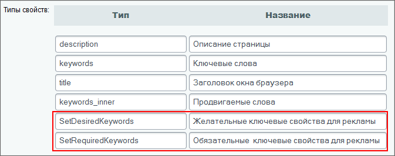
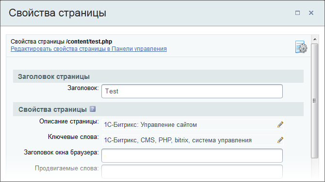

# Управление значениями метаданных

**Навигация**
- [← Оглавление курса](index.md)
- [← Предыдущий: 3438 — Пример таблицы стилей для шаблона сайта](lesson_3438.md)
- [Следующий: 4565 — Что такое компонент →](lesson_4565.md)

Официальная страница урока: https://dev.1c-bitrix.ru/learning/course/index.php?COURSE_ID=43&LESSON_ID=3428

Как правило, основной целью использования метаданных является оптимизация сайта для поисковых систем. Поисковые системы используют метаданные для индексации документов сайта.

Примером управления метаданными в продукте может служить механизм задания ключевых слов и описаний для страниц и разделов сайта. По умолчанию в дистрибутиве продукта настроено управление именно этими двумя типами метаданных (по аналогичной схеме список возможных вариантов может быть дополнен).

#### Управление значениями метаданных через визуальный интерфейс

Чтобы иметь возможность управлять значениями метаданных, предварительно необходимо создать соответствующие свойства в настройках модуля **Управление структурой** (Настройки &gt; Настройки продукта &gt; Настройки модулей &gt;Управление структурой):



**Важно!** Названия **типов**свойств, используемых для управления метаданными страниц, должны совпадать с названиями мета-тегов в языке HTML. Например, типы свойств ***ключевые слова*** и ***описание*** должны совпадать именами (name) соответствующих мета-тегов: `keywords` и `description`.

**Примечание**: Набор свойств может быть задан отдельно для каждого сайта, работающего под управлением системы.

Подробную информацию по настройке свойств страниц и разделов, а также по управлению значениями метаданных вы можете узнать в курсах [Контент-менеджер](http://dev.1c-bitrix.ru/learning/course/index.php?COURSE_ID=34&CHAPTER_ID=01850) и [Администратор. Базовый](http://dev.1c-bitrix.ru/learning/course/index.php?COURSE_ID=35&LESSON_ID=1929).

**Обратите внимание!** Значения свойств, заданные для папки, по умолчанию будут использоваться для всех страниц и подразделов соответствующего раздела сайта (если для них не заданы собственные значения этих свойств).

#### Управление метаданными в коде

Для вывода значений метаданных в коде страницы нужно воспользоваться функцией [ShowMeta()](http://dev.1c-bitrix.ru/api_help/main/reference/cmain/showmeta.php), размещаемой в прологе шаблона дизайна сайта:

```
<head>
…
<?$APPLICATION->ShowMeta("keywords")?>
<?$APPLICATION->ShowMeta("description")?>
…
</head>
```

Предположим, что для страницы заданы следующие значения свойств ключевые слова и описание:



C помощью функции [SetPageProperty()](http://dev.1c-bitrix.ru/api_help/main/reference/cmain/setpageproperty.php) значения данных свойств будут применены к странице:

```
<?
$APPLICATION->SetPageProperty("keywords","веб,разработка,программирование");
$APPLICATION->SetPageProperty("description","Система управления сайтом");
?>
```

**Примечание**: Настройка свойств раздела может быть выполнена с помощью функции [SetDirProperty()](http://dev.1c-bitrix.ru/api_help/main/reference/cmain/setdirproperty.php) (например, в коде файла **.section.php**):

```
<?
…
$APPLICATION->SetDirProperty("keywords","дизайн, веб, сайт");
…
?>
```

В коде файла за это отвечает массив `$arDirProperties`:

```
$arDirProperties = array(
	"description" => "",
	"keywords" => "дизайн, веб, сайт",
	"title" => "",
);
```

Тогда в результате работы функции *ShowMeta()* в код страницы будет подставлен следующий HTML-код:

```
<meta name="keywords" content="веб,разработка,программирование">
<meta name="description" content="Система управления сайтом">
```

Если для самой страницы значение свойства не задано, то будет взято значение свойства вышестоящего раздела (рекурсивно до корня сайта). Если значение свойства не определено, то значение соответствующего мета-тэга останется незаданным. Свойства страницы могут быть установлены динамически из кода компонентов, расположенных на странице. Например, для страниц показа информации каталога или новостей свойства страницы могут быть установлены в соответствии с определенными свойствами элементов инфоблоков:

```
 $APPLICATION->SetPageProperty("description",$arIBlockElement["PROPERTIES"][$META_DESCRIPTION]["VALUE"]);
```

В данном случае в качестве значения свойства страницы **description** будет использовано значение свойства элемента информационного блока с кодом `meta_description`. Таким образом, можно создавать свойства **keywords** и **description** для элементов каталога и динамически подставлять их в код страницы.

**Ссылки по теме:**

- [Свойства страниц и мета-теги](lesson_2814.md#properties)
