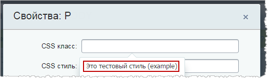
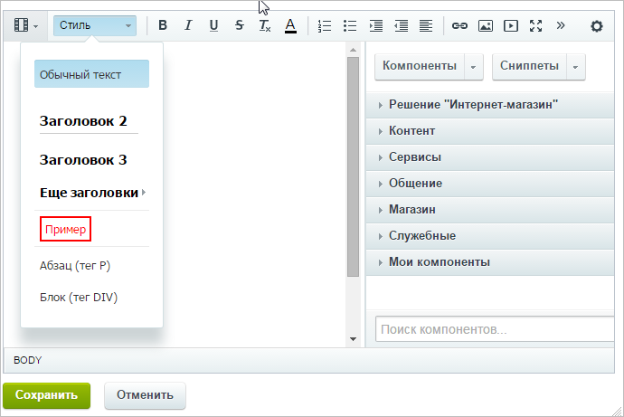
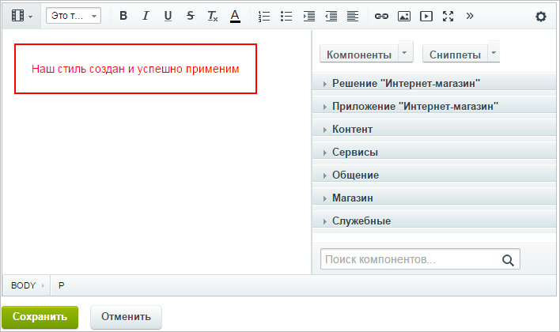

# Работа со стилями в визуальном HTML-редакторе

**Навигация**
- [← Оглавление курса](index.md)
- [← Предыдущий: 3517 — Механизм реализации](lesson_3517.md)
- [Следующий: 3438 — Пример таблицы стилей для шаблона сайта →](lesson_3438.md)

Официальная страница урока: https://dev.1c-bitrix.ru/learning/course/index.php?COURSE_ID=43&LESSON_ID=3437

Для визуального редактора присутствует возможность к уже имеющимся стандартным стилям добавлять собственные и помещать их в соответствующую панель редактора. Чтобы стили отображались в меню, файл **styles.css** в шаблоне сайта должен существовать и быть непустым.

Чтобы подключать сторонние стили в визуальном редакторе, например [Bootstrap](https://getbootstrap.com/) и [Font Awesome](https://fontawesome.com/), нужно прописать данную возможность в файле **description.php**, находящемся в папке шаблона сайта:

```

"EDITOR_STYLES" => array (
		'/bitrix/css/main/bootstrap.css',
		'/bitrix/css/main/font-awesome.css',
```

**Внимание**! Ошибки при создании стилей могут вызвать серьезные проблемы в работе сайта, поэтому данную задачу лучше предоставить разработчику с необходимой квалификацией.

Для примера создадим простой стиль, добавляющий тексту рамку и меняющий его цвет на красный. Для начала добавим в файл **styles.css** описание стиля.

```

.example {
	border: 2px solid red;
	color: red;
	padding: 20px;
}
```

Когда стиль создан им уже можно начать пользоваться через форму **Свойства**, вызываемую по щелчку правой кнопкой мышки в рабочей области визуального редактора.



Чтобы созданный стиль отображался в меню, нужно добавить соответствующую строку в файл **.styles.php**.

```
<?
return array (
"example" => array(
        "tag" => 'p', /*в какой тег будет помещен текст в данном стиле*/
        "title" => "Это тестовый стиль", /*название стиля*/
        "html" => '<span style="border: 2px solid red;color: #ff0000; padding: 4px;">Пример</span>')  /*оформление текста с помощью html*/
);
?>
```

**Примечание**: Поля `"tag"` и `"title"` являются обязательными для заполнения. Также поле `"title"` по умолчанию используется как название пункта в списке, соответствующему стилю, и всплывающая подсказка при наведении курсора на него. Однако при использовании поля `"html"` можно также указать название, которое и будет отображаться в выпадающем списке.

Также можно разбивать стили по категориям с помощью поля `"section"`. Пока что собственные стили можно помещать только в уже существующие категории.

Теперь созданный нами стиль отобразится в меню.



И его можно применять:


