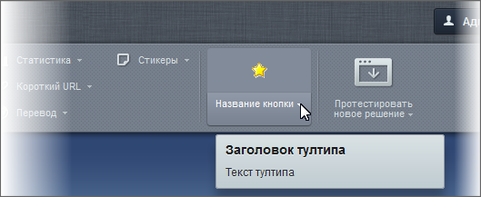

# Добавление кнопок на панель управления

**Навигация**
- [← Оглавление курса](index.md)
- [← Предыдущий: 15292 — Установка PostgreSQL](lesson_15292.md)
- [Следующий: 3851 — Добавление контекстного меню →](lesson_3851.md)

Официальная страница урока: https://dev.1c-bitrix.ru/learning/course/index.php?COURSE_ID=43&LESSON_ID=3440

При создании собственных проектов может возникнуть потребность в создании новых кнопок на **Панели управления**. Добавление кнопок на панель управления можно осуществить следующим образом:

```

<?$APPLICATION->AddPanelButton(
	Array(
		"ID" => "ID кнопки", //определяет уникальность кнопки
		"TEXT" => "Название кнопки",
		"TYPE" => "BIG", //BIG - большая кнопка, иначе маленькая
		"MAIN_SORT" => 100, //индекс сортировки для групп кнопок
		"SORT" => 10, //сортировка внутри группы
		"HREF" => "URL для перехода", //или javascript:MyJSFunction())
		"ICON" => "icon-class", //название CSS-класса с иконкой кнопки
		"SRC" => "путь к иконке кнопки",
		"ALT" => "Текст всплывающей подсказки", //старый вариант
		"HINT" => array( //тултип кнопки
			"TITLE" => "Заголовок тултипа",
			"TEXT" => "Текст тултипа" //HTML допускается
		),
		"HINT_MENU" => array( //тултип кнопки контекстного меню
			"TITLE" => "Заголовок тултипа",
			"TEXT" => "Текст тултипа" //HTML допускается
		),
		"MENU" => Array(
			Array( //массив пунктов контекстного меню
				"TEXT" => "название пункта",
				"TITLE" => "всплывающая подсказака над пунктом",
				"SORT" => 10, //индекс сортировки пункта
				"ICON" => "", //иконка пункта
				"ACTION" => "Javascript-код",
				"SEPARATOR" => true, //определяет пункт-разделитель
				"DEFAULT" => true, //пункт по умолчанию?
				"MENU" => Array() //массив подменю
				)
			)
		),
	$bReplace = false //заменить существующую кнопку?
);
?>
```

Есть несколько вариантов добавления. В зависимости от того, что нужно, кнопку можно добавлять:

- в компоненте
- на странице
- в шаблоне сайта
- на событии [OnBeforeProlog](http://dev.1c-bitrix.ru/api_help/main/events/onbeforeprolog.php)

Результат добавления в шаблон сайта:


