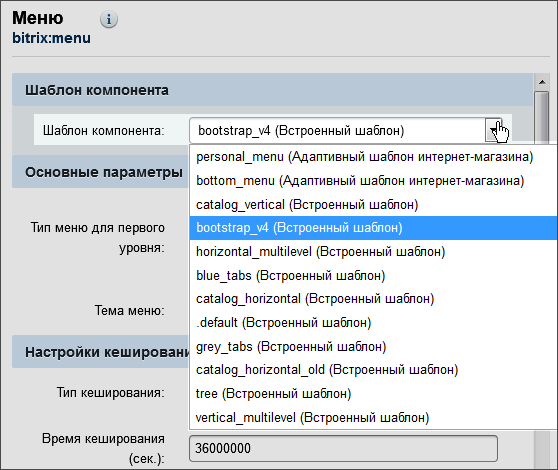
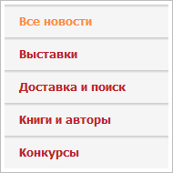
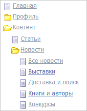
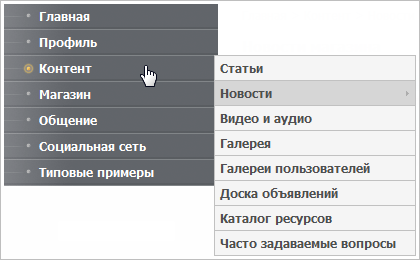
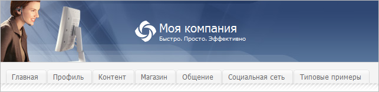
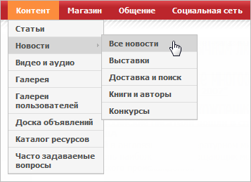
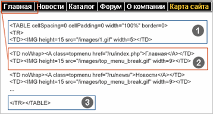
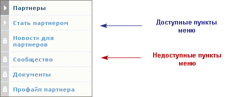

# Шаблоны меню

**Навигация**
- [← Оглавление курса](index.md)
- [← Предыдущий: 3254 — Построение и показ меню](lesson_3254.md)
- [Следующий: 3256 — Управление меню →](lesson_3256.md)

Официальная страница урока: https://dev.1c-bitrix.ru/learning/course/index.php?COURSE_ID=43&LESSON_ID=3473

Вывод данных в компоненте **Меню** реализован с помощью [шаблонов](lesson_2829.md). Шаблоны могут создаваться пользователями самостоятельно.


### Системные шаблоны

В дистрибутиве по умолчанию включены

			несколько шаблонов

                    

		. Описания некоторых из них:

- **Default** (Вертикальное) – шаблон для вертикального меню. Самый простой шаблон. При выборе в параметрах компонента глубины вложения более 1 вы увидите список страниц сайта в общей иерархии. То есть индексная страница сайта (раздела) будет размещена на одном уровне с вложенной страницей (разделом). Это затрудняет осмысление структуры сайта посетителем. Поэтому шаблон рекомендуется для простых видов меню и главных меню верхнего уровня. Шаблон достаточно прост для кастомизации под конкретный дизайн.
  
- **Tree** (Древовидное) – шаблон для вертикального меню. Реализует меню в виде древовидной структуры аналогично Проводнику Windows. Вложенные страницы показаны в виде страниц в папке (разделе), что существенно облегчает понимание пользователем структуры сайта. Это меню не всегда удобно при разветвленной структуре интернет-проекта, так как существенно растягивает по вертикали колонку, где оно расположено.
  
- **Vertical_multilevel** (Вертикальное многоуровневое выпадающее) – шаблон для вертикального меню. Реализует меню с выпадающими пунктами нижнего уровня, что сохраняет легкость восприятия структуры сайта посетителем, характерное для древовидного меню, но при этом не растягивает дизайн при разветвленной структуре.
  
- **Grey_tabs** (Серое меню в виде закладок) и **Blue_tabs** (Голубое меню в виде закладок) – шаблоны для горизонтального меню. Отличаются только внешним видом. Это самые простые шаблоны, аналогичные шаблону по умолчанию (**default**) для вертикального меню.
  
- **Horizontal_multilevel** (Горизонтальное многоуровневое выпадающее) – шаблон для горизонтального меню. Аналогично **Vertical_multilevel** (Вертикальному многоуровневому выпадающему меню) и реализует меню с выпадающими пунктами нижнего уровня.
  

|  |
| --- |

### Создание шаблонов меню

#### Выделение HTML элементов для построения меню

Создание шаблонов меню начинается с выделения необходимых HTML областей в шаблоне сайта:



- неизменной верхней и нижней части шаблона;
- повторяющихся элементов. Например, для горизонтального меню – это ячейки таблицы, а для вертикального – строки.

#### Создание шаблона меню

Все шаблоны меню имеют одинаковую структуру:

- область пролога шаблона;
- область с описанием замен для различных условий обработки шаблона;
- область тела шаблона;
- область эпилога шаблона.

В php шаблоне для вывода меню используется массив `$arItem` - копия массива пунктов меню, в котором каждый пункт в свою очередь представляет собой массив, использующий следующие параметры:

- **TEXT** - заголовок пункта;
- **LINK** - ссылка на пункте;
- **SELECTED** - активен ли пункт меню в данный момент, возможны следующие значения:

  - **true** - пункт  выбран;
  - **false** - пункт не выбран;
- **PERMISSION** - [право доступа](lesson_2819.md) на страницу, указанную в **LINK** для текущего пользователя. Возможны следующие значения:

  - **D** - доступ запрещён;
  - **R** - чтение (право просмотра содержимого файла);
  - **U** - документооборот (право на редактирование файла в режиме документооборота);
  - **W** - запись (право на прямое редактирование);
  - **X** - полный доступ (право на прямое редактирование файла и право на изменение прав доступа на данный файл);
- **ITEM_TYPE** - флаг, указывающий на тип ссылки, указанной в **LINK**, возможны следующие значения:

  - **D** - каталог (**LINK** заканчивается на "/");
  - **P** - страница;
  - **U** - страница с параметрами;
- **ITEM_INDEX** - порядковый номер пункта;
- **PARAMS** - ассоциативный массив параметров пунктов. Параметры задаются в расширенном режиме редактирования меню.

Рассмотрим построение шаблона меню на примере **Левого меню**, представленного в демо-версии продукта (шаблон **.default** компонента **Меню**):

```
<?if (!defined("B_PROLOG_INCLUDED") || B_PROLOG_INCLUDED!==true)die();?>
   <?if (!empty($arResult)):?>
	<ul class="left-menu">
	<?foreach($arResult as $arItem):?>
		<?if($arItem["SELECTED"]):?>
			<li><a href="<?=$arItem["LINK"]?>" class="selected">
			<?=$arItem["TEXT"]?></a></li>
		<?else:?>
			<li><a href="<?=$arItem["LINK"]?>">
			<?=$arItem["TEXT"]?></a></li>
		<?endif?>
	<?endforeach?>
	</ul>
<?endif?>
```

Повторяющаяся часть меню, выделенная на предыдущем шаге, выносится в тело шаблона.

При создании шаблона меню потребуется также создать дополнительные стили в таблице стилей (CSS). Например, для текстового меню: цвет пункта меню и цвет текущего (активного) пункта меню.

Отдельного представления в шаблоне могут потребовать заголовки разделов (например, название текущего раздела при просмотре подразделов). Также можно предусмотреть использование графических или текстовых обозначений, например, того, что данный пункт ссылается на подразделы или документ текущего раздела и т.д.



**Примечание:** Все шаблоны меню хранятся в папке компонента: `/bitrix/components/bitrix/menu/templates/`.

Быстрый доступ к редактированию шаблона каждого типа меню можно осуществить в режиме **Правки** с помощью пункта **Редактировать шаблон компонента** меню команд кнопки по управлению компонентом.

**Примечание:** Шаблон меню, если он является системным, перед изменением необходимо скопировать в текущий шаблон сайта.

При редактировании такого шаблона из публичной части сайта системой автоматически будет предложена возможность копирования.
