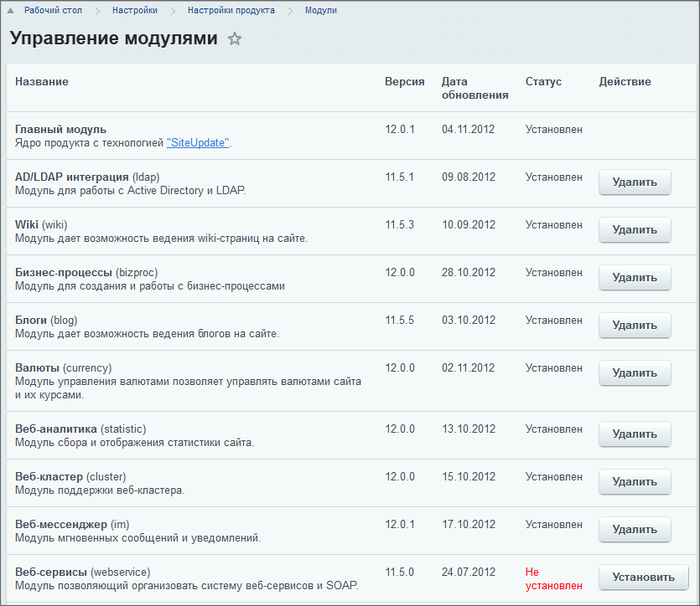

# Установка и удаление

**Навигация**
- [← Оглавление курса](index.md)
- [← Предыдущий: 2825 — Взаимодействие модулей](lesson_2825.md)
- [Следующий: 3565 — Пример создания windows-приложения для добавления новостей →](lesson_3565.md)

Официальная страница урока: https://dev.1c-bitrix.ru/learning/course/index.php?COURSE_ID=43&LESSON_ID=3475

### Установка модуля

Инсталляция осуществляется в административном интерфейсе на странице Настройки &gt; Настройки продукта &gt; Модули нажатием кнопки **Установить**.

При этом будет вызван метод [DoInstall](http://dev.1c-bitrix.ru/api_help/main/reference/cmodule/doinstall.php) класса с именем, представляющим собой ID модуля, где точка заменяется на нижнее подчеркивание. Этот класс должен быть описан в файле `/bitrix/modules/ID модуля/install/index.php`.

В процессе инсталляции должны быть выполнены в обязательном порядке:

- Регистрация, которая осуществляется с помощью функции [RegisterModule](http://dev.1c-bitrix.ru/api_help/main/functions/module/registermodule.php).
- Если модуль обладает административными скриптами, то для их вызова в каталог `/bitrix/admin/` должны быть скопированы вызывающие скрипты.
- Все изображения, используемые модулем, должны быть скопированы в каталог `/bitrix/images/ID модуля/`.

В самом начале файла лучше объявить все используемые в коде [синонимы](lesson_3524.md#use). Скорее всего их сразу не удастся все объявить, но их можно добавлять в процессе работы. Очень важно следить, чтобы одни и те же синонимы не использовались для разных пространств имен.

### Удаление модуля

Деинсталляция осуществляется нажатием кнопки **Удалить**. При этом будет вызван метод [DoUninstall](http://dev.1c-bitrix.ru/api_help/main/reference/cmodule/douninstall.php) класса с именем совпадающим с ID модуля. Этот класс должен быть описан в файле `/bitrix/modules/ID модуля/install/index.php`.

В процессе деинсталляции должны быть выполнены в обязательном порядке:

- Удаление регистрационной записи, которая осуществляется с помощью функции [UnRegisterModule](http://dev.1c-bitrix.ru/api_help/main/functions/module/unregistermodule.php)
- Если модуль обладает административными скриптами, то вызывающие их скрипты должны быть удалены из каталога `/bitrix/admin/`.
- Все изображения, используемые модулем, должны быть удалены из каталога `/bitrix/images/ID модуля/`.

**Примечание**: Модули **Главный** и **Управление структурой** удалить нельзя.
