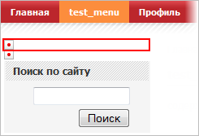
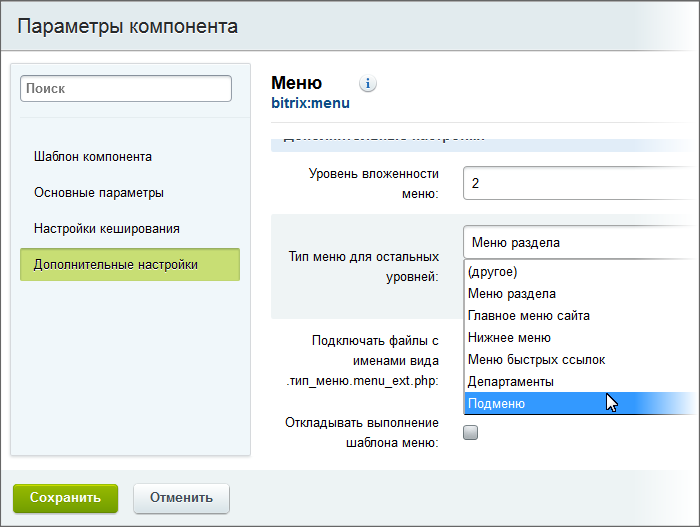
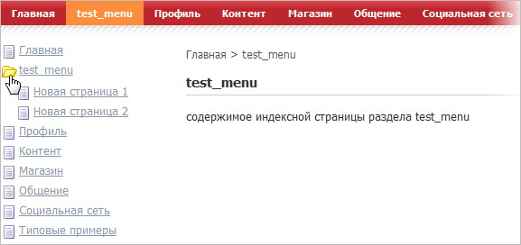
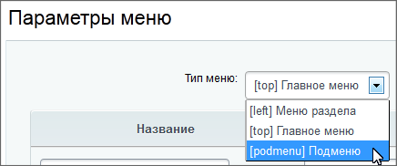
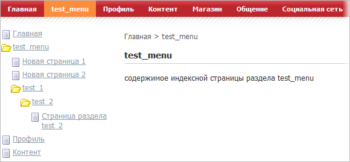
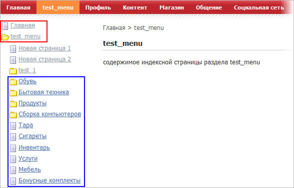
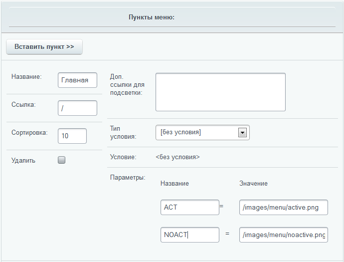
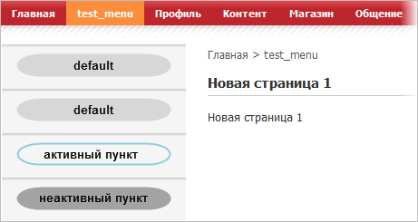

# Примеры создания меню

**Навигация**
- [← Оглавление курса](index.md)
- [← Предыдущий: 3256 — Управление меню](lesson_3256.md)
- [Следующий: 3464 — Примеры решения частных задач в меню →](lesson_3464.md)

Официальная страница урока: https://dev.1c-bitrix.ru/learning/course/index.php?COURSE_ID=43&LESSON_ID=3498

### Предварительные операции


Для примера мы [создадим](/learning/course/index.php?COURSE_ID=34&LESSON_ID=1911&LESSON_PATH=3905.4461.1911#create_razdel) в структуре сайта новый раздел **test_menu**, который также добавим в главное меню.

Для удобства будем использовать компонент меню, который уже расположен в левой части шаблона сайта.

В параметрах компонента, для примера, в опции **Тип меню для первого уровня** укажем **Главное меню**.



**Примечание:** По умолчанию этот компонент уже настроен для вывода **Меню раздела**, поэтому операция по созданию меню и его настройка будет пропущена.

### Древовидное меню

Древовидное меню – самое распространенное. Оно достаточно простое и вместе с этим информативное. Создается на базе статических и динамических элементов: разделов, страниц и инфоблоков.

**Примечание:** При использовании древовидного меню, если необходимо указать именно раскрывающуюся папку, нужно указывать путь до папки, а не до индексного файла этой папки.

#### Одноуровневое древовидное меню

**Задача:** создать древовидное меню.

- Создайте дополнительный [тип меню](https://dev.1c-bitrix.ru/learning/course/index.php?COURSE_ID=34&LESSON_ID=10239#types): **Подменю** (**podmenu**).
- В параметрах компонента установите следующие параметры:
  

  - **Шаблон компонента** - tree (Встроенный шаблон);
  - **Тип меню для первого уровня** - Главное меню;
  - **Тип меню для остальных уровней** - Подменю;
  - **Уровень вложенности меню** - 2.
- Перейдите в раздел **test_menu** и создайте в нем 2 страницы: novaya_stranitsa_1 и novaya_stranitsa_2. При их создании необходимо отметить опцию **Добавить пункт меню** и выбрать тип **Подменю**.

**Результат**. Результатом этой работы будет меню такого вида:




Файл **.podmenu.menu.php** будет иметь следующую структуру:

```
<?
$aMenuLinks = Array(
	Array(
		"Новая страница 1",
		"/test_menu/novaya_stranitsa_1.php",
		Array(),
		Array(),
		""
	),
	Array(
		"Новая страница 2",
		"/test_menu/novaya_stranitsa_2.php",
		Array(),
		Array(),
		""
	)
);
?>
```


#### Многоуровневое древовидное меню

Шаблоны компонента **Меню** поддерживают создание многоуровневого меню с глубиной вложения до 4-х уровней. Покажем это на примере. Выполнять работу на данном этапе удобнее в административной части.

**Задача:** создать четырехуровневое меню.

**Решение.** Решение осуществим на примере [уже созданного выше](#tree_simple) меню с шаблоном **tree**.

- Перейдите в административный раздел на страницу **Управление структурой** (Структура сайта &gt; Файлы и папки)
- В созданном ранее разделе `/test_menu` с помощью команды **Добавить папку** кнопки **Добавить** контекстной панели создайте новый каталог со следующими параметрами:
  **Примечание:** Для полноты картины можно создать в папках по дополнительной странице (кроме индексной). При создании их не забывайте добавить их в тип меню –  **Подменю**.

  - **Имя папки** - test_1;
  - **Название раздела** - test_1;
  - **Тип меню** - Подменю;
  - **Название пункта** - test_1.
- Перейдите во вновь созданный раздел и создайте по описанному выше алгоритму папку `/test_2`.
  **Примечание:** Если в последней по вложенности папке не создать файл меню, то в публичной части сайта она будет отображаться как страница, а не папка.
- При необходимости добавления новых пунктов или редактирования существующих перейдите в нужный раздел (например, `/test_menu`) и на контекстной панели используйте команду **Добавить меню** кнопки **Добавить**. В открывшейся форме выберите тип меню равный **Подменю**, после чего отредактируйте нужные пункты меню.
  
  **Примечание:** При удалении страниц и разделов из административной части потребуется последующее редактирование пунктов меню вручную.

**Результат**: результатом работы будет созданное древовидное меню в четыре уровня:



**Примечание:** Система по умолчанию позволяет создать только четыре уровня вложения. Практика показывает, что данной глубины вложения хватает на большинство типовых проектов.


## Если требуется уровень вложенности более, чем по умолчанию

В крайне редких случаях требуется реализовать меню с уровнем вложенности более 4. Эта проблема решается до версии 10.5 корректировкой файла стилей соответствующего шаблона компонента, с версии 10.5 - кастомизацией компонента.

До версии 10.5

- Откройте для редактирования файл **css** используемого шаблона компонента.
- Дополните аналогичным способом остальные группы стилей, имеющих в своем названии `*Items text`.
- Сохраните внесенные изменения.

Теперь вы можете использовать глубину вложений равную 5.

### Выпадающее меню

Чтобы сделать многоуровневое выпадающее меню нужно использовать шаблон многоуровнего выпадающего меню, вертикального или горизонтального, в зависимости от дизайна проекта. Настройка компонента и основные правила создания этого меню абсолютно аналогичны древовидному меню. Приведем их в обобщенном виде:

- Необходимо иметь два типа меню. Одно (первичное) будет применено как основное меню в разделе, другое (вторичное) – как источник формирования собственно выпадающего меню.
- В каждом разделе должно быть обязательно создано вторичное меню с указанием его пунктов.
- При указании путей до разделов, которые должны быть развернуты в выпадающем меню, необходимо указывать путь до папки подраздела, а не до индексного файла подраздела.
- Выпадающее меню может быть построено не только на базе статических разделов и страниц, но и на основе инфоблоков.
- Система допускает только четыре уровня вложения.


### Меню из информационных блоков

Построение меню из динамических элементов - информационных блоков - позволяет снять с контент-менеджера часть нагрузки по поддержке сайта. Не нужно будет выполнять работы по актуализации меню в связи с появившимися новыми разделами и страницами. Для решения этой задачи необходимо использовать компонент **Пункты меню (bitrix:menu.sections)**.

Перед созданием такого меню у вас должен быть создан необходимый тип инфоблока и сам инфоблок. Желательно создать пару разделов и элементов для наглядности.

- Выполните команду **Редактировать параметры компонента** из меню компонента **Меню**.
- В разделе **Дополнительные настройки** установите флажок в поле **Подключать файлы с именами вида .тип_меню.menu_ext.php**.
- Сохраните внесенные изменения.
- Перейдите в административную часть сайта.
- Перейдите в раздел, для которого планируется создавать меню с помощью инфоблоков.
- Создайте пустой файл под именем **.podmenu.menu_ext.php** в директории, в меню которой должны подключаться пункты инфоблока (например, `/test_menu`).
- Откройте файл для редактирования в визуальном редакторе.
- Добавьте в тело файла компонент **Пункты меню (bitrix:menu.sections)**.
- Выберите тип информационного блока и сам информационный блок (например, **Каталог товаров**).
- Установите глубину вложений любую, более 1.
- Сохраните внесенные изменения. Форма создания файла закроется, файл появится в общем списке файлов папки.
- Откройте его вновь для редактирования, но уже в режиме **Редактировать как PHP**.
- Допишите в файле код проверки включения кода из ядра:
  ```
  <?
  if(!defined("B_PROLOG_INCLUDED") || B_PROLOG_INCLUDED!==true)die();
  global $APPLICATION;
  $aMenuLinksExt = $APPLICATION->IncludeComponent(…
  ```
- После вызова компонента допишите код подключения к меню:
  ```
  $aMenuLinks = array_merge($aMenuLinks, $aMenuLinksExt);
  ```
- Сохраните внесенные изменения.


**Результат:** Перейдите в публичную часть в раздел, для которого создавался файл **.тип_меню.menu_ext.php**.

			Вы увидите

                    Если вы ранее не отключали кеш, то, возможно, нужно сбросить кеш, чтобы меню отобразилось.

		 созданное новое меню:



Красным цветом выделены пункты, созданные в рамках главного меню (массив `$aMenuLinks`, возвращающий пункты главного меню), синим цветом – полученные из инфоблоков (массив `$aMenuLinksExt`).


### Два меню рядом

Рассмотрим довольно простой пример размещения двух меню в ряд на примере классического трехколоночного шаблона сайта, который мы использовали до сих пор.

- Перейдите к [редактированию шаблона](lesson_3232.md#edit) сайта.
- В режиме редактирования кода в левой колонке сайта создайте таблицу с одной строкой и двумя ячейками.
- Переместите в левую ячейку компонент меню, использовавшийся в качестве верхнего меню, а в правую – компонент меню, использовавшийся в качестве левого меню.
- Сохраните внесенные изменения.
- Перейдите в публичную часть сайта.
- Выполните команду **Редактировать параметры компонента** из меню компонента меню, стоящего в левой ячейке.
- Задайте в качестве шаблона шаблон **default**.
- В поле **Уровень вложенности меню** выставьте значение 1.
- Сохраните внесенные изменения.
- Создайте пункты в меню типа **top** (которое в левой ячейке).
- Выполните команду **Редактировать параметры компонента** из меню компонента меню, стоящего справа.
- Настройте его так, как мы настраивали в примере построения меню из инфоблоков.
- Выполните команду **Редактировать пункты меню** для компонента меню, стоящего в правой ячейке.
- Сохраните внесенные изменения.

После перезагрузки вы увидите простое меню по умолчанию. При переходе во внутренние разделы справа от основного меню будут раскрываться меню активного раздела в зависимости от его настроек (статичное или динамическое, из инфоблоков).


### Графическое меню

Иногда встает задача создания меню с графическими элементами в качестве его пунктов. Эту задачу можно решить разными способами.

Самый простой – за счет редактирования файла CSS. Этот способ имеет преимущество в том плане, что текст, используемый в компонентах меню для разных пунктов, будет редактироваться обычным способом. Изображение, выводимое css, будет фоновым. Так как данный способ не относится непосредственно к Bitrix Framework, то он рассмотрен не будет.

Рассмотрим вариант представления пункта в качестве картинки, реализованный за счет возможностей расширенного режима редактирования меню. В этом случае текст на изображении средствами системы выводиться не будет, надпись названия раздела  должна быть сделана непосредственно на картинке пункта меню.

**Задача:** создать меню, где пункты оформляются выводом картинок. Отображение картинок должно быть различным: для активного пункта меню и пассивного пункта меню. Если по каким-то причинам картинки меню не загружены на сайт (либо для пункта меню не заданы параметры), должна отображаться картинка по умолчанию.

- Создайте по паре картинок на каждый из пунктов меню и картинку для пунктов без параметров или без картинки.
- Создайте папку `/images/menu` в рамках структуры сайта.
- Загрузите в эту папку созданные картинки.
- Перейдите в административной части сайта в раздел с меню, для которого хотите назначить картинки.
- Откройте меню для редактирования в [Расширенном режиме](lesson_3256.md#menu_edit_advanced).
  
- В строке **Параметры** каждого пункта меню в колонке **Название** введите `ACT`.
- В строке **Параметры** каждого пункта меню в колонке **Значение** укажите путь до картинки, соответствующей активному состоянию пункта меню, от корня сайта.
- Примените внесенные изменения. После перезагрузки добавится еще одна строка **Параметры**.
  **Примечание:** Увеличить количество доступных сразу дополнительных параметров меню можно в настройках модуля **Управление структурой** с помощью соответствующей опции.
- Заполните для каждого пункта меню поля **Название** (`NOACT`) и **Значение** (укажите путь до картинки, соответствующей неактивному состоянию пункта меню, от корня сайта).
- Сохраните внесенные изменения.

Мы задали параметры для системы, по которым она будет определять какую картинку ей выводить. Теперь переходим к редактированию шаблона. Для простоты будем использовать шаблон **default**.

- Перейдите в публичную часть сайта.
- Выполните команду **Редактировать параметры компонента** из меню компонента **Меню**.
- Назначьте для компонента шаблон **default**.
- Перейдите к [редактированию шаблона](lesson_3473.md#menu_template_edit_pub) компонента, скопируйте его и откройте для редактирования.
- Замените первую ссылку в коде на строку:
  ```
  <a href="<?=$arItem["LINK"]?>">
  " /></a>
  ```
- Замените вторую ссылку в коде на строку:
  ```
  <a href="<?=$arItem["LINK"]?>">
  " /></a>
  ```
- Сохраните внесенные изменения.

При переходе в публичную часть мы увидим такое меню:


