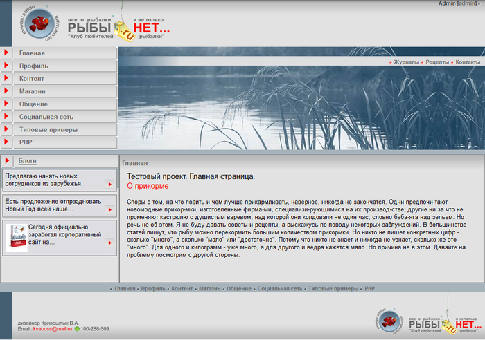
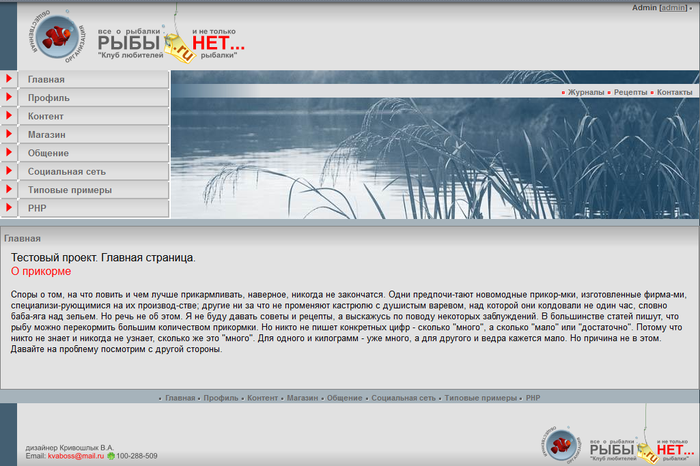

# Work Area и разные шаблоны

**Навигация**
- [← Оглавление курса](index.md)
- [← Предыдущий: 3538 — Включаемые области](lesson_3538.md)
- [Следующий: 12774 — Подготовка к работе →](lesson_12774.md)

Официальная страница урока: https://dev.1c-bitrix.ru/learning/course/index.php?COURSE_ID=43&LESSON_ID=3537

*Bitrix Framework* позволяет создавать и использовать несколько шаблонов для разных условий просмотра. Условия могут быть самыми разными: для разных групп пользователей, для разных разделов, даже для отдельных страниц. Это очень удобно в самых разных случаях. Например, при смене дизайна.

Все шаблоны создаются за счет того или иного размещения в пределах шаблона сайта Рабочей области `#WORK_AREA#`, включения или исключения в/из нее элементов входящих на данный момент в **Header** или **Footer**.

Создадим три шаблона:

- С зоной `#WORK_AREA#` занимающей всю среднюю часть сайта, без левой и правой колонки (для блогов и форумов).
- С левой колонкой в **Header**’е и без правой колонки (для статей).
- С левой колонкой в **Header**’е и правой колонкой в **Footer**’е (для страниц, где нужно организовать предварительный показ картинок).

Собственно третий у нас уже есть, он создался после удаления текста статьи из **Footer**’а. Логичнее всего будет далее последовательным удалением элементов создать оставшиеся два шаблона. Детально приводить удаляемый код в данном случае мы не будем, здесь вам надо положиться на собственные знания html. Для грамотного выполнения этой операции вам надо очень внимательно следить за тем, что вы модифицируете в шаблоне и почаще пользоваться кнопкой **Предпросмотр** перед сохранением результатов.

Шаблоны можно создать двумя способами. Первый: простым копированием. Второй – созданием нового и добавлением в него кода из старого шаблона. Преимущество первого способа – в простоте выполнения операции, преимущество второго в том, что можно задать произвольное имя шаблона (в первом случае копия будет называться **test_copy**). Второй вариант несколько более сложный, так как требует дополнительных действий по настройке:

- Откройте для редактирования шаблон тестового сайта.
- Скопируйте в буфер обмена весь код.
- Нажмите кнопку **Добавить шаблон** на Контекстной панели. Откроется форма создания нового шаблона.
- Вставьте скопированный код шаблона в поле **Внешний вид шаблона сайта**.
- В поле **ID** введите название `test2`.
- В поле **Название** введите `test_article`.
- В поле **Описание** введите: `Шаблон для статей`.
- Скопируйте в шаблон стили сайта и стили шаблона.
- Скопируйте в папку шаблона папку **components** из папки `bitrix\templates\test\`

Такие названия и пояснения мы сделали для того, чтобы не путаться в шаблонах. Если вы будете создавать их довольно много, то логически осмысленные названия и описания вам не помешают.

- Удалите код, включающий в себя правую колонку:
  Метки:
  ```
  <!-- #Begin_right_Column -->
  <!-- #End_right_Column -->
  ```
- Сохраните внесенные изменения.

Результат:



Шаблон создан. Следующий вариант мы создадим по первому варианту, копированием.

- Выполните команду Настройки &gt; Настройки продукта &gt; Сайты &gt; Шаблоны сайтов. Откроется список шаблонов.
- В колонке команд в строке нашего второго шаблона выберите команду **Копировать**. Система выполнит копирование, в списке появится шаблон под именем test_copy.
- Откройте его для редактирования.
- В поле **Название** смените название на `test_blogs`.
- В поле **Описание** смените текст на `Шаблон для раздела Блоги`.
- Удалите из него левую колонку. Метки:
  ```
  <!-- #Begin_left_Column -->
  <!-- #End_left_Column -->
  ```
- Сохраните внесенные изменения.

Результат:



Число шаблонов, которые вы можете использовать на сайте – не ограничено, хоть для каждой отдельной страницы создавайте свой собственный вид. Есть один нюанс. При создании шаблонов всегда учитывайте функционал удаляемых частей, и, при необходимости, изменяйте размещение компонентов. Например, при создании последнего шаблона вместе с левой колонкой мы удалили и компонент Таблица статистики. Если она вам нужна на страницах, использующих этот шаблон, то таблицу придется добавлять в `#WORK_AREA#`.
