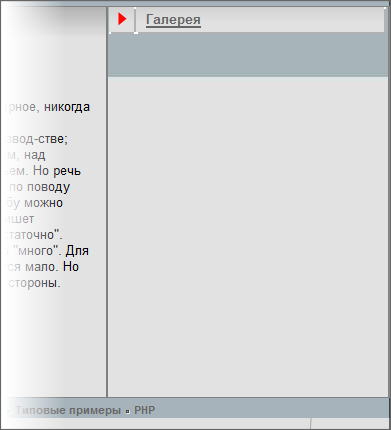
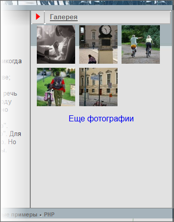
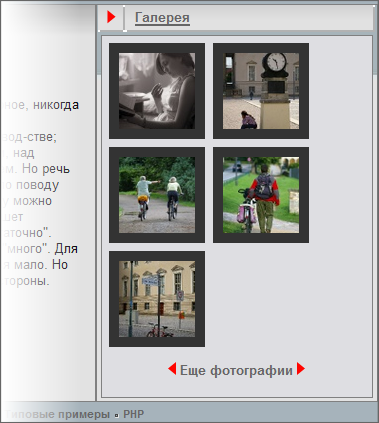

# Включаемые области

**Навигация**
- [← Оглавление курса](index.md)
- [← Предыдущий: 4800 — Баннер](lesson_4800.md)
- [Следующий: 3537 — Work Area и разные шаблоны →](lesson_3537.md)

Официальная страница урока: https://dev.1c-bitrix.ru/learning/course/index.php?COURSE_ID=43&LESSON_ID=3538

### Правая колонка

Тестовый шаблон рисовался в тот момент, когда в *1С-Битрикс: Управление сайтом* не было показа фотогалереи во всплывающем окне. Предложенный дизайнером на тот момент вариант сегодня - не лучший вариант. Кроме того, использование правой колонки можно не ограничивать фотографиями. Ведь в разных разделах сайта может потребоваться вывод разных данных в этой колонке. Если такая потребность возникнет, то придётся создавать новый шаблон с новым компонентом (и соответственно впоследствии поддерживать его). Мы поступим по-другому. Создадим в этом месте [Включаемую область](https://dev.1c-bitrix.ru/learning/course/index.php?COURSE_ID=43&CHAPTER_ID=04881) и при необходимости будем наполнять её нужным контентом в нужном разделе.

Для этого мы удалим из шаблона таблицы, имитирующие фотогалерею и оставим верхнюю часть таблицы с фоном, чтобы при необходимости можно было использовать симметричный дизайн: таблица справа, таблица слева.

- Откройте для редактирования шаблон сайта.
- Удалите коды, имитирующие фотогалерею в правой таблице, расположенные между
  ```
  <!-- #Begin_right_Column -->
  <!-- #End_right_Column -->
  ```
- Добавьте в это место код вызова компонента
  			Включаемая область
                      Компонент располагается в шаблоне дизайна сайта и определяет место расположения включаемых областей страниц и разделов.
  						[Описание компонента «Вставка включаемой области» в пользовательской документации.](http://dev.1c-bitrix.ru/user_help/detail.php?ID=63458)
  		 из документации.
- Сохраните внесенные изменения.
- Скопируйте и  откройте для редактирования шаблон области.
- Из исходного кода дизайна возьмите код заголовка области между метками
  ```
  <!-- #Begin_right_Column -->
  <!-- #Begin_Foto -->
  ```
- Сохраните внесенные изменения.

Теперь правая колонка у нас выглядит так:



Внешне ничего не изменилось, так как мы перенесли в шаблон компонента часть оформления сайта. Сделано это для того, чтобы простым копированием шаблона можно было назначать его для каждой новой включаемой области с новым названием. В текущем варианте у нас правая колонка называется **Галерея**.  Если мы создадим в другом разделе новую включаемую область, то скопировав шаблон мы получим нужное название колонки простой заменой этой надписи в новом шаблоне компонента.

На главной странице должна быть фотогалерея. Значит нужно разместить во включаемой области соответствующий компонент: **Список фото (со слайдером)**.

- Включаемая область - это файл с именем **sect_inc.php**, расположенный в соответствующей директории сайта. В нашем случае - в корне сайта. Откройте этот файл для редактирования.
- Перенесите в этот файл код вызова компонента
  			Список фото (со слайдером)
  						[Описание компонента «Список фото (со слайдером)» в пользовательской документации.](http://dev.1c-bitrix.ru/user_help/detail.php?ID=478386)
  		 (**photogallery.detail.list.ex**)
- Настройте параметры:

  - **THUMBNAIL_SIZE** - размер фотографии-анонса (значение нужно взять из исходного дизайна);
  - **IBLOCK_TYPE** - тип информационного блока, используемого в качестве фотогалереи
  - **IBLOCK_ID** - инфоблок, используемый в качестве фотогалереи
  - **PAGE_ELEMENTS** - число выводимых фото на странице, например - 5.
- Сохраните внесенные изменения.

Результат действий:



### Кастомизация шаблона

- Скопируйте и откройте для редактирования шаблон компонента **photogallery.detail.list.ex**.
- Для начала сделаем фоновую таблицу для всех фотографий. И в качестве основы возьмём таблицу, которую использовали при кастомизации компонента **blog.new_posts**. Перед этим нужно определить какая часть шаблона отвечает за вывод списка превью фотографий. Этот код отмечен комментарием `/* Used to show 'More photos' in js*/` и выделен в блок `<div>` с классом **photo-items-list photo-photo-list**. Вот этот блок и нужно включить в таблицу.
  Поместите блок с указанным классом в ячейку таблицы:
  ```
  <table width="99%" border="0" cellspacing="3" cellpadding="5">
  	<tr>
  		<td class="br" bgcolor="#DEDEE2" bordercolor="#bfbfbf">
  		</td>
  	</tr>
  </table>
  ```
- Если мы остановимся на этом, то ссылка на открытие других фотографий у нас окажется вне таблицы, что не верно с точки зрения исходного дизайна. Надо включить вывод этой надписи в таблицу тоже. Найти часть кода, отвечающую за эту надпись, просто:

  - Откройте файл `\bitrix\templates\test\components\bitrix\photogallery.detail.list.ex\test_1\lang\ru\`.
  - Через поиск найдите фразу **Еще фотографии**. Это значение установлено у параметра **P_SLIDER_MORE_PHOTOS**.
  - Через поиск найдите в шаблоне код с этим параметром. Этот код в блоке с классом **photo-show-more** расположен внутри PHP-условия. Значит нужно перенести закрывающий код таблицы после тега, закрывающего это PHP-условие.
- Теперь нам нужно сделать темные рамочки у каждой выводимой превью. Перед этим нужно определить какая часть шаблона выводит непосредственно превью. Эту часть кода легко найти через поиск по **img src**. Вызов картинки обрамлён в тег `a href` с классом **photo-item-inner**. Заключите этот тег в ячейку таблицы, взятой из исходного кода дизайна:
  ```
  <table border="0" cellspacing="0" cellpadding="10">
  	<tr>
  		<td bgcolor="#333333" align="center" valign="top">
  		</td>
  	</tr>
  </table>
  ```
- Сохраните внесенные изменения.

Осталось только привести к нужному виду фразу **Ещё фотографии**. Подгоним стили вывода текста и добавим стрелки, как на исходном дизайне.

- Как писали выше фраза **Ещё фотографии** размещена в блоке с классом **photo-show-more**. Значит надо задать ему параметры, чтобы текст отображался в соответствии с дизайном. Воспользуйтесь вашими знаниями CSS.
- Для размещения картинок стрелок посмотрите в исходном коде коды картинок и разместите их вокруг вызова сообщения `<?= GetMessage("P_SLIDER_MORE_PHOTOS")?>`
- Сохраните внесенные изменения.

Результат:



**Примечание**: Можно поиграться настройками компонента, параметрами таблиц, чтобы получить более "красивое" положение и оформление.
