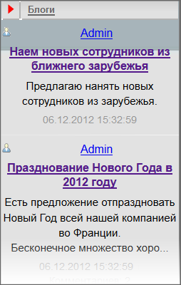
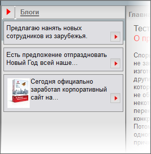

# Компонент Новые сообщения блогов

**Навигация**
- [← Оглавление курса](index.md)
- [← Предыдущий: 4866 — Цепочка навигации](lesson_4866.md)
- [Следующий: 4963 — Счетчик посещений →](lesson_4963.md)

Официальная страница урока: https://dev.1c-bitrix.ru/learning/course/index.php?COURSE_ID=43&LESSON_ID=3539

Предполагается, что сайт предназначен прежде всего для общения единомышленников. В качестве основной формы такого общения выбран блог – сетевой журнал. К настройкам самих блогов мы еще вернемся. А пока нам нужно внедрить в шаблон компонент **Новые сообщения блога**. С его помощью будут выводиться на всех страницах тестового шаблона новые сообщения в блогах.


### Размещение и настройка компонента

#### Размещение компонента

- Откройте для редактирования шаблон тестового сайта.
- Найдите и удалите код, имитирующий вывод новых сообщений блога, расположенный между:
  ```
  <!-- #Begin_blog -->
  <!-- #End_blog -->
  ```
- Разместите между метками код вызова компонента
  			Новые сообщения
                      Компонент выводит последние сообщения блогов текущего сайта. Компонент стандартный и входит в дистрибутив модуля.
  						[Описание компонента «Новые сообщения» в пользовательской документации.](http://dev.1c-bitrix.ru/user_help/detail.php?ID=63197)
  		.
- Сохраните внесенные изменения.

#### Настройка компонента


Перед настройкой компонента необходимо проверить настройки (и, при необходимости изменить) групп блогов и блога администратора, на который мы будем настраивать компонент.

- Перейдите в Панель управления на страницу Сервисы &gt; Блоги &gt; Группы блогов. Откроется форма **Группы блогов**.
- Переопределите какую-нибудь группу блогов на ваш тестовый сайт.
- Сохраните внесенные изменения.
- Перейдите в Панель управления на страницу Сервисы &gt; Блоги &gt; Блоги. Откроется список блогов, имеющихся в дистрибутиве.
- Привяжите один или несколько блогов к выбранной выше группе.

Перейдя в публичку, вы увидите, что блоги появились:



- Вызовите диалог настройки свойств компонента.
- В поле **Шаблон пути к странице с сообщением блога группы** необходимо настроить путь до страницы с сообщениями. Если используется дистрибутив по умолчанию, то путь будет вида:`/blog/group/#group_id#/post/#post_id#/`
- В исходном дизайне у нас предусмотрен вывод только трех последних сообщений. Потом всегда можно эти настройки «переиграть». В поле **Количество результатов, выводимых на страницу** поставьте значение 3.
  **Примечание**: Есть еще важный параметр, существенно влияющий на внешний вид проекта: **Длина выводимого текста сообщения**. Но его значение вам надо будет подбирать экспериментально на реальном проекте. Пока это поле оставим без изменения.
- Сохраните внесенные изменения.

### Кастомизация вывода данных

В исходном варианте дизайна в качестве новых сообщений выводится только текст. Без авторства и даты, но с аватаром. Задумка красивая, но есть одно «Но». Эта идея с аватарами накладывает ограничения на их размер, что не совсем удобно. Это – мелочи, в общем-то, можно потерпеть мелкие аватары в самих блогах. Серьезнее другое: для реализации этого варианта нам придется модифицировать код самого компонента. Это выходит за рамки примера. Потому отойдем от дизайна и вместо аватара выведем картинку с блога с параметрами, заданными в исходном шаблоне.

Значит нам нужно:

- Удалить картинку по умолчанию;
- Удалить дату;
- Удалить ссылку на комментарии;
- Перевести ссылку на сообщение на картинку квадратика со стрелкой, как в исходном дизайне.
- Вместо аватара пользователя вывести картинку из блога.

Займемся этими изменениями.

- Скопируйте шаблон компонента в текущий шаблон сайта и откройте его для редактирования.
- Найдите и удалите из шаблона код:
  ```
  <div class="blog-author">
  	<?if($arParams["SEO_USER"] == "Y"):?>
  		<noindex>
  		<a class="blog-author-icon" href="<?=$arPost["urlToAuthor"]?> title="<?=GetMessage("BLOG_BLOG_M_TITLE_BLOG")?>" rel="nofollow"></a>
  		</noindex>
  	<?else:?>
  		<a class="blog-author-icon" href="<?=$arPost["urlToAuthor"]?>" title="<?=GetMessage("BLOG_BLOG_M_TITLE_BLOG")?>"></a>
  	<?endif;?>
  	<?
  	if (COption::GetOptionString("blog", "allow_alias", "Y") == "Y" && (strlen($arPost["urlToBlog"]) > 0 || strlen($arPost["urlToAuthor"]) > 0) && array_key_exists("BLOG_USER_ALIAS", $arPost) && strlen($arPost["BLOG_USER_ALIAS"]) > 0)
  		$arTmpUser = array(
  			"NAME" => "",
  			"LAST_NAME" => "",
  			"SECOND_NAME" => "",
  			"LOGIN" => "",
  			"NAME_LIST_FORMATTED" => $arPost["~BLOG_USER_ALIAS"],
  		);
  	elseif (strlen($arPost["urlToBlog"]) > 0 || strlen($arPost["urlToAuthor"]) > 0)
  		$arTmpUser = array(
  			"NAME" => $arPost["~AUTHOR_NAME"],
  			"LAST_NAME" => $arPost["~AUTHOR_LAST_NAME"],
  			"SECOND_NAME" => $arPost["~AUTHOR_SECOND_NAME"],
  			"LOGIN" => $arPost["~AUTHOR_LOGIN"],
  			"NAME_LIST_FORMATTED" => "",
  		);
  	?>
  	<?
  	$GLOBALS["APPLICATION"]->IncludeComponent("bitrix:main.user.link",
  		'',
  		array(
  			"ID" => $arPost["AUTHOR_ID"],
  			"HTML_ID" => "blog_new_posts_".$arPost["AUTHOR_ID"],
  			"NAME" => $arTmpUser["NAME"],
  			"LAST_NAME" => $arTmpUser["LAST_NAME"],
  			"SECOND_NAME" => $arTmpUser["SECOND_NAME"],
  			"LOGIN" => $arTmpUser["LOGIN"],
  			"NAME_LIST_FORMATTED" => $arTmpUser["NAME_LIST_FORMATTED"],
  			"USE_THUMBNAIL_LIST" => "N",
  			"PROFILE_URL" => $arPost["urlToAuthor"],
  			"PROFILE_URL_LIST" => $arPost["urlToBlog"],
  			"PATH_TO_SONET_MESSAGES_CHAT" => $arParams["~PATH_TO_MESSAGES_CHAT"],
  			"PATH_TO_VIDEO_CALL" => $arParams["~PATH_TO_VIDEO_CALL"],
  			"DATE_TIME_FORMAT" => $arParams["DATE_TIME_FORMAT"],
  			"SHOW_YEAR" => $arParams["SHOW_YEAR"],
  			"CACHE_TYPE" => $arParams["CACHE_TYPE"],
  			"CACHE_TIME" => $arParams["CACHE_TIME"],
  			"NAME_TEMPLATE" => $arParams["NAME_TEMPLATE"],
  			"SHOW_LOGIN" => $arParams["SHOW_LOGIN"],
  			"PATH_TO_CONPANY_DEPARTMENT" => $arParams["~PATH_TO_CONPANY_DEPARTMENT"],
  			"PATH_TO_SONET_USER_PROFILE" => ($arParams["USE_SOCNET"] == "Y" ?
                                     $arParams["~PATH_TO_USER"] : $arParams["~PATH_TO_SONET_USER_PROFILE"]),
  			"INLINE" => "Y",
  			"SEO_USER" => $arParams["SEO_USER"],
  		),
  		false,
  		array("HIDE_ICONS" => "Y")
  	);
  	?>
  	</div>
  ```


Этим мы удалили картинку по умолчанию, имя владельца блога, выводимое через компонент.

- Найдите и удалите в коде шаблона код:
  ```
  <div class="blog-mainpage-meta">
  		<a href="<?=$arPost["urlToPost"]?>
                  " title="<?=GetMessage("BLOG_BLOG_M_DATE")?>"><?=$arPost["DATE_PUBLISH_FORMATED"]?></a>
  		<?if(IntVal($arPost["VIEWS"]) > 0):?>
  			<span class="blog-vert-separator"></span> <a href="<?=$arPost["urlToPost"]?>"
                          title="<?=GetMessage("BLOG_BLOG_M_VIEWS")?>"><?=GetMessage("BLOG_BLOG_M_VIEWS")?>:
                           <?=$arPost["VIEWS"]?></a>
  		<?endif;?>
  		<?if(IntVal($arPost["NUM_COMMENTS"]) > 0):?>
  			<span class="blog-vert-separator"></span>
                          <a href="<?=$arPost["urlToPost"]?>#comments" title="<?=GetMessage("BLOG_BLOG_M_NUM_COMMENTS")?>">
                          <?=GetMessage("BLOG_BLOG_M_NUM_COMMENTS")?>: <?=$arPost["NUM_COMMENTS"]?></a>
  		<?endif;?>
  		<?if ($arParams["SHOW_RATING"] == "Y"):?>
  		<span class="rating_vote_text">
  		<span class="blog-vert-separator"></span>
  		<?
  		$APPLICATION->IncludeComponent(
  			"bitrix:rating.vote", $arParams["RATING_TYPE"],
  			Array(
  				"ENTITY_TYPE_ID" => "BLOG_POST",
  				"ENTITY_ID" => $arPost["ID"],
  				"OWNER_ID" => $arPost["AUTHOR_ID"],
  				"USER_VOTE" => $arResult[0]["RATING"][$arPost["ID"]]["USER_VOTE"],
  				"USER_HAS_VOTED" => $arResult[0]["RATING"][$arPost["ID"]]["USER_HAS_VOTED"],
  				"TOTAL_VOTES" => $arResult[0]["RATING"][$arPost["ID"]]["TOTAL_VOTES"],
  				"TOTAL_POSITIVE_VOTES" => $arResult[0]["RATING"][$arPost["ID"]]["TOTAL_POSITIVE_VOTES"],
  				"TOTAL_NEGATIVE_VOTES" => $arResult[0]["RATING"][$arPost["ID"]]["TOTAL_NEGATIVE_VOTES"],
  				"TOTAL_VALUE" => $arResult[0]["RATING"][$arPost["ID"]]["TOTAL_VALUE"],
  				"PATH_TO_USER_PROFILE" => $arParams["~PATH_TO_USER"],
  			),
  			$component,
  			array("HIDE_ICONS" => "Y")
  		);?>
  		</span>
  		<?endif;?>
  	</div>
  ```

Этим мы удалили вывод даты сообщения, комментариев и компонент рейтинга.

- Удалите из шаблона код:
  ```
  <div class="blog-mainpage-title"><a href="<?=$arPost["urlToPost"]?>"><?echo $arPost["TITLE"]; ?></a></div>
  ```


Этим мы удалили название сообщения (правда, одновременно со ссылкой на само сообщение и её нам ещё предстоит вернуть).


- Удалим из кода проверку первого сообщения и линию, разделяющие сообщения. Эта линия нам не нужна, так как в исходном дизайне сообщения разделяются рамкой.
  ```
  if($arPost["FIRST"]!="Y")
  	{
  		?><div class="blog-line"></div><?
  	}
  ```
- Удалите блоки `</div>` с классами `blog-mainpage-item` и `blog-clear-float`. Они нам не нужны, так как форматирование в исходном дизайне задаётся таблицей.

Из шаблона компонента удалено всё не нужное, но теперь надо привести вид в соответствие с задумками дизайнера.

- Вставьте код:
  ```
  <?
    if(strlen($arPost["IMG"]) > 0)
    echo $arPost["IMG"];
      ?>
  ```
  Перед вызовом текста сообщения (`<?=$arPost["TEXT_FORMATED"]?>`)
- Сохраните внесенные изменения.
- Откройте для редактирования диалог настройки параметров компонента.
- Посмотрите в исходном шаблоне дизайна сайта параметры картинки предпросмотра и установите эти параметры в поля **Ширина картинки предпросмотра** и **Высота картинки предпросмотра**.
  **Примечание**: Учтите, что компонент **blog.new_posts** не может производить изменение пропорций изображений. При этом параметр высоты имеет преимущество перед шириной.

Этим мы обеспечили вывод картинки из сообщения блога. (Если в сообщении нет картинки, то выводиться ничего не будет.) Теперь добавим код из исходного дизайна.

- Добавьте из исходного кода дизайна код таблицы сообщения блога
  ```
  <table width="99%" border="0" cellspacing="3" cellpadding="5">
               <tr>
                  <td class="br" bgcolor="#DEDEE2" bordercolor="#bfbfbf">
  ```
  Перед блоком `<div class="blog-mainpage-content">`
- Закройте ячейку, строку и саму таблицу после закрывающего тега `</div>`
- Сохраните внесенные изменения.

Теперь нам нужно добавить картинку перехода к сообщению и установить ссылку на сообщение на эту картинку. Ссылка на сообщение у нас в исходном шаблоне была в таком виде:

```
<div class="blog-mainpage-title"><a href="<?=$arPost["urlToPost"]?>"><?echo $arPost["TITLE"]; ?></a></div>
```

Если из этого кода удалить код блока и вызов названия, то получим только ссылку:

```
<a href="<?=$arPost["urlToPost"]?>"></a>
```

- Вставьте код ссылки в код шаблона после кода вызова текста сообщения (`<?=$arPost["TEXT_FORMATED"]?>`)
- Скопируйте из исходного кода код картинки (``) и вставьте его в код ссылки.
- Сохраните внесенные изменения.

Теперь переход к сообщению у нас происходит с картинки. Однако пока ещё отображение текста не соответствует нужному.

### Файл CSS

В коде шаблона есть указание на расположение файлов стилей:

```
<?
if (!$this->__component->__parent || empty($this->__component->__parent->__name) || $this->__component->__parent->__name != "bitrix:blog"):
	$GLOBALS['APPLICATION']->SetAdditionalCSS('/bitrix/components/bitrix/blog/templates/.default/style.css');
	$GLOBALS['APPLICATION']->SetAdditionalCSS('/bitrix/components/bitrix/blog/templates/.default/themes/blue/style.css');
endif;
?>
```

Можно отредактировать эти файлы, а можно добавить свой файл CSS в папке `C:\www\bitrix\templates\test\components\bitrix\blog.new_posts\template1\`, что мы и сделаем.

- Добавьте в указанную папку файл **style.css**.
- Пропишите в файле:
  ```
   .blog-mainpage-content
  {
          font-size:80%;
          text-decoration:none;
  }
  ```
- Сохраните внесенные изменения.

Результат работы практически полностью соответствует исходному дизайну:



**Примечание**: Маловероятно, что пользователи буду грузить картинки в пропорциях нужных для правильного отображения картинки на главной странице сайта. Значит разработчик должен будет предусмотреть модификацию вывода компонента с помощью файла [result_modifier.php](https://dev.1c-bitrix.ru/learning/course/index.php?COURSE_ID=43&CHAPTER_ID=02830) с целью формирования картинки в нужном размере.

Кроме того, необходимо предусмотреть ситуацию, когда в блоге не загружена картинка. Это можно сделать в самом шаблоне компонента.
