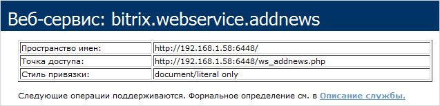
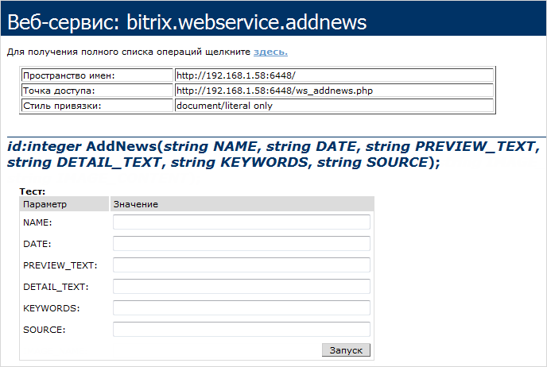
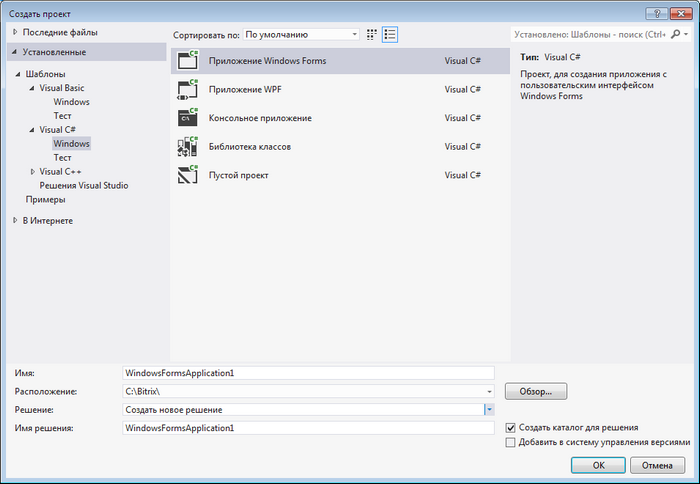
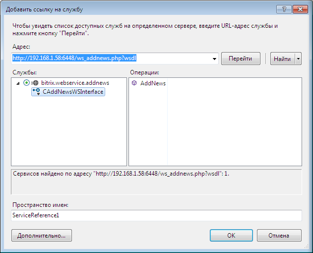
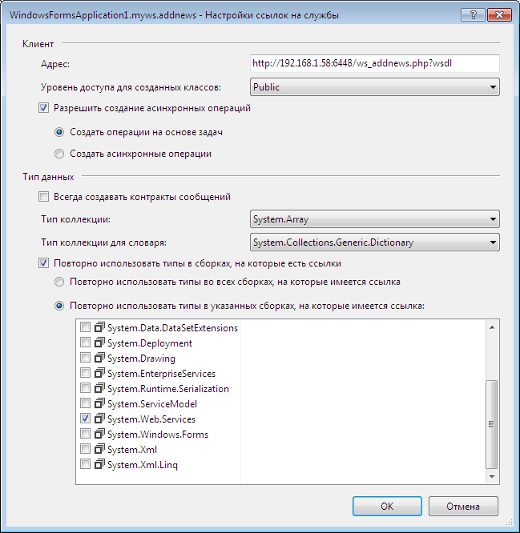
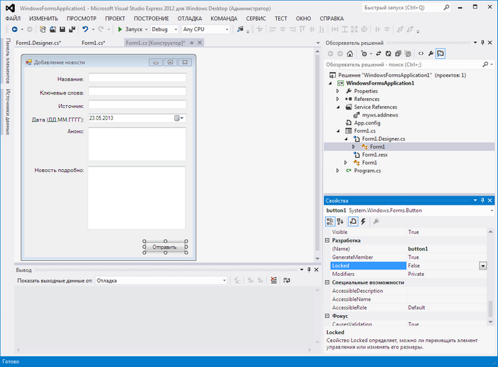
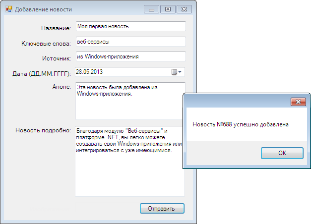

# Пример создания windows-приложения для добавления новостей

**Навигация**
- [← Оглавление курса](index.md)
- [← Предыдущий: 3475 — Установка и удаление](lesson_3475.md)
- [Следующий: 11881 — Vue.js и Bitrix Framework →](lesson_11881.md)

Официальная страница урока: https://dev.1c-bitrix.ru/learning/course/index.php?COURSE_ID=43&LESSON_ID=3565

### Описание

Рассмотрим, как на основе модуля **Веб-сервисы** можно сделать простейшее Windows-приложение для добавления новостей при помощи *Visual Studio 2012* и *.NET Framework 4.5*. Для этого можно скачать одну из бесплатных версий *Express 2012 for Windows Desktop*.

#### Создание информационного блока

Прежде всего, чтобы иметь возможность добавлять новости, необходимо определить информационный блок, в котором они будут храниться. Для примера будем использовать уже имеющийся у нас на сайте инфоблок с ID=3.

### Создание компонента

Создание компонента веб-сервиса для добавления новостей

При установке модуля **Веб-сервисы** создается новый компонент **bitrix:webservice.server**. Он предназначен для простого создания, тестирования и вывода в читабельном виде информации о ваших веб-сервисах. Для нашего веб-сервиса он будет являться «сервером».

Сначала [создадим свой компонент](/learning/course/index.php?COURSE_ID=43&CHAPTER_ID=04777). Для этого создадим новую папку в `/bitrix/components/demo`, назовем ее **webservice.addnews**. Как и любой другой компонент 2.0, компонент веб-сервиса должен содержать стандартные файлы описаний:

- Файл **.description.php**:
  ```
  <?
  if (!defined("B_PROLOG_INCLUDED") || B_PROLOG_INCLUDED!==true) die();
  $arComponentDescription = array(
  	"NAME" => "Веб-сервис добавления новостей",
  	"DESCRIPTION" => "Веб-сервис добавления новостей",
  	"CACHE_PATH" => "Y",
  	"PATH" => array(
  		"ID" => "service",
  			"CHILD" => array(
  				"ID" => "webservice",
  				"NAME" => "Веб-сервис добавления новостей."
  		)
  	),
  );
  ?>
  ```
- Файл **.parameters.php**:
  ```
  <?
  if (!defined("B_PROLOG_INCLUDED") || B_PROLOG_INCLUDED!==true) die();
  $arComponentParameters = array(
  	"GROUPS" => array(),
  	"PARAMETERS" => array(),
  	);
  ?>
  ```
- И исполняемый файл **component.php**. Создадим первоначально его в следующем виде:
  ```
  <?
  if(!defined("B_PROLOG_INCLUDED") || B_PROLOG_INCLUDED!==true) die();
  if(!CModule::IncludeModule("webservice") || !CModule::IncludeModule("iblock"))
     return;
  // наш новый класс наследуется от базового IWebService
  class CAddNewsWS extends IWebService
  {
  	// метод GetWebServiceDesc возвращает описание сервиса и его методов
  	function GetWebServiceDesc()
  	{
  		$wsdesc = new CWebServiceDesc();
  		$wsdesc->wsname = "bitrix.webservice.addnews"; // название сервиса
  		$wsdesc->wsclassname = "CAddNewsWS"; // название класса
  		$wsdesc->wsdlauto = true;
  		$wsdesc->wsendpoint = CWebService::GetDefaultEndpoint();
  		$wsdesc->wstargetns = CWebService::GetDefaultTargetNS();
  		$wsdesc->classTypes = array();
  		$wsdesc->structTypes = Array();
  		$wsdesc->classes = array();
  		return $wsdesc;
  	}
  }
  $arParams["WEBSERVICE_NAME"] = "bitrix.webservice.addnews";
  $arParams["WEBSERVICE_CLASS"] = "CAddNewsWS";
  $arParams["WEBSERVICE_MODULE"] = "";
  // передаем в компонент описание веб-сервиса
  $APPLICATION->IncludeComponent(
  	"bitrix:webservice.server",
  	"",
  	$arParams
  	);
  die();
  ?>
  ```

Это минимальное содержимое для определения веб-сервиса. Как видно он содержит наследованный от *IWebService* класс *CAddNewsWS*, переопределенный метод *GetWebServiceDesc*, возвращающий описание сервиса в формате *CWebServiceDesc* и вызов компонента **bitrix:webservice.server**, которому в качестве параметров передается описание нашего зарождающегося веб-сервиса.

Для проверки работоспособности создадим новую страницу, например, **ws_addnews.php**, разместим на ней новый компонент и сохраним. В публичном разделе результат будет следующим



Как мы видим, появилось описание нашего веб-сервиса. Но у него нет ни одного метода. Для создания метода нам потребуется добавить в класс новый метод, который принимает на вход в качестве параметров некоторые поля новости, а в качестве результата возвращает ID добавленной новости или ошибку:

```

function AddNews($NAME, $DATE, $PREVIEW_TEXT, $DETAIL_TEXT, $KEYWORDS, $SOURCE)
{
	$iblock_permission = CIBlock::GetPermission(3);
	if ($iblock_permission < "W")
	{
		$GLOBALS["USER"]->RequiredHTTPAuthBasic();
		return new CSOAPFault('Server Error', 'Unable to authorize user.');
	}
		$arFields = Array(
			"IBLOCK_ID"=>3, // инфоблок "Новости магазина"
			"NAME"=>$NAME,
			"DATE_ACTIVE_FROM"=>$DATE,
			"PREVIEW_TEXT"=>$PREVIEW_TEXT,
			"DETAIL_TEXT"=>$DETAIL_TEXT,
			"PROPERTY_VALUES" => Array(
				"KEYWORDS"=>$KEYWORDS,
				"SOURCE"=>$SOURCE,
		)
	);
	$ib_element = new CIBlockElement();
	$result = $ib_element->Add($arFields);
	if($result>0)
		return Array("id"=>$result);

	return new CSOAPFault( 'Server Error', 'Error: '.$ib_element->LAST_ERROR );
}
```

Зарегистрируем новый метод в массиве `$wsdesc->classes`:

```

$wsdesc->classes = array(
	"CAddNewsWS"=> array(
		"AddNews" => array(
			"type"      => "public",
			"input"      => array(
				"NAME" => array("varType" => "string"),
				"DATE" => array("varType" => "string"),
				"PREVIEW_TEXT" => array("varType" => "string"),
				"DETAIL_TEXT" => array("varType" => "string"),
				"KEYWORDS" => array("varType" => "string"),
				"SOURCE" => array("varType" => "string"),
				),
			"output"   => array(
			"id" => array("varType" => "integer")
		),
		"httpauth" => "Y"
		),
	)
);
```

В массиве содержится название класса и названия методов, с описанием входных и выходных параметров.

Вот и все, теперь если обновить страницу, на которой расположен компонент, то появится новый метод и также можно протестировать его работу непосредственно из браузера:



### Создание приложения

Теперь можно приступать к завершающему этапу - созданию в *Visual Studio* простого Windows-приложения. В нашем примере мы будем делать приложение в *Express 2012 for Windows Desktop* на C#.

- Создаем новый проект в *Visual Studio*, в качестве шаблона выбираем **Приложение Windows Forms**:
  
- На вкладке **Обозреватель решений** добавляем ссылку на службу:
  
- В открывшейся форме указываем ссылку на страницу с компонентом в следующем виде: http://_ваш_домен_/ws_addnews.php?wsdl. Нажимаем кнопку **Перейти**.
  В поле **Службы** отобразится наш веб-сервис **bitrix.webservice.addnews** с интерфейсом **CAddNewsWSInterface**, для которого доступна операция **AddNews**:
  
  Переименовываем пространство имен в **myws.addnews** и нажимаем кнопку **OK**.
- В файле конфигурации приложения **App.config** необходимо добавить настройки **basicHttpBinding**:
  ```
  <binding name="CAddNewsWSBinding">
  	<security mode="TransportCredentialOnly">
  		<transport clientCredentialType="Basic" proxyCredentialType="None"
  			realm="AXIS" />
  		<message clientCredentialType="UserName" algorithmSuite="Default" />
  	</security>
  </binding>
  ```
- В настройках ссылки на службу необходимо отметить использование **System.Web.Services**:
  
- Далее приступаем к созданию непосредственно самого окна ввода новости, для этого разместим на форме необходимые поля и кнопку **Отправить**:
  
- Двойным кликом по кнопке открываем обработчик события нажатия на кнопку и размещаем код сохраняющий новость на сайте. Можно использовать обычный код:
  ```
  private void button1_Click(object sender, EventArgs e)
  	{
  		CAddNewsWSInterfaceClient news = new CAddNewsWSInterfaceClient();
  		news.ClientCredentials.UserName.UserName = "admin";
  		news.ClientCredentials.UserName.Password = "password";
  		try
  		{
  		long result = news.AddNews(NAME.Text, NEWS_DATE.Text, PREVIEW_TEXT.Text, DETAIL_TEXT.Text, KEYWORDS.Text, SOURCE.Text);
  		MessageBox.Show("Новость №" + result + " успешно добавлена");
  		}
  		catch (System.Web.Services.Protocols.SoapHeaderException exception)
  		{
  			MessageBox.Show("Ошибка добавления новости [" + exception.Message + "]");
  		}
  	}
  ```
  или асинхронный:
  ```
  private async void button1_Click(object sender, EventArgs e)
  	{
  		CAddNewsWSInterfaceClient news = new CAddNewsWSInterfaceClient();
  		news.ClientCredentials.UserName.UserName = "admin";
  		news.ClientCredentials.UserName.Password = "password";
  	try
  	{
  	AddNewsResponse result = await news.AddNewsAsync(NAME.Text, NEWS_DATE.Text, PREVIEW_TEXT.Text, DETAIL_TEXT.Text, KEYWORDS.Text, SOURCE.Text);
  	MessageBox.Show("Новость №" + result.Body.id + " успешно добавлена");
  		}
  			catch (System.Web.Services.Protocols.SoapHeaderException exception)
  				{
  					MessageBox.Show("Ошибка добавления новости [" + exception.Message + "]");
  				}
  	}
  ```
  **Важно!** в описании используемых пространств имен необходимо добавить:
  ```
  using System.Net;
  using WindowsFormsApplication1.myws.addnews;
  ```
- Компилируем приложение, запускаем, заполняем поля, нажимаем кнопку **Отправить**:
  

В данном уроке показан очень простой пример. Конечно, данный веб-сервис можно дорабатывать, например, чтобы в параметрах компонента можно было управлять в какой инфоблок, какую информацию добавлять, поддержку произвольных свойств и т.п. Также  можно доработать и Windows-приложение, например, чтобы оно выгружало новости на сайт «пачками», содержало больше полей и настроек.

Исходный код компонента: [скачать](http://dev.1c-bitrix.ru/docs/articles/webservices/webservice.addnews.rar).

Исходный код приложения: [скачать](http://dev.1c-bitrix.ru/docs/articles/webservices/WindowsFormsApplication1.rar).

**Примечание:** чтобы добавлять новости с картинкой, придется на стороне Windows-приложения читать файл, конвертировать его при помощи `System.Convert.ToBase64String в BASE64`, а на стороне компонента конвертировать назад функцией `base64_decode`, сохранять его во временный файл и передавать на вход методу [CIBlockElement:Add()](http://dev.1c-bitrix.ru/api_help/iblock/classes/ciblockelement/add.php), как одно из полей. Помимо этого, нам необходимо знать на сервере как минимум расширение (тип) файла, поэтому вместе с содержимым будем передавать оригинальное имя файла.

Таким образом вот так будет выглядеть наш класс веб-сервиса в компоненте:

```

class CAddNewsWS extends IWebService
{
	function AddNews($NAME, $DATE, $PREVIEW_TEXT, $DETAIL_TEXT, $KEYWORDS, $SOURCE, $IMAGE_NAME, $IMAGE_CONTENT)
	{
		$iblock_permission = CIBlock::GetPermission(3);
		if ($iblock_permission < "W")
		{
			$GLOBALS["USER"]->RequiredHTTPAuthBasic();
			return new CSOAPFault('Server Error', 'Unable to authorize user.');
		}

		$arFields = Array(
			"IBLOCK_ID"=>3, // инфоблок "Новости магазина"
			"NAME"=>$NAME,
			"DATE_ACTIVE_FROM"=>$DATE,
			"PREVIEW_TEXT"=>$PREVIEW_TEXT,
			"DETAIL_TEXT"=>$DETAIL_TEXT,
			"PROPERTY_VALUES" => Array(
				"KEYWORDS"=>$KEYWORDS,
				"SOURCE"=>$SOURCE,
				)
		);
	if(strlen($IMAGE_NAME)>0 && strlen($IMAGE_CONTENT)>0)
        {
		$IMAGE_CONTENT = base64_decode($IMAGE_CONTENT);
		if(strlen($IMAGE_CONTENT)>0)
		{
			$tmp_name = $_SERVER['DOCUMENT_ROOT'].'/bitrix/tmp/'.md5(uniqid(rand(), true)).".tmp";
			CheckDirPath($tmp_name);
			$f = fopen($tmp_name, "wb");
			fwrite($f, $IMAGE_CONTENT);
			fclose($f);
			$arFields["DETAIL_PICTURE"] = Array("name"=>$IMAGE_NAME, "tmp_name"=>$tmp_name, "size"=>strlen($IMAGE_CONTENT), "type"=>"image/jpeg");
			}
		}
		$ib_element = new CIBlockElement();
		$result = $ib_element->Add($arFields);
		if($tmp_name)
			@unlink($tmp_name);
		if($result>0)
			return Array("id"=>$result);
		return new CSOAPFault( 'Server Error', 'Error: '.$ib_element->LAST_ERROR );
	}

	// метод GetWebServiceDesc возвращает описание сервиса и его методов
	function GetWebServiceDesc()
	{
		$wsdesc = new CWebServiceDesc();
		$wsdesc->wsname = "bitrix.webservice.addnews";
		$wsdesc->wsclassname = "CAddNewsWS";
		$wsdesc->wsdlauto = true;
		$wsdesc->wsendpoint = CWebService::GetDefaultEndpoint();
		$wsdesc->wstargetns = CWebService::GetDefaultTargetNS();
		$wsdesc->classTypes = array();
		$wsdesc->structTypes = Array();
		$wsdesc->classes = array(
			"CAddNewsWS"=> array(
				"AddNews" => array(
					"type"        => "public",
					"input"        => array(
						"NAME" => array("varType" => "string"),
						"DATE" => array("varType" => "string"),
						"PREVIEW_TEXT" => array("varType" => "string"),
						"DETAIL_TEXT" => array("varType" => "string"),
						"KEYWORDS" => array("varType" => "string"),
						"SOURCE" => array("varType" => "string"),
						"IMAGE_NAME" => array("varType" => "string"),
						"IMAGE_CONTENT" => array("varType" => "string"),
						),
					"output"    => array(
						"id" => array("varType" => "integer")
					),
					"httpauth" => "Y"
				),
			)
		);

		return $wsdesc;
	}
}
```

А вот так обработчик нажатия на кнопку в Windows-приложении (`IMAGE` - это новый контрол на форме, в нем должен быть путь к файлу на диске):

```

private void button1_Click(object sender, EventArgs e)
{
	Byte[] binaryData;
	string base64String = "";
	if(IMAGE.Text.Length>0)
	{
		try
		{
			System.IO.FileStream imageFile = new System.IO.FileStream(IMAGE.Text, System.IO.FileMode.Open,System.IO.FileAccess.Read);
			binaryData = new Byte[imageFile.Length];
			imageFile.Read(binaryData, 0, (int)imageFile.Length);
			imageFile.Close();
			base64String = System.Convert.ToBase64String(binaryData, 0, binaryData.Length);
		}
		catch (System.Exception exp)
		{
			MessageBox.Show("Ошибка чтения картинки [" + exp.Message + "]");
			return;
		}
	}

			CAddNewsWSInterfaceClient news = new CAddNewsWSInterfaceClient();
			news.ClientCredentials.UserName.UserName = "admin";
			news.ClientCredentials.UserName.Password = "password";
			try
			{
			long result = news.AddNews(NAME.Text, NEWS_DATE.Text, PREVIEW_TEXT.Text, DETAIL_TEXT.Text, KEYWORDS.Text, SOURCE.Text, IMAGE_FILE.Text, base64String);
			MessageBox.Show("Новость №" + result + " успешно добавлена");
		}
		catch (System.Web.Services.Protocols.SoapHeaderException exception)
		{
			MessageBox.Show("Ошибка добавления новости [" + exception.Message + "]");
		}
}
```
