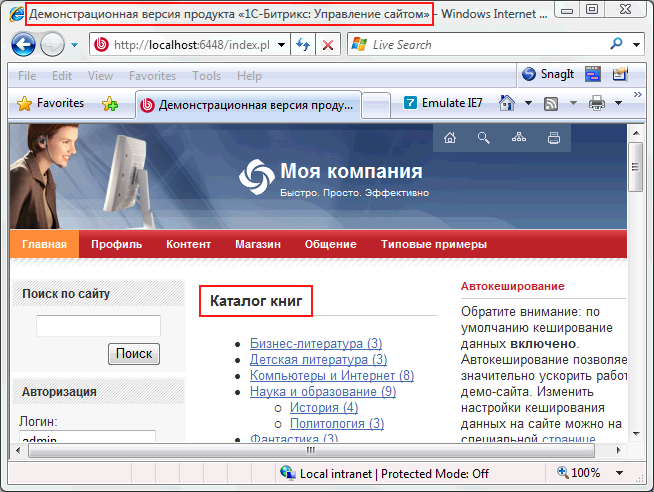
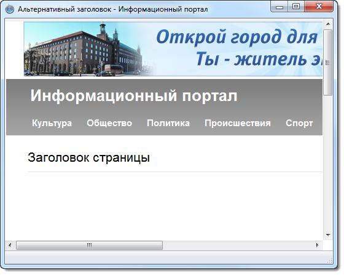
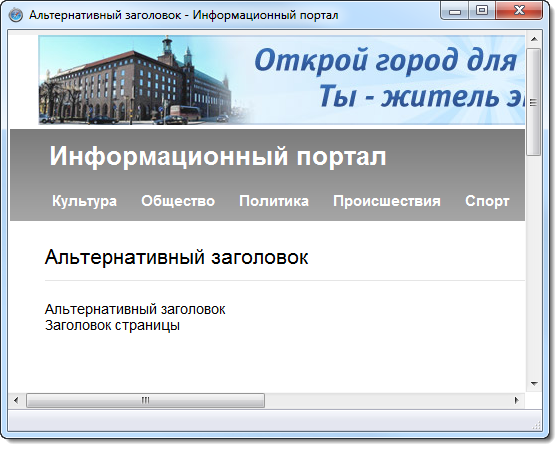
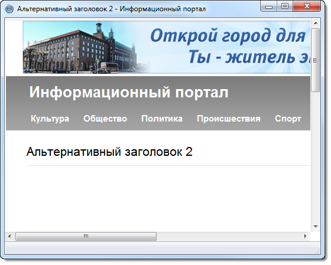

# Примеры работы

**Навигация**
- [← Оглавление курса](index.md)
- [← Предыдущий: 4934 — Управление кодировкой страниц](lesson_4934.md)
- [Следующий: 3517 — Механизм реализации →](lesson_3517.md)

Официальная страница урока: https://dev.1c-bitrix.ru/learning/course/index.php?COURSE_ID=43&LESSON_ID=3753

В данном уроке мы поэтапно рассмотрим пример создания страницы, у которой заголовок окна браузера и сам заголовок страницы будут различаться.
В ходе работы, возможно, потребуется изменить шаблон сайта.

В результате мы должны получить примерно следующий результат:



Выполним следующее:

- Зададим заголовок страницы из [интерфейса](/learning/course/index.php?COURSE_ID=35&LESSON_ID=1929) или с помощью функции `$APPLICATION->SetTitle("Заголовок страницы")`:
  ```
  <? require($_SERVER["DOCUMENT_ROOT"]."/bitrix/header.php");
  $APPLICATION->SetTitle("Заголовок страницы"); ?>
  <? require($_SERVER["DOCUMENT_ROOT"]."/bitrix/footer.php"); ?>
  ```
  
- Добавим дополнительный заголовок [через интерфейс](/learning/course/index.php?COURSE_ID=35&LESSON_ID=1929) или с помощью функции `$APPLICATION->SetPageProperty('title','Альтернативный заголовок')`:
  ```
  <? require($_SERVER["DOCUMENT_ROOT"]."/bitrix/header.php");
  $APPLICATION->SetTitle("Заголовок страницы"); ?>
  <? $APPLICATION->SetPageProperty('title','Альтернативный заголовок'); ?>
  <? require($_SERVER["DOCUMENT_ROOT"]."/bitrix/footer.php"); ?>
  ```
  В системе функция `$APPLICATION->SetPageProperty()` имеет приоритет над функцией `$APPLICATION->SetTitle()` , поэтому в заголовке браузера и страницы будет отображено именно ее содержимое:
  
- [Изменим шаблон страницы](lesson_3232.md#edit), если необходимо, так, чтобы вместо функции `$APPLICATION->ShowTitle()` заголовок страницы (не браузера) задавала `$APPLICATION->ShowTitle(false)`.
  В таком случае будет игнорироваться значение свойства страницы `SetPageProperty('title','Альтернативный заголовок')` и в качестве заголовка страницы будет использовано значение, установленное функцией *SetTitle()*.
  Пример работы кода из предыдущего пункта, но с измененной функцией `$APPLICATION->ShowTitle()` на `$APPLICATION->ShowTitle(false)` в шаблоне сайта:
  
  Отдельно продемонстрируем разницу работы функции `$APPLICATION->ShowTitle()` с параметром `false` на следующем примере, без  изменения кода шаблона:
  ```
  <? require($_SERVER["DOCUMENT_ROOT"]."/bitrix/header.php");
  $APPLICATION->SetTitle("Заголовок страницы"); ?>
  <? $APPLICATION->SetPageProperty('title','Альтернативный заголовок'); ?>
  <? $APPLICATION->ShowTitle(); ?>
  <br>
  <? $APPLICATION->ShowTitle(false); ?>
  <?require($_SERVER["DOCUMENT_ROOT"]."/bitrix/footer.php");?>
  ```
  
- Дополнительный пример работы нескольких функций по установке заголовка:
  ```
  <? require($_SERVER["DOCUMENT_ROOT"]."/bitrix/header.php");
  $APPLICATION->SetTitle("Заголовок страницы"); ?>
  <?
  $APPLICATION->SetPageProperty('title','Альтернативный заголовок');
  //......
  $APPLICATION->SetTitle("Заголовок страницы 2"); // заголовок установлен не будет т.к. у этой функции приоритет меньше
  //.....
  $APPLICATION->SetPageProperty('title','Альтернативный заголовок 2'); // будет установлен именно этот заголовок т.к функция расположена ниже по коду
  ?>
  <? require($_SERVER["DOCUMENT_ROOT"]."/bitrix/footer.php"); ?>
  ```
  
